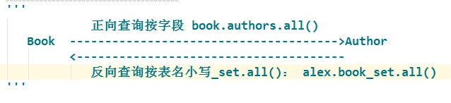
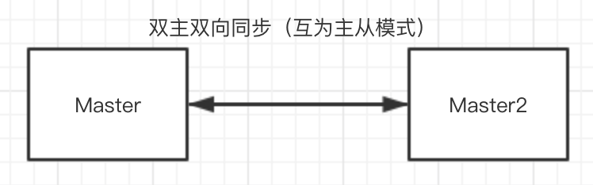

## 创建项目：

### 创建项目：

1. 通过命令行的方式：首先要进入到安装了django的虚拟环境中。然后执行命令：
    ```
    django-admin startproject [项目的名称]
    ```
    这样就可以在当前目录下创建一个项目了。
2. 通过pycharm的方式：文件->新建项目->选择django。然后指定项目所在的路径，以及Python解释器，再点击Create就可以创建项目了。

### 运行项目：

1. 终端：进入到项目文件夹中，然后执行以下命令即可运行：
    ```python
    python manage.py runserver
    ```
2. pycharm：直接点击右上角的绿色三角箭头按钮就可以了。**注意：用pycharm运行项目，要避免一个项目运行多次。**。在项目配置中，把“只用单一实例”那个选项勾选上，避免以上的问题。

### 改变端口号：

1. 在终端：运行的时候加上一个端口号就可以了。命令为：`python manage.py runserver 9000`。
2. 在pycharm中：右上角->项目配置->port。改成你想要的端口号，重新运行。

### 让同局域网中的其他电脑访问本机的项目：

1. 让项目运行到额时候，host为0.0.0.0。
    * 在终端，使用命令：`python manage.py runserver 0.0.0.0:8000`。
    * 在pycharm，右上角->项目配置->host。改成`0.0.0.0`。
    
2. 在`settings.py`文件中，配置`ALLOWED_HOSTS`，将本机的ip地址添加进去。示例代码如下：
    ```python
    ALLOWED_HOSTS = ['192.168.0.103']
    ```
    注意：要关闭自己电脑的防火墙才行。

### 项目结构分析：

1. `manange.py`：以后和项目交互基本上都是基于这个文件。一般都是在终端输入python manage.py [子命令]。可以输入python manage.py help看下能做什么事情。除非你知道你自己在做什么，一般情况下不应该编辑这个文件。
2. `settings.py`：保存项目所有的配置信息。
3. `urls.py`：用来做url与视图函数映射的。以后来了一个请求，就会从这个文件中找到匹配的视图函数。
4. `wsig.py`：专门用来做部署的。不需要修改。

### django推荐的项目规范：

按照功能或者模块进行分层，分成一个个app。所有和某个模块相关的视图都写在对应的app的views.py中，并且模型和其他的也是类似。然后django已经提供了一个比较方便创建app的命令叫做`python manage.py startapp [app的名称]`。把所有的代码写在各自的app中。

### DEBUG模式：

1. 如果开启了DEBUG模式，那么以后我们修改了Django项目的代码，然后按下ctrl+s，那么Django就会自动的给我们重启项目，不需要手动重启。
2. 如果开启了DEBUG模式，那么以后Django项目中的代码出现bug了，那么在浏览器中和控制台会打印出错信息。
3. 在生产环境中，禁止开启DEBUG模式，不然有很大的安全隐患。
4. 如果将DEBUG设置为False，那么必须要设置ALLOWED_HOSTS.

### ALLOWED_HOSTS：

这个变量是用来设置以后别人只能通过这个变量中的ip地址或者域名来进行访问。

## 视图函数

1. 视图函数的第一个参数必须是request。这个参数绝对不能少。
2. 视图函数的返回值必须是`django.http.response.HttpResponseBase`的子类的对象。

## url相关：django2.0

### url映射：

不使用缓存去加载页面`ctrl+shift+r`

1. 为什么会去urls.py文件中寻找映射呢？
  是因为在`settings.py`文件中配置了`ROOT_URLCONF`为`urls.py`。所有django会去`urls.py`中寻找。
2. 在`urls.py`中我们所有的映射，都应该放在`urlpatterns`这个变量中。
3. 所有的映射不是随便写的，而是使用`path`函数或者是`re_path`函数进行包装的。

### url传参数：

1. 采用在url中使用变量的方式：在path的第一个参数中，使用`<参数名>`的方式可以传递参数。然后在视图函数中也要写一个参数，视图函数中的参数必须和url中的参数名称保持一致，不然就找不到这个参数。另外，url中可以传递多个参数。`path("book/detail/<book_id>/<category_id>/",views.book_detail)`多个参数

1. 采用查询字符串的方式：在url中，不需要单独的匹配查询字符串的部分。只需要在视图函数中使用`request.GET.get('参数名称')`的方式来获取。示例代码如下：
    ```python
    def author_detail(request):
        author_id = request.GET['id']
        text = '作者的id是：%s' % author_id
        return HttpResponse(text)
    ```
    因为查询字符串使用的是`GET`请求，所以我们通过`request.GET`来获取参数。并且因为`GET`是一个类似于字典的数据类型，所有获取值跟字典的方式都是一样的。

### url参数的转换器：

`path("book/publisher/<path:publisher_id>/",views.publisher_detail)`

1. str：除了斜杠`/`以外所有的字符都是可以的。
2. int：只有是一个或者多个的阿拉伯数字。
3. path：所有的字符都是满足的。
4. uuid：只有满足`uuid.uuid4()`这个函数返回的字符串的格式。
5. slug：英文中的横杆或者英文字符或者阿拉伯数字或者下划线才满足

### urls模块化（路由转发）：

如果项目变得越来越大。那么url会变得越来越多。如果都放在主`urls.py`文件中，那么将不太好管理。因此我们可以将每个app自己的urls放到自己的app中进行管理。一般我们会在app中新建一个urls.py文件用来存储所有和这个app相关的子url。
需要注意的地方：

1. 应该使用`include`函数包含子`urls.py`，并且这个`urls.py`的路径是相对于项目的路径。示例代码如下：
    ```python
    # 父url
    urlpatterns = [
        path('admin/', admin.site.urls),
        path('book/',include('book.urls'))
    ]
    # 子url
    urlpatterns = [
      path('reports/', credit_views.report),
      path('reports/<int:id>/', credit_views.report),
    ]
    ```
2. 在`app`的`urls.py`中，所有的url匹配也要放在一个叫做`urlpatterns`的变量中，否则找不到。
3. `url`是会根据主`urls.py`和app中的`urls.py`进行拼接的，因此注意不要多加斜杠。

### include函数的用法：

1. include(module,namespace=None)：
    * module：子url的模块字符串。
    * namespace：实例命名空间。这个地方需要注意一点。如果指定实例命名空间，那么前提必须要先指定应用命名空间。也就是在子`urls.py`中**添加`app_name`变量**。
2. include((pattern_list, app_namespace), namespace=None)：`include`函数的第一个参数既可以为一个字符串，也可以为一个元组，如果是元组，那么元组的第一个参数是子`urls.py`模块的字符串，元组的第二个参数是应用命名空间。这样的话，namespace就可传可不传。也就是说，应用命名空间既可以在子`urls.py`中通过`app_name`指定，也可以在`include`函数中指定。
3. include(pattern_list)：`pattern_list`是一个列表。这个列表中装的是`path`或者`re_path`函数。也就是说，可以把子url中的path放在这个列表中，实例代码如下：
    ```python
    path('movie/',include([
        path('',views.movie),
        path('list/',views.movie_list),
    ]))
    ```

### url命名：

#### 为什么需要url命名？

因为url是经常变化的。如果在代码中写死可能会经常改代码。给url取个名字，以后使用url的时候就使用他的名字进行反转就可以了，就不需要写死url了。

#### 如何给一个url指定名称？

在`path`函数中，传递一个`name`参数就可以指定。示例代码如下：
```python
urlpatterns = [
    path('',views.index,name='index'),
    path('login/',views.login,name='login')
]
```

#### 应用命名空间：

在多个app之间，有可能产生同名的url。这时候为了避免反转url的时候产生混淆，可以使用应用命名空间，来做区分。定义应用命名空间非常简单，只要在`app`的`urls.py`中定义一个叫做`app_name`的变量，来指定这个应用的命名空间即可。示例代码如下：
```python
# 应用命名空间
app_name = 'front'

urlpatterns = [
    path('',views.index,name='index'),
    path('login/',views.login,name='login')
]
```
以后在做反转的时候就可以使用`应用命名空间:url名称`的方式进行反转。示例代码如下：
```python
login_url = reverse('front:login')
```

#### 应用(app)命名空间和实例命名空间：

一个app，可以创建多个实例。可以使用多个url映射同一个app。所以这就会产生一个问题。以后在做反转的时候，如果使用应用命名空间，那么就会发生混淆。为了避免这个问题。我们可以使用实例命名空间。实例命名空间也是非常简单，只要在`include`函数中传递一个`namespace`变量即可。示例代码如下：
```python
urlpatterns = [
    path('',include('front.urls')),
    # 同一个app下有两个实例
    path('cms1/',include('cms.urls',namespace='cms1')),
    path('cms2/',include('cms.urls',namespace='cms2')),
]
```
以后在做反转的时候，就可以根据实例命名空间来指定具体的url。示例代码如下：
```python
def index(request):
    username = request.GET.get("username")
    if username:
        return HttpResponse('CMS首页')
    else:
        # 获取当前的命名空间
        current_namespace = request.resolver_match.namespace
        return redirect(reverse("%s:login"%current_namespace))
```

### re_path

1. re_path和path的作用都是一样的。只不过`re_path`是在写url的时候可以用正则表达式，功能更加强大。

2. 写正则表达式都推荐使用原生字符串。也就是以`r`开头的字符串。

3. 在正则表达式中定义变量，需要使用圆括号括起来。这个参数是有名字的，那么需要使用`?P<参数的名字>`。然后在后面添加正则表达式的规则。示例代码如下：
    ```python
    from django.urls import re_path
    from . import views
    
    urlpatterns = [
        # r""：代表的是原生字符串（raw）
        re_path(r'^$',views.article),
        # /article/list/<year>/
        re_path(r"^list/(?P<year>\d{4})/$",views.article_list),
        re_path(r"^list/(?P<month>\d{2})/$",views.article_list_month)
    ]
    ```

4. 如果不是特别要求。直接使用`path`就够了，省的把代码搞的很麻烦（因为正则表达式其实是非常晦涩的，特别是一些比较复杂的正则表达式，今天写的明天可能就不记得了）。除非是url中确实是需要使用正则表达式来解决才使用`re_path`。

### reverse

1. 如果在反转url的时候，需要添加参数，那么可以传递`kwargs`参数到`revers`函数中。示例代码如下：
    ```python
    detail_url = reverse('detail',kwargs={"article_id":1,'page':2})
    ```
2. 如果想要添加查询字符串的参数，则必须手动的进行拼接。示例代码如下：
    ```python
    login_url = reverse('login') + "?next=/"
    ```

在“文章分类”参数传到视图函数之前要把这些分类分开来存储到列表中。
比如参数是`python+django`，那么传到视图函数的时候就要变成`['python','django']`。

以后在使用reverse反转的时候，限制传递“文章分类”的参数应该是一个列表，并且要将这个列表变成`python+django`的形式。

### 自定义URL转换器

**第一种办法：**

之前已经学到过一些django内置的url转换器，包括有int、uuid等。有时候这些内置的url转换器并不能满足我们的需求，因此django给我们提供了一个接口可以让我们自己定义自己的url转换器。

自定义url转换器按照以下五个步骤来走就可以了： 
1. 为了模块化，在app里建一个单独的文件如：converters.py,在其中定义一个类，直接继承自object就可以了。 
2. 在类中定义一个属性regex，这个属性是用来限制url转换器规则的正则表达式。 
3. 实现to_python(self,value)方法，这个方法是将url中的值转换一下，然后传给视图函数的。 
4. 实现to_url(self,value)方法，这个方法是在做url反转的时候，将传进来的参数转换后拼接成一个正确的url。
5. 将定义好的转换器，使用`django.urls.converters.register_converter`方法注册到django中。
6. 需要在当前app包中的`__init__.py`中引入一下这个包`from . import converters`
7. 源码参照`from django.urls import converters`中已经定义好的去写。

示例代码如下：
```python
from django.urls import register_converter

class CategoryConverter(object):
    regex = r'\w+|(\w+\+\w+)+'

    def to_python(self,value):
        # python+django+flask
        # ['python','django','flask']
        result = value.split("+")
        return result

    def to_url(self,value):
        # value：['python','django','flask']
        # python+django+flask
        if isinstance(value,list):
            result = "+".join(value)
            return result
        else:
            raise RuntimeError("转换url的时候，分类参数必须为列表！")

register_converter(CategoryConverter,'cate')
```

**第二种办法：**

写一个类，并包含下面的成员和属性：

- 类属性regex：一个字符串形式的正则表达式属性；
- to_python(self, value) 方法：一个用来将匹配到的字符串转换为你想要的那个数据类型，并传递给视图函数。如果转换失败，它必须弹出ValueError异常；
- to_url(self, value)方法：将Python数据类型转换为一段url的方法，上面方法的反向操作。

例如，新建一个converters.py文件，与urlconf同目录，写个下面的类：

```
class FourDigitYearConverter:
    regex = '[0-9]{4}'

    def to_python(self, value):
        return int(value)

    def to_url(self, value):
        return '%04d' % value
```

写完类后，在URLconf 中注册，并使用它，如下所示，注册了一个xxxx：

```python
from django.urls import register_converter, path

from . import converters, views

register_converter(converters.FourDigitYearConverter, 'xxxx') # 注册

urlpatterns = [
    path('articles/2003/', views.special_case_2003),
    path('articles/<xxxx:year>/', views.year_archive),
    ...
]
```

### URL映射的时候指定默认参数

使用path或者是re_path的后，在route中都可以包含参数，而有时候想指定默认的参数，这时候可以通过以下方式来完成。示例代码如下：
```python
from django.urls import path

from . import views

urlpatterns = [
    path('blog/', views.page),
    path('blog/page<int:num>/', views.page),
]

# View (in blog/views.py)
def page(request, num=1):
    # Output the appropriate page of blog entries, according to num.
    ...
```
当在访问blog/的时候，因为没有传递num参数，所以会匹配到第一个url，这时候就执行view.page这个视图函数，而在page函数中，又有num=1这个默认参数。因此这时候就可以不用传递参数。而如果访问blog/1的时候，因为在传递参数的时候传递了num，因此会匹配到第二个url，这时候也会执行views.page，然后把传递进来的参数传给page函数中的num。

### 使用正则表达式

Django2.0的url虽然改‘配置’了，但它依然向老版本兼容。而这个兼容的办法，就是用`re_path()`方法代替`path()`方法。`re_path()`方法在骨子里，根本就是以前的`url()`方法，只不过导入的位置变了。下面是一个例子，对比一下Django1.11时代的语法，有什么太大的差别？

```python
from django.urls import path, re_path

from . import views

urlpatterns = [
    path('articles/2003/', views.special_case_2003),
    re_path(r'^articles/(?P<year>[0-9]{4})/$', views.year_archive),
    re_path(r'^articles/(?P<year>[0-9]{4})/(?P<month>[0-9]{2})/$', views.month_archive),
    re_path(r'^articles/(?P<year>[0-9]{4})/(?P<month>[0-9]{2})/(?P<slug>[\w-]+)/$', views.article_detail),
]
```

与`path()`方法不同的在于两点：

- year中匹配不到10000等非四位数字，这是正则表达式决定的
- 传递给视图的所有参数都是字符串类型。而不像`path()`方法中可以指定转换成某种类型。在视图中接收参数时一定要小心。

### 自定义错误页面

当Django找不到与请求匹配的URL时，或者当抛出一个异常时，将调用一个错误处理视图。Django默认的自带的错误视图包括400、403、404和500，分别表示请求错误、拒绝服务、页面不存在和服务器错误。它们分别位于：

- handler400 —— django.conf.urls.handler400。
- handler403 —— django.conf.urls.handler403。
- handler404 —— django.conf.urls.handler404。
- handler500 —— django.conf.urls.handler500。

这些值可以在根URLconf中设置。在其它app中的二级URLconf中设置这些变量无效。

Django有内置的HTML模版，用于返回错误页面给用户，但是这些403，404页面实在丑陋，通常我们都自定义错误页面。

首先，在根URLconf中额外增加下面的条目，并导入views模块：

```python
from django.contrib import admin
from django.urls import path
from app import views

urlpatterns = [
    path('admin/', admin.site.urls),
]

# 增加的条目
handler400 = views.bad_request
handler403 = views.permission_denied
handler404 = views.page_not_found
handler500 = views.error
```

然后在，app/views.py文件中增加四个处理视图：

```python
def bad_request(request):
    return render(request, '400.html')


def permission_denied(request):
    return render(request, '403.html')


def page_not_found(request):
    return render(request, '404.html')


def error(request):
    return render(request, '500.html')

```

再根据自己的需求，创建对应的400、403、404、500.html四个页面文件，就可以了（要注意好模板文件的引用方式，视图的放置位置等等）。

## 模板

在之前的章节中，视图函数只是直接返回文本，而在实际生产环境中其实很少这样用，因为实际的页面大多是带有样式的HTML代码，这可以让浏览器渲染出非常漂亮的页面。目前市面上有非常多的模板系统，其中最知名最好用的就是DTL和Jinja2。DTL是Django Template Language三个单词的缩写，也就是Django自带的模板语言。当然也可以配置Django支持Jinja2等其他模板引擎，但是作为Django内置的模板语言，和Django可以达到无缝衔接而不会产生一些不兼容的情况。因此建议大家学习好DTL。

**DTL与普通的HTML文件的区别**

DTL模板是一种带有特殊语法的HTML文件，这个HTML文件可以被Django编译，可以传递参数进去，实现数据动态化。在编译完成后，生成一个普通的HTML文件，然后发送给客户端。

### 渲染模板：

渲染模板有多种方式。这里讲下两种常用的方式。

1. `render_to_string`：找到模板，然后将模板编译后渲染成Python的字符串格式。最后再通过HttpResponse类包装成一个HttpResponse对象返回回去。示例代码如下：
```python
from django.template.loader import render_to_string
 from django.http import HttpResponse
 def book_detail(request,book_id):
     html = render_to_string("detail.html")
     return HttpResponse(html)
```
2. 以上方式虽然已经很方便了。但是django还提供了一个更加简便的方式，直接将模板渲染成字符串和包装成HttpResponse对象一步到位完成。示例代码如下：
```python
 from django.shortcuts import render
 def book_list(request):
     return render(request,'list.html')
```

### 模版查找路径

在项目的settings.py文件中。有一个TEMPLATES配置，这个配置包含了模板引擎的配置，模板查找路径的配置，模板上下文的配置等。模板路径可以在两个地方配置。

1. `DIRS`：这是一个列表，在这个列表中可以存放所有的模板路径，以后在视图中使用render或者render_to_string渲染模板的时候，会在这个列表的路径中查找模板。
2. `APP_DIRS`：默认为True，这个设置为True后，会在INSTALLED_APPS的安装了的APP下的templates文件加中查找模板。
3. 查找顺序：比如代码render('list.html')。先会在DIRS这个列表中依次查找路径下有没有这个模板，如果有，就返回。如果DIRS列表中所有的路径都没有找到，那么会先检查当前这个视图所处的app是否已经安装，如果已经安装了，那么就先在当前这个app下的templates文件夹中查找模板，如果没有找到，那么会在其他已经安装了的app中查找。如果所有路径下都没有找到，那么会抛出一个TemplateDoesNotExist的异常。
4. DIRS > 当前APP > 其他APP

### 模版变量

1. 在模版中使用变量，需要将变量放到`{{ 变量 }}`中。
2. 如果想要访问对象的属性，那么可以通过`对象.属性名`来进行访问。
    ```python
    class Person(object):
        def __init__(self,username):
            self.username = username
    
    context = {
        'person': p
    }
    ```
    以后想要访问`person`的`username`，那么就是通过`person.username`来访问。
3. 如果想要访问一个字典的key对应的value，那么只能通过`字典.key`的方式进行访问，不能通过`中括号[]`的形式进行访问。
    ```python
    context = {
        'person': {
            'username':'zhiliao'
        }
    }
    ```
    那么以后在模版中访问`username`。就是以下代码`person.username`
4. 因为在访问字典的`key`时候也是使用`点.`来访问，因此不能在字典中定义字典本身就有的属性名当作`key`，否则字典的那个属性将编程字典中的key了。
    ```python
    context = {
        'person': {
            'username':'zhiliao',
            'keys':'abc'
        }
    }
    ```
    以上因为将`keys`作为`person`这个字典的`key`了。因此以后在模版中访问`person.keys`的时候，返回的不是这个字典的所有key，而是对应的值。
5. 如果想要访问列表或者元组，那么也是通过`点.`的方式进行访问，不能通过`中括号[]`的形式进行访问。这一点和python中是不一样的。示例代码如下：
    ```python
    {{ persons.1 }}
    ```

### if语句

1. 所有的标签都是在``之间。
2. if标签有闭合标签。就是``。
3. if标签的判断运算符，就跟python中的判断运算符是一样的。`==、!=、<、<=、>、>=、in、not in、is、is not`这些都可以使用。
4. 还可以使用`elif`以及`else`等标签。

### for...in...

**`for...in…`标签**

`for...in...`类似于`Python`中的`for...in...`。可以遍历列表、元组、字符串、字典等一切可以遍历的对象。示例代码如下：

```python

<p>{{ person.name }}</p>

```

如果想要反向遍历，那么在遍历的时候就加上一个`reversed`。示例代码如下：

```python

<p>{{ person.name }}</p>

```

遍历字典的时候，需要使用`items`、`keys`和`values`等方法。在`DTL`中，执行一个方法不能使用圆括号的形式。遍历字典示例代码如下：

```python

<p>key：{{ key }}</p>
<p>value：{{ value }}</p>

```

在`for`循环中，`DTL`提供了一些变量可供使用。这些变量如下：

* `forloop.counter`：当前循环的下标。以1作为起始值。
* `forloop.counter0`：当前循环的下标。以0作为起始值。
* `forloop.revcounter`：当前循环的反向下标值。比如列表有5个元素，那么第一次遍历这个属性是等于5，第二次是4，以此类推。并且是以1作为最后一个元素的下标。
* `forloop.revcounter0`：类似于forloop.revcounter。不同的是最后一个元素的下标是从0开始。
* `forloop.first`：是否是第一次遍历。
* `forloop.last`：是否是最后一次遍历。
* `forloop.parentloop`：如果有多个循环嵌套，那么这个属性代表的是上一级的for循环。

** 模板中的for...in...没有continue和break语句，这一点和Python中有很大的不同，一定要记清楚！ **

**for...in...empty`标签**

这个标签使用跟`for...in...`是一样的，只不过是在遍历的对象如果没有元素的情况下，会执行`empty`中的内容。示例代码如下：

```python

<li>{{ person }}</li>

暂时还没有任何人

```

### with标签

1. 在模板中，想要定义变量，可以通过`with`语句来实现。
2. `with`语句有两种使用方式，第一种是`with xx=xxx`的形式，第二种是`with xxx as xxx`的形式。
3. 定义的变量只能在with语句块中使用，在with语句块外面使用取不到这个变量。
  示例代码如下：
```python
    
        <p>{{ zs }}</p>
        <p>{{ zs }}</p>
    
    下面这个因为超过了with语句块，因此不能使用
    <p>{{ zs }}</p>

    
        <p>{{ zs }}</p>
    
```

### url标签

`url`标签：在模版中，我们经常要写一些`url`，比如某个`a`标签中需要定义`href`属性。当然如果通过硬编码的方式直接将这个`url`写死在里面也是可以的。但是这样对于以后项目维护可能不是一件好事。因此建议使用这种反转的方式来实现，类似于`django`中的`reverse`一样。示例代码如下：

```python
<a href="">图书列表页面</a>
```

如果`url`反转的时候需要传递参数，那么可以在后面传递。但是参数分位置参数和关键字参数。位置参数和关键字参数不能同时使用。示例代码如下：

```python
# path部分
path('detail/<book_id>/',views.book_detail,name='detail')

# url反转，使用位置参数
<a href="">图书详情页面</a>

# url反转，使用关键字参数
<a href="">图书详情页面</a>
```

如果想要在使用`url`标签反转的时候要传递查询字符串的参数，那么必须要手动在在后面添加。示例代码如下：

```python
<a href="?page=1">图书详情页面</a>
```

如果需要传递多个参数，那么通过空格的方式进行分隔。示例代码如下： 

```python
<a href="">图书详情页面</a>
```

### autoescape自动转义

1. DTL中默认已经开启了自动转义。会将那些特殊字符进行转义。比如会将`<`转义成`&lt;`等。
2. 如果你不知道自己在干什么，那么最好是使用DTL的自动转义。这样网站才不容易出现XSS漏洞。
3. 如果变量确实是可信任的。那么可以使用`autoescape`标签来关掉自动转义。示例代码如下：
    ```python
    
        {{ info }}
    
    ```

### verbatim标签

`verbatim`标签：默认在`DTL`模板中是会去解析那些特殊字符的。和其他模板相冲突的时候，需要关闭解析的时候，比如``以及`{{`等。如果你在某个代码片段中不想使用`DTL`的解析引擎。那么你可以把这个代码片段放在`verbatim`标签中。示例代码下：

```python

{{if dying}}Still alive.{{/if}} // 这样就是原始字符不会被当成变量解析

```

### Django模板过滤器

**为什么需要过滤器？**

因为在DTL中，不支持函数的调用形式`()`，因此不能给函数传递参数，这将有很大的局限性。而过滤器其实就是一个函数，可以对需要处理的参数进行处理，并且还可以额外接收一个参数（也就是说，最多只能有2个参数）。

**add过滤器：**

将传进来的参数添加到原来的值上面。这个过滤器会尝试将`值`和`参数`转换成整形然后进行相加。如果转换成整形过程中失败了，那么会将`值`和`参数`进行拼接。如果是字符串，那么会拼接成字符串，如果是列表，那么会拼接成一个列表。示例代码如下：

```python
{{ value|add:"2" }}
```

如果`value`是等于4，那么结果将是6。如果`value`是等于一个普通的字符串，比如`abc`，那么结果将是`abc2`。`add`过滤器的源代码如下：

```python
def add(value, arg):
"""Add the arg to the value."""
try:
return int(value) + int(arg)
except (ValueError, TypeError):
try:
return value + arg
except Exception:
return ''
```

**cut过滤器**

移除值中所有指定的字符串。类似于`python`中的`replace(args,"")`。示例代码如下：

```python
{{ value|cut:" " }}
```

以上示例将会移除`value`中所有的空格字符。`cut`过滤器的源代码如下：

```python
def cut(value, arg):
"""Remove all values of arg from the given string."""
safe = isinstance(value, SafeData)
value = value.replace(arg, '')
if safe and arg != ';':
return mark_safe(value)
return value
```

**`date`过滤器**

将一个日期按照指定的格式，格式化成字符串。示例代码如下：

```python
# 数据
context = {
"birthday": datetime.now()
}

# 模版
{{ birthday|date:"Y/m/d" }}
```

那么将会输出`2018/02/01`。其中`Y`代表的是四位数字的年份，`m`代表的是两位数字的月份，`d`代表的是两位数字的日。  
还有更多时间格式化的方式。见下表。

| 格式字符 | 描述                                 | 示例  |
| -------- | ------------------------------------ | ----- |
| Y        | 四位数字的年份                       | 2018  |
| m        | 两位数字的月份                       | 01-12 |
| n        | 月份，1-9前面没有0前缀               | 1-12  |
| d        | 两位数字的天                         | 01-31 |
| j        | 天，但是1-9前面没有0前缀             | 1-31  |
| g        | 小时，12小时格式的，1-9前面没有0前缀 | 1-12  |
| h        | 小时，12小时格式的，1-9前面有0前缀   | 01-12 |
| G        | 小时，24小时格式的，1-9前面没有0前缀 | 1-23  |
| H        | 小时，24小时格式的，1-9前面有0前缀   | 01-23 |
| i        | 分钟，1-9前面有0前缀                 | 00-59 |
| s        | 秒，1-9前面有0前缀                   | 00-59 |

**default**

如果值被评估为`False`。比如`[]`，`""`，`None`，`{}`等这些在`if`判断中为`False`的值，都会使用`default`过滤器提供的默认值。为True 时，则会使用value的值，示例代码如下：

```python
{{ value|default:"nothing" }}
```

如果`value`是等于一个空的字符串。比如`""`，那么以上代码将会输出`nothing`。

**default\_if\_none**

如果值是`None`，那么将会使用`default_if_none`提供的默认值。这个和`default`有区别，`default`是所有被评估为`False`的都会使用默认值。而`default_if_none`则只有这个值是等于`None`的时候才会使用默认值。示例代码如下：

```python
{{ value|default_if_none:"nothing" }}
```

如果`value`是等于`""`也即空字符串，那么以上会输出空字符串。如果`value`是一个`None`值，以上代码才会输出`nothing`。

**first**

返回列表/元组/字符串中的第一个元素。示例代码如下：

```python
{{ value|first }}
```

如果`value`是等于`['a','b','c']`，那么输出将会是`a`。

**last**

返回列表/元组/字符串中的最后一个元素。示例代码如下：

```python
{{ value|last }}
```

如果`value`是等于`['a','b','c']`，那么输出将会是`c`。

**floatformat**

使用四舍五入的方式格式化一个浮点类型。如果这个过滤器没有传递任何参数。那么只会在小数点后保留一个小数，如果小数后面全是0，那么只会保留整数。当然也可以传递一个参数，标识具体要保留几个小数。

1. 如果没有传递参数：

| value    | 模版代码                  | 输出 |
| -------- | ------------------------- | ---- |
| 34.23234 | `{{ value|floatformat }}` | 34.2 |
| 34.000   | `{{ value|floatformat }}` | 34   |
| 34.260   | `{{ value|floatformat }}` | 34.3 |

2. 如果传递参数：

| value    | 模版代码                  | 输出   |
| -------- | ------------------------- | ------ |
| 34.23234 | `{{value|floatformat:3}}` | 34.232 |
| 34.0000  | `{{value|floatformat:3}}` | 34.000 |
| 34.26000 | `{{value|floatformat:3}}` | 34.260 |

**join**

类似与`Python`中的`join`，将列表/元组/字符串用指定的字符进行拼接。示例代码如下：

```python
{{ value|join:"/" }}
```

如果`value`是等于`['a','b','c']`，那么以上代码将输出`a/b/c`。

**length**

获取一个列表/元组/字符串/字典的长度。示例代码如下：

```python
{{ value|length }}
```

如果`value`是等于`['a','b','c']`，那么以上代码将输出`3`。如果`value`为`None`，那么以上将返回`0`。

**lower**

将值中所有的字符全部转换成小写。示例代码如下：

```python
{{ value|lower }}
```

如果`value`是等于`Hello World`。那么以上代码将输出`hello world`。

**upper**

类似于`lower`，只不过是将指定的字符串全部转换成大写。

**random**

在被给的列表/字符串/元组中随机的选择一个值。示例代码如下：

```python
{{ value|random }}
```

如果`value`是等于`['a','b','c']`，那么以上代码会在列表中随机选择一个。

**safe**

标记一个字符串是安全的。也即会关掉这个字符串的自动转义。示例代码如下：

```python
{{value|safe}}
```

如果`value`是一个不包含任何特殊字符的字符串，比如`<a>`这种，那么以上代码就会把字符串正常的输入。如果`value`是一串`html`代码，那么以上代码将会把这个`html`代码渲染到浏览器中。

也可以把返回的字符串通过导入`from django.utils.safestring import mark_safe`  `mark_safe(字符串)`

**slice**

类似于`Python`中的切片操作。示例代码如下：

```python
{{ some_list|slice:"2:" }}
```

以上代码将会给`some_list`从`2`开始做切片操作。

**stringtags**

删除字符串中所有的`html`标签。示例代码如下：

```python
{{ value|striptags }}
```

如果`value`是`<strong>hello world</strong>`，那么以上代码将会输出`hello world`。

**truncatechars**

如果给定的字符串长度超过了过滤器指定的长度。那么就会进行切割，并且会拼接三个点来作为省略号。示例代码如下：

```python
{{ value|truncatechars:5 }}
```

如果`value`是等于`北京欢迎您~`，那么输出的结果是`北京...`。可能你会想，为什么不会`北京欢迎您...`呢。因为三个点也占了三个字符，所以`北京`+三个点的字符长度就是5。

**truncatechars\_html**

类似于`truncatechars`，只不过是不会切割`html`标签。示例代码如下：

```python
{{ value|truncatechars:5 }}
```

如果`value`是等于`<p>北京欢迎您~</p>`，那么输出将是`<p>北京...</p>`。

查看源码：from django.template import defaultfilters

### 自定义过滤器

1. 首先在某个app中，创建一个python包，叫做`templatetags`，注意，这个包的名字必须为`templatetags`，不然就找不到。
2. 在这个`templatetags`包下面，创建一个python文件用来存储过滤器。
3. 在新建的python文件中，定义过滤器（也就是函数），这个函数的第一个参数永远是被过滤的那个值，并且如果在使用过滤器的时候传递参数，那么还可以定义另外一个参数。但是过滤器最多只能有2个参数。
4. 在写完过滤器（函数）后，要使用`register=django.template.Library() register.filter(过滤器名子，函数名子)`进行注册。
5. 还要把这个过滤器所在的这个app添加到`settings.INSTALLED_APS`中，不然Django也找不到这个过滤器。
6. 在模板中使用`load`标签加载过滤器所在的python包。
7. 可以使用过滤器了。
8. `django.template.Library.filter`还可以当作装饰器来使用。如果`filter`函数没有传递任何参数，那么将会使用这个函数的名字来作为过滤器的名字。当然如果你不想使用函数的名字来作为过滤器的名字，也可以传递一个`name`参数。示例代码如下：
    ```python
    @register.filter('my_greet')
    def greet(value,word):
        return value + word
    ```

```python
@register.filter
def time_since(value):
    """
    time距离现在的时间间隔
    1.如果时间间隔小于1分钟以内，那么就显示“刚刚”
    2.如果是大于1分钟小于1小时，那么就显示“xx分钟前”
    3.如果是大于1小时小于24小时，那么就显示“xx小时前”
    4.如果是大于24小时小于30天以内，那么就显示“xx天前”
    5.否则就是显示具体的时间
    2017/10/20 16:15
    """
    if not isinstance(value,datetime):
        return value
    now = datetime.now()
    # timedelay.total_seconds
    timestamp = (now - value).total_seconds()
    if timestamp < 60:
        return '刚刚'
    elif timestamp >= 60 and timestamp < 60*60:
        minutes = int(timestamp/60)
        return '%s分钟前' % minutes
    elif timestamp >= 60*60 and timestamp < 60*60*24:
        hours = int(timestamp/60/60)
        return '%s小时前' % hours
    elif timestamp >= 60*60*24 and timestamp < 60*60*24*30:
        days = int(timestamp/60/60/24)
        return '%s天前' % days
    else:
        return value.strftime("%Y/%m/%d %H:%M")
```

### include

1. 有些模版代码是重复的。因此可以单独抽取出来，以后哪里需要用到，就直接使用`include`进来就可以了。
2. 如果想要在`include`子模版的时候，传递一些参数，那么可以使用`with xxx=xxx`的形式。示例代码如下：
    ```python
    
    ```

### 模版继承

在前端页面开发中。有些代码是需要重复使用的。这种情况可以使用`include`标签来实现。也可以使用另外一个比较强大的方式来实现，那就是模版继承。模版继承类似于`Python`中的类，在父类中可以先定义好一些变量和方法，然后在子类中实现。模版继承也可以在父模版中先定义好一些子模版需要用到的代码，然后子模版直接继承就可以了。并且因为子模版肯定有自己的不同代码，因此可以在父模版中定义一个block接口，然后子模版再去实现。以下是父模版的代码：

```html

<!DOCTYPE html>
<html lang="en">
<head>
<link rel="stylesheet" href="" />
<title>我的站点</title>
</head>

<body>
<div id="sidebar">

<ul>
<li><a href="/">首页</a></li>
<li><a href="/blog/">博客</a></li>
</ul>

</div>
<div id="content">

</div>
</body>
</html>
```

这个模版，我们取名叫做`base.html`，定义好一个简单的`html`骨架，然后定义好两个`block`接口，让子模版来根据具体需求来实现。子模板然后通过`extends`标签来实现，示例代码如下：

```html


博客列表



<h2>{{ entry.title }}</h2>
<p>{{ entry.body }}</p>


```

**需要注意的是：extends标签必须放在模版的第开始的位置**
**子模板中的代码必须放在block中，否则将不会被渲染。**
如果在某个`block`中需要使用父模版的内容，那么可以使用`{{block.super}}`来继承。比如上例，``，如果想要使用父模版的`title`，那么可以在子模版的`title block`中使用`{{ block.super }}`来实现。

在定义`block`的时候，除了在`block`开始的地方定义这个`block`的名字，还可以在`block`结束的时候定义名字。比如``。这在大型模版中显得尤其有用，能让你快速的看到`block`包含在哪里。

### 加载静态文件


在一个网页中，不仅仅只有一个`html`骨架，还需要`css`样式文件，`js`执行文件以及一些图片等。因此在`DTL`中加载静态文件是一个必须要解决的问题。在`DTL`中，使用`static`标签来加载静态文件。要使用`static`标签，首先需要``。加载静态文件的步骤如下： 

1. 首先确保`django.contrib.staticfiles`已经添加到`settings.INSTALLED_APPS`中,创建时已经默认添加好了。

2. 确保在`settings.py`中设置了`STATIC_URL`。`STATIC_URL=\static\`

3. 在已经安装了的`app`下创建一个文件夹叫做`static`，然后再在这个`static`文件夹下创建一个当前`app`的名字的文件夹，再把静态文件放到这个文件夹下。例如你的`app`叫做`book`，有一个静态文件叫做`zhiliao.jpg`，那么路径为`book/static/book/zhiliao.jpg`。（为什么在`app`下创建一个`static`文件夹，还需要在这个`static`下创建一个同`app`名字的文件夹呢？原因是如果直接把静态文件放在`static`文件夹下，那么在模版加载静态文件的时候就是使用`zhiliao.jpg`，如果在多个`app`之间有同名的静态文件，这时候可能就会产生混淆。而在`static`文件夹下加了一个同名`app`文件夹，在模版中加载的时候就是使用``，这样就可以避免产生混淆。）

4. 如果有一些静态文件是不和任何`app`挂钩的。那么可以在`settings.py`中添加`STATICFILES_DIRS`，以后`DTL`就会在这个列表的路径中查找静态文件。那么查找的有顺序就变为，先在自己的app里找，找不到就会这个目录下去找。比如可以设置为:

```python
STATICFILES_DIRS = [
os.path.join(BASE_DIR,"static")
]
```

5. 在模版中使用`load`标签加载`static`标签。比如要加载在项目的`static`文件夹下的`style.css`的文件。那么示例代码如下：

```html

<link rel="stylesheet" href="">
```

6. 如果不想每次在模版中加载静态文件都使用`load`加载`static`标签，那么可以在`settings.py`中的`TEMPLATES/OPTIONS`添加`'builtins':['django.templatetags.static']`，这样以后在模版中就可以直接使用`static`标签，变成一个内置的标签，而不用手动的`load`了。

7. 如果没有在`settings.INSTALLED_APPS`中添加`django.contrib.staticfiles`。那么我们就需要手动的将请求静态文件的`url`与静态文件的路径进行映射了。示例代码如下：

```python
from django.conf import settings
from django.conf.urls.static import static

urlpatterns = [
# 其他的url映射
] + static(settings.STATIC_URL, document_root=settings.STATIC_ROOT)
```

***


## 数据库操作和ORM模型

### 基本配置

1. 安装 `pip install pymysql`

2. 在Django的settings.py中设置数据库的配置

   ```python
   DATABASES = {
       'default': {
           'ENGINE': 'django.db.backends.mysql',
           'NAME': 'book',
           'USER': 'root',
           'PASSWORD': '123',
           'HOST': '192.168.17.88',
           'PORT': '3306'
       }
   }
   ```

   app配置单独的数据库

   ```python
   DATABASES = {
       'default': {
           'ENGINE': 'django.db.backends.mysql',
           'NAME':'bms',     　　 　  # 要连接的数据库，连接前需要创建好
           'USER':'root',　　　　　　  # 连接数据库的用户名
           'PASSWORD':'',　　　　　　  # 连接数据库的密码
           'HOST':'127.0.0.1',       # 连接主机，默认本级
           'PORT'：3306    　　　     #  端口 默认3306
       }，
       'app01': { #可以为每个app都配置自己的数据，并且数据库还可以指定别的，也就是不一定就是mysql，也可以指定sqlite等其他的数据库
           'ENGINE': 'django.db.backends.mysql',
           'NAME':'bms',     　　 　  # 要连接的数据库，连接前需要创建好
           'USER':'root',　　　　　　  # 连接数据库的用户名
           'PASSWORD':'',　　　　　　  # 连接数据库的密码
           'HOST':'127.0.0.1',       # 连接主机，默认本级
           'PORT'：3306    　　　     #  端口 默认3306
       }
   }
   
   ```

3. 在主目录下的`__init__.py`中添加代码如下：

   ```python
   import pymysql
   pymysql.install_as_MySQLdb()
   ```

4. 如果想打印orm转换过程中的sql，需要在settings中进行如下配置：

   ```python
   LOGGING = {
       'version': 1,
       'disable_existing_loggers': False,
       'handlers': {
           'console':{
               'level':'DEBUG',
               'class':'logging.StreamHandler',
           },
       },
       'loggers': {
           'django.db.backends': {
               'handlers': ['console'],
               'propagate': True,
               'level':'DEBUG',
           },
       }
   }
   ```

**使用原生sql语句**

1. 从django.db中导入connection包

2. 生成一个游标对象 `cursor=connection.cursor()`

3. 进行常用的操作：

   `cursor.execute("原生sql语句")`

   `ret = cursor.fetchall()`拿到查询后的结果

   `ret = cursor.fetchone()`拿到查询后单个的结果
   
   ```python
   from app01 import models
   
   def add_book(request):
       '''
       添加表记录
       :param request: http请求信息
       :return:
       '''
       book_obj = models.Book(title='python',price=123,pub_date='2012-12-12',publish='人民出版社')
       book_obj.save()
       from django.db import connection  #通过这种方式也能查看执行的sql语句
       print(connection.queries)
       return HttpResponse('ok')
   ```

### 创建ORM模型

`ORM`模型一般都是放在`app`的`models.py`文件中。每个`app`都可以拥有自己的模型。并且如果这个模型想要映射到数据库中，那么这个`app`必须要放在`settings.py`的`INSTALLED_APP`中进行安装。以下是写一个简单的书籍`ORM`模型。示例代码如下：

```python
from django.db import models
class Book(models.Model):
    name = models.CharField(max_length=20,null=False)
    author = models.CharField(max_length=20,null=False)
    pub_time = models.DateTimeField(default=datetime.now)
    price = models.FloatField(default=0)
```

以上便定义了一个模型。这个模型继承自`django.db.models.Model`，如果这个模型想要映射到数据库中，就必须继承自这个类。这个模型以后映射到数据库中，表名是模型名称的小写形式，为`book`。在这个表中，有四个字段，一个为`name`，这个字段是保存的是书的名称，是`varchar`类型，最长不能超过20个字符，并且不能为空。第二个字段是作者名字类型，同样也是`varchar`类型，长度不能超过20个。第三个是出版时间，数据类型是`datetime`类型，默认是保存这本书籍的时间。第五个是这本书的价格，是浮点类型。

还有一个字段我们没有写，就是主键`id`，在`django`中，如果一个模型没有定义主键，那么将会自动生成一个自动增长的`int`类型的主键，并且这个主键的名字就叫做`id`。

如果是自定义的主键，比如`id`，给他设置了`primary_key`，就会也增加自增长的属性。

### 映射模型到数据库中

将`ORM`模型映射到数据库中，总结起来就是以下几步：
1. 在`settings.py`中，配置好`DATABASES`，做好数据库相关的配置。
2. 在`app`中的`models.py`中定义好模型，这个模型必须继承自`django.db.models`。
3. 将这个`app`添加到`settings.py`的`INSTALLED_APP`中。
4. 在命令行终端，进入到项目所在的路径，然后执行命令`python manage.py makemigrations`来生成迁移脚本文件。
5. 同样在命令行中，执行命令`python manage.py migrate`来将迁移脚本文件映射到数据库中。

**migrate怎么判断哪些迁移脚本需要执行**

他会将代码中的迁移脚本和数据库中`django_migrations`中的迁移脚本进行对比，如果发现数据库中，没有这个迁移脚本，那么就会执行这个迁移脚本。

**migrate做了什么事情：**

1. 将相关的迁移脚本翻译成SQL语句，在数据库中执行这个SQL语句。
2. 如果这个SQL语句执行没有问题，那么就会将这个迁移脚本的名字记录到`django_migrations`中。

**执行migrate命令的时候报错的解决办法**

**原因：**

​	执行migrate命令会报错的原因是。数据库的`django_migrations`表中的迁移版本记录和代码中的迁移脚本不一	致导致的。

错误信息：django.db.utils.InternalError: (1050, "Table 'django_content_type' already exists"）

**解决办法**

**使用—fake参数**

首先对比数据库中的迁移脚本和代码中的迁移脚本。然后找到哪个不同，之后再使用`--fake`，将代码中的迁移脚本添加到`django_migrations`中，但是并不会执行sql语句。这样就可以避免每次执行`migrate`的时候，都执行一些重复的迁移脚本。

`执行python manage.py migrate --fake`


再次执行`python manage.py migrate`

**终极解决方案**

如果代码中的迁移脚本和数据库中的迁移脚本实在太多，就是搞不清了。那么这时候就可以使用以下终极解决方案：
1. 终极解决方案原理：就是将之前的那些迁移脚本都不用了。重新来过。要将出问题的app下的所有模型和数据库中表保持一致，重新映射。
2. 将出问题的app下的所有模型，都和数据库中的表保持一致。
3. 将出问题的app下的所有迁移脚本文件都删掉。再在`django_migrations`表中将出问题的app相关的迁移记录都删掉。
4. 使用`makemigrations`，重新将模型生成一个迁移脚本。
5. 使用`migrate --fake-initial`参数，将刚刚生成的迁移脚本，标记为已经完成（因为这些模型相对应的表，其实都已经在数据库中存在了，不需要重复执行了。）
6. 可以做其他的映射了。

**django项目中，执行python manage migrate时 报错WARNINGS: ?: (mysql.W002) MySQL Strict Mode is not set for data**

django项目中，执行`python manage migrate`时 


**解决**

在settings中，在DATABASES变量定义处下面添加

```python
DATABASES['OPTIONS']['init_command'] = "SET sql_mode='STRICT_TRANS_TABLES'"
```

或者在DATABASES变量定义时，添加上面命令中所示的键值对。 


这种情况出现的原因是django版本的差异引起的，使用的是django1.9，而Django1.10后添加了一个新特性，就是在`migrate`的时候会检查历史一致性，就像github在push前会检查新旧版本之间是否有冲突


### navie时间和aware时间：

**什么是navie时间？什么是aware时间？**

1. navie时间：不知道自己的时间表示的是哪个时区的。也就是不知道自己几斤几两。比较幼稚。
2. aware时间：知道自己的时间表示的是哪个时区的。也就是比较清醒。也就是说数据库存的时候要存这种类型的时间。再转换成其他时区的时间就比较好转了。

**navie和aware介绍以及在django中的用法**

https://docs.djangoproject.com/en/2.0/topics/i18n/timezones/EmailField：

**pytz库**

专门用来处理时区的库。这个库会经常更新一些时区的数据，不需要我们担心。并且这个库在安装Django的时候会默认的安装。如果没有安装，那么可以通过`pip install pytz`的方式进行安装。

**astimezone方法**

将一个时区的时间转换为另外一个时区的时间。这个方法只能被`aware`类型的时间调用。不能被`navie`类型的时间调用。
示例代码如下：

```python
import pytz
from datetime import datetime
now = datetime.now() # 这是一个navie类型的时间
utc_timezone = pytz.timezone("UTC") # 定义UTC的时区对象
utc_now = now.astimezone(utc_timezone) # 将当前的时间转换为UTC时区的时间
>> ValueError: astimezone() cannot be applied to a naive datetime # 在linux上会抛出一个异常，原因就是因为navie类型的时间不能调用astimezone方法，在windows和mac上不会报错，会成功转换。
now = now.replace(tzinfo=pytz.timezone('Asia/Shanghai'))
utc_now = now.astimezone(utc_timezone)
# 这时候就可以正确的转换。
```

**replace方法**

可以将一个时间的某些属性进行更改。

**django.utils.timezone.now方法**

会根据`settings.py`中是否设置了`USE_TZ=True`获取当前的时间。如果设置了，那么就获取一个`aware`类型的`UTC`时间。如果没有设置或者设置为False，那么就会获取一个`navie`类型的时间。

导包：

```
from django.utils.timezone import now, localtime
```

使用：

`articlee = Article(title='abc', createe_time=now())`注意这里的now和`datetime.now()`是不一样的。

```python
def now():
    """
    Returns an aware or naive datetime.datetime, depending on settings.USE_TZ.
    """
    if settings.USE_TZ:
        # timeit shows that datetime.now(tz=utc) is 24% slower如果设置了，就会返回一个清醒的时间aware。
        return datetime.utcnow().replace(tzinfo=utc)
    else:
        return datetime.now()
```

**django.utils.timezone.localtime方法**

会根据`setting.py`中的`TIME_ZONE`来将一个`aware`类型的时间转换为`TIME_ZONE`指定时区的时间。比如`Asia/Shanghai` 

 在模板中使用时，先``， 然后再使用过滤器的方式使用`{{ create_time | localtime }}`也可以不使用过滤器，`django`也会自动的把`utc`时间转换成一个本地的时间。

### 常用Field

字段是模型中最重要的内容之一，也是唯一必须的部分。字段在Python中表现为一个类属性，体现了数据表中的一个列。请不要使用`clean`、`save`、`delete`等Django内置的模型API名字，防止命名冲突。

**字段命名约束：**

Django不允许下面两种字段名：

1. 与Python关键字冲突。这会导致语法错误。例如：

`class Example(models.Model): pass = models.IntegerField() # 'pass'是Python保留字！`

2. 字段名中不能有两个以上下划线在一起，因为两个下划线是Django的查询语法。例如：

`class Example(models.Model): foo__bar = models.IntegerField() # 'foo__bar' 有两个下划线在一起!`

由于你可以自定义表名、列名，上面的规则可能被绕开，但是请养成良好的习惯，一定不要那么起名。

SQL语言的join、where和select等保留字可以作为字段名，因为Django对它们都进行了转义。

#### 常用字段类型

字段类型的作用：

- 决定数据库中对应列的数据类型(例如：INTEGER, VARCHAR, TEXT)
- HTML中对应的表单标签的类型，例如`<input type=“text” />`
- 在admin后台和自动生成的表单中最小的数据验证需求

Django内置了许多字段类型，它们都位于`django.db.models`中，例如`models.CharField`。这些类型基本满足需求，如果还不够，你也可以自定义字段。

下表列出了所有Django内置的字段类型，但不包括关系字段类型（字段名采用驼峰命名法，一定要注意，加粗的是常用的）：

| 类型                       | 说明                                                         |
| -------------------------- | ------------------------------------------------------------ |
| AutoField                  | 一个自动增加的整数类型字段。通常你不需要自己编写它，Django会自动帮你添加字段：`id = models.AutoField(primary_key=True)`，这是一个自增字段，从1开始计数。如果你非要自己设置主键，那么请务必将字段设置为`primary_key=True`。Django在一个模型中只允许有一个自增字段，并且该字段必须为主键！ |
| BigAutoField               | (1.10新增)64位整数类型自增字段，数字范围更大，从1到9223372036854775807 |
| BigIntegerField            | 64位整数字段（看清楚，非自增），类似IntegerField ，-9223372036854775808 到9223372036854775807。在Django的模板表单里体现为一个textinput标签。 |
| BinaryField                | 二进制数据类型。使用受限，少用。                             |
| **BooleanField**           | 布尔值类型。默认值是None。在HTML表单中体现为CheckboxInput标签。如果要接收null值，请使用NullBooleanField。 |
| **CharField**              | 字符串类型。必须接收一个max_length参数，表示字符串长度不能超过该值。默认的表单标签是input text。最常用的filed，没有之一！ |
| CommaSeparatedIntegerField | 逗号分隔的整数类型。必须接收一个max_length参数。常用于表示较大的金额数目，例如1,000,000元。 |
| **DateField**              | `class DateField(auto_now=False, auto_now_add=False, **options)`日期类型。一个Python中的datetime.date的实例。在HTML中表现为TextInput标签。在admin后台中，Django会帮你自动添加一个JS的日历表和一个“Today”快捷方式，以及附加的日期合法性验证。两个重要参数：（参数互斥，不能共存） `auto_now`:每当对象被保存时将字段设为当前日期，常用于保存最后修改时间。`auto_now_add`：每当对象被创建时，设为当前日期，常用于保存创建日期(注意，它是不可修改的)。设置上面两个参数就相当于给field添加了`editable=False`和`blank=True`属性。如果想具有修改属性，请用default参数。例子：`pub_time = models.DateField(auto_now_add=True)`，自动添加发布时间。 |
| DateTimeField              | 日期时间类型。Python的datetime.datetime的实例。与DateField相比就是多了小时、分和秒的显示，其它功能、参数、用法、默认值等等都一样。 |
| DecimalField               | 固定精度的十进制小数。相当于Python的Decimal实例，必须提供两个指定的参数！参数`max_digits`：最大的位数，必须大于或等于小数点位数 。`decimal_places`：小数点位数，精度。 当`localize=False`时，它在HTML表现为NumberInput标签，否则是text类型。例子：储存最大不超过999，带有2位小数位精度的数，定义如下：`models.DecimalField(..., max_digits=5, decimal_places=2)`。 |
| DurationField              | 持续时间类型。存储一定期间的时间长度。类似Python中的timedelta。在不同的数据库实现中有不同的表示方法。常用于进行时间之间的加减运算。但是小心了，这里有坑，PostgreSQL等数据库之间有兼容性问题！ |
| **EmailField**             | 邮箱类型，默认max_length最大长度254位。使用这个字段的好处是，可以使用DJango内置的EmailValidator进行邮箱地址合法性验证。 |
| **FileField**              | `class FileField(upload_to=None, max_length=100, **options)`上传文件类型，后面单独介绍。 |
| FilePathField              | 文件路径类型，后面单独介绍                                   |
| FloatField                 | 浮点数类型，参考整数类型                                     |
| **ImageField**             | 图像类型，后面单独介绍。                                     |
| **IntegerField**           | 整数类型，最常用的字段之一。取值范围-2147483648到2147483647。在HTML中表现为NumberInput标签。 |
| **GenericIPAddressField**  | `class GenericIPAddressField(protocol='both', unpack_ipv4=False, **options)[source]`,IPV4或者IPV6地址，字符串形式，例如`192.0.2.30`或者`2a02:42fe::4`在HTML中表现为TextInput标签。参数`protocol`默认值为‘both’，可选‘IPv4’或者‘IPv6’，表示你的IP地址类型。 |
| NullBooleanField           | 类似布尔字段，只不过额外允许`NULL`作为选项之一。             |
| PositiveIntegerField       | 正整数字段，包含0,最大2147483647。                           |
| PositiveSmallIntegerField  | 较小的正整数字段，从0到32767。                               |
| SlugField                  | slug是一个新闻行业的术语。一个slug就是一个某种东西的简短标签，包含字母、数字、下划线或者连接线，通常用于URLs中。可以设置max_length参数，默认为50。 |
| SmallIntegerField          | 小整数，包含-32768到32767。                                  |
| **TextField**              | 大量文本内容，在HTML中表现为Textarea标签，最常用的字段类型之一！如果你为它设置一个max_length参数，那么在前端页面中会受到输入字符数量限制，然而在模型和数据库层面却不受影响。只有CharField才能同时作用于两者。 |
| TimeField                  | 时间字段，Python中datetime.time的实例。接收同DateField一样的参数，只作用于小时、分和秒。 |
| **URLField**               | 一个用于保存URL地址的字符串类型，默认最大长度200。           |
| **UUIDField**              | 用于保存通用唯一识别码（Universally Unique Identifier）的字段。使用Python的UUID类。在PostgreSQL数据库中保存为uuid类型，其它数据库中为char(32)。这个字段是自增主键的最佳替代品，后面有例子展示。 |


##### 1. **FileField：**

```python
 def __init__(self, verbose_name=None, name=None, upload_to='', storage=None, **kwargs):
        self._primary_key_set_explicitly = 'primary_key' in kwargs

        self.storage = storage or default_storage
        self.upload_to = upload_to

        kwargs['max_length'] = kwargs.get('max_length', 100)
        super(FileField, self).__init__(verbose_name, name, **kwargs)
        ..........
```

**上传文件字段（不能设置为主键）**。默认情况下，该字段在HTML中表现为一个ClearableFileInput标签。在数据库内，我们实际保存的是一个字符串类型，默认最大长度100，可以通过max_length参数自定义。真实的文件是保存在服务器的文件系统内的。

重要参数`upload_to`用于设置上传地址的目录和文件名。如下例所示：

```python
class MyModel(models.Model):
    # 文件被传至`MEDIA_ROOT/uploads`目录，MEDIA_ROOT由你在settings文件中设置
    upload = models.FileField(upload_to='uploads/')
    # 或者
    # 被传到`MEDIA_ROOT/uploads/2015/01/30`目录，增加了一个时间划分
    upload = models.FileField(upload_to='uploads/%Y/%m/%d/')
```

Django很人性化地帮我们实现了根据日期生成目录的方式！

**upload_to参数也可以接收一个回调函数，该函数返回具体的路径字符串**，如下例：

```python
def user_directory_path(instance, filename):
    #文件上传到MEDIA_ROOT/user_<id>/<filename>目录中
    return 'user_{0}/{1}'.format(instance.user.id, filename)

class MyModel(models.Model):
    upload = models.FileField(upload_to=user_directory_path)
```

例子中，`user_directory_path`这种回调函数，必须接收两个参数，然后返回一个Unix风格的路径字符串。参数`instace`代表一个定义了`FileField`的模型的实例，说白了就是当前数据记录。`filename`是原本的文件名。

****

##### 2.  **ImageField**

```python
def __init__(self, verbose_name=None, name=None, width_field=None, height_field=None, **kwargs):
  self.width_field, self.height_field = width_field, height_field
  super(ImageField, self).__init__(verbose_name, name, **kwargs)
```

用于保存图像文件的字段。其基本用法和特性与FileField一样，只不过多了两个属性height和width。默认情况下，该字段在HTML中表现为一个ClearableFileInput标签。在数据库内，我们实际保存的是一个字符串类型，默认最大长度100，可以通过max_length参数自定义。真实的图片是保存在服务器的文件系统内的。

`height_field`参数：保存有图片高度信息的模型字段名。 `width_field`参数：保存有图片宽度信息的模型字段名。

**使用Django的ImageField需要提前安装pillow模块，pip install pillow即可。**

使用FileField或者ImageField字段的步骤：

1. 在settings文件中，配置`MEDIA_ROOT`，作为你上传文件在服务器中的基本路径（为了性能考虑，这些文件不会被储存在数据库中）。再配置个`MEDIA_URL`，作为公用URL，指向上传文件的基本路径。请确保Web服务器的用户账号对该目录具有写的权限。
2. 添加FileField或者ImageField字段到你的模型中，定义好`upload_to`参数，文件最终会放在`MEDIA_ROOT`目录的“upload_to”子目录中。
3. 所有真正被保存在数据库中的，只是指向你上传文件路径的字符串而已。可以通过url属性，在Django的模板中方便的访问这些文件。例如，假设你有一个ImageField字段，名叫`mug_shot`，那么在Django模板的HTML文件中，可以使用`{{ object.mug_shot.url }}`来获取该文件。其中的object用你具体的对象名称代替。
4. 可以通过`name`和`size`属性，获取文件的名称和大小信息。

**安全建议**

无论你如何保存上传的文件，一定要注意他们的内容和格式，避免安全漏洞！务必对所有的上传文件进行安全检查，确保它们不出问题！如果你不加任何检查就盲目的让任何人上传文件到你的服务器文档根目录内，比如上传了一个CGI或者PHP脚本，很可能就会被访问的用户执行，这具有致命的危害。

***

##### 3.  **FilePathField**

```python
    def __init__(self, verbose_name=None, name=None, path='', match=None,
                 recursive=False, allow_files=True, allow_folders=False, **kwargs):
        self.path, self.match, self.recursive = path, match, recursive
        self.allow_files, self.allow_folders = allow_files, allow_folders
        kwargs['max_length'] = kwargs.get('max_length', 100)
        super(FilePathField, self).__init__(verbose_name, name, **kwargs)
```

一种用来保存文件路径信息的字段。在数据表内以字符串的形式存在，默认最大长度100，可以通过max_length参数设置。

它包含有下面的一些参数：

`path`：必须指定的参数。表示一个系统绝对路径。

`match`:可选参数，一个正则表达式，用于过滤文件名。只匹配基本文件名，不匹配路径。例如`foo.*\.txt$`，只匹配文件名`foo23.txt`，不匹配`bar.txt`与`foo23.png`。

`recursive`:可选参数，只能是True或者False。默认为False。决定是否包含子目录，也就是是否递归的意思。

`allow_files`:可选参数，只能是True或者False。默认为True。决定是否应该将文件名包括在内。它和`allow_folders`其中，必须有一个为True。

`allow_folders`： 可选参数，只能是True或者False。默认为False。决定是否应该将目录名包括在内。

比如：

```python
FilePathField(path="/home/images", match="foo.*", recursive=True)
```

它只匹配`/home/images/foo.png`，但不匹配`/home/images/foo/bar.png`，因为默认情况，只匹配文件名，而不管路径是怎么样的。

------

##### 4.  **UUIDField：**

数据库无法自己生成uuid，因此需要如下使用default参数：

```
import uuid     # Python的内置模块
from django.db import models

class MyUUIDModel(models.Model):
    id = models.UUIDField(primary_key=True, default=uuid.uuid4, editable=False)
    # 其它字段
```

##### 5. **自定义字段**

```python
class UnsignedIntegerField(models.IntegerField):
    def db_type(self, connection):
        return 'integer UNSIGNED'
```

自定义char类型字段：

```python
class FixedCharField(models.Field):
    """
    自定义的char类型的字段类
    """
    def __init__(self, max_length, *args, **kwargs):
        super().__init__(max_length=max_length, *args, **kwargs)
        self.length = max_length

    def db_type(self, connection):
        """
        限定生成数据库表的字段类型为char，长度为length指定的值
        """
        return 'char(%s)' % self.length


class Class(models.Model):
    id = models.AutoField(primary_key=True)
    title = models.CharField(max_length=25)
    # 使用上面自定义的char类型的字段
    cname = FixedCharField(max_length=25)
```

***

#### 关系类型字段

##### 一、多对一（ForeignKey）

多对一的关系，通常被称为外键。外键字段类的定义如下：

```python
def __init__(self, to, on_delete=None, related_name=None, related_query_name=None,
                 limit_choices_to=None, parent_link=False, to_field=None,
                 db_constraint=True, **kwargs):
  .........
```

外键需要两个位置参数，一个是关联的模型，另一个是`on_delete`选项。实际上，在目前版本中，`on_delete`选项也可以不设置，但Django极力反对如此，因此在Django2.0版本后，该选项会设置为必填。

**外键要定义在‘多’的一方！**

```python
from django.db import models

class Book(models.Model):
    publisher = models.ForeignKey(
        'Publisher',
        on_delete=models.CASCADE,
    )
    # ...

class Publisher(models.Model):
    # ...
    pass
```

上面的例子中，每本书都有一个出版社，出版社可以出版N本书，于是用一个外键字段Publisher表示，并放在Book模型中。注意，此Publisher非彼Publisher模型类，它是一个字段的名称。在Django的模型定义中，经常出现类似的英文单词大小写不同，一定要注意区分！

**如果要关联的对象在另外一个app中**，可以显式的指出。下例假设Publisher模型存在于production这个app中，则Book模型的定义如下:

```python
class Book(models.Model):
    publisher = models.ForeignKey(
        'production.Publisher',      # 关键在这里！！
        on_delete=models.CASCADE,
    )
```

**如果要创建一个递归的外键，也就是自己关联自己的的外键**，使用下面的方法:

```python
models.ForeignKey('self', on_delete=models.CASCADE)
```

核心在于‘self’这个引用。什么时候需要自己引用自己的外键呢？典型的例子就是评论系统！一条评论可以被很多人继续评论，如下所示：

```python
class Comment(models.Model):
    title = models.CharField(max_length=128)
    text = models.TextField()
    parent_comment = models.ForeignKey('self', on_delete=models.CASCADE)
    # .....
```

注意上面的外键字段定义的是父评论，而不是子评论。为什么呢？因为外键要放在‘多’的一方！

在实际的数据库后台，Django会为每一个外键添加`_id`后缀，并以此创建数据表里的一列。在上面的出版社与书的例子中，Book模型对应的数据表中，会有一列叫做`publisher_id`。但实际上，在`Django`代码中你不需要使用这个列名，除非你书写原生的SQL语句，一般我们都直接使用字段名`publisher`。

关系字段的定义还有个小坑。在后面我们会讲到的`verbose_name`参数用于设置字段的别名。很多情况下，为了方便，我们都会设置这么个值，并且作为字段的第一位置参数。**但是对于关系字段，其第一位置参数永远是关系对象，不能是`verbose_name`，一定要注意！**

**参数说明：**

外键还有一些重要的参数，说明如下：

**on_delete**

**注意：这个参数在Django2.0之后，不可以省略了，需要显式的指定！这也是除了路由编写方式外，Django2和Django1.x最大的不同点之一！**

当一个被外键关联的对象被删除时，Django将模仿`on_delete`参数定义的SQL约束执行相应操作。比如，你有一个可为空的外键，并且你想让它在关联的对象被删除时，自动设为null，可以如下定义：

```python
user = models.ForeignKey(
    User,
    models.SET_NULL,
    blank=True,
    null=True,
)
```

该参数可选的值都内置在`django.db.models`中，包括：

1. `CASCADE`：级联操作。如果外键对应的那条数据被删除了，那么这条数据也会被删除。

2. `PROTECT`：受保护。即只要这条数据引用了外键的那条数据，那么就不能删除外键的那条数据。

3. `SET_NULL`：设置为空。如果外键的那条数据被删除了，那么在本条数据上就将这个字段设置为空`null=True`。如果设置这个选项，前提是要指定这个字段可以为空。

4. `SET_DEFAULT`：设置默认值。如果外键的那条数据被删除了，那么本条数据上就将这个字段设置为默认值。如果设置这个选项，前提是要指定这个字段一个默认值。`category = models.ForeignKey("Category",on_delete=models.SET_DEFAULT,default=Category.obgects.get(pk=1))`

5. `SET()`：如果外键的那条数据被删除了。那么将会获取`SET`函数中的值来作为这个外键的值。`SET`函数可以接收一个可以调用的对象（比如函数或者方法），如果是可以调用的对象，那么会将这个对象调用后的结果作为值返回回去。`category = models.ForeignKey("Category",on_delete=models.SET(Category.obgects.get(pk=1)))`

   `SET(函数)`

   ```python
   def defaule_category():
     return Category.obgects.get(pk=1)
   
   ....
   category = models.ForeignKey("Category",on_delete=models.SET(defaule_category)
   
   ```

6. ` DO_NOTHING`：不采取任何行为。一切全看数据库级别的约束。

   

**以上这些选项只是Django级别的，数据级别依旧是RESTRICT！**

**limit_choices_to**

该参数用于限制外键所能关联的对象，只能用于`Django`的`ModelForm`（Django的表单模块）和admin后台，对其它场合无限制功能。其值可以是一个字典、Q对象或者一个返回字典或Q对象的函数调用，如下例所示：

```python
staff_member = models.ForeignKey(
    User,
    on_delete=models.CASCADE,
    limit_choices_to={'is_staff': True},
)
```

可以参考下面的方式，使用函数调用：

```python
def limit_pub_date_choices():
    return {'pub_date__lte': datetime.date.utcnow()}

# ...
limit_choices_to = limit_pub_date_choices
# ...
```

又比如有这么一个例子：

在使用Django Admin后台时，有时候想自定义某一字段的Choice_field，例如屏蔽某些选项，只显示某些指定的选项。

想象这样的应用场景，我有一个网站，导航栏是这样的：


点开“技术杂谈”后，显示成这样：


在这里，我在后台设计model时，将“技术杂谈”这种显示在导航栏的分类定义成一级分类，将“C/C++”、“Python”这种隐藏在折叠栏中的分类定义成二级分类，二级分类有一个字段存储有链接到对应的父分类的id号。

但这里出现了一个问题，我在后台创建文章时分类选项卡中显示成了这样：


一级分类和二级分类混杂到了一起，而我实际上只希望它显示二级分类。因为当选择“C/C++”、“python”这些二级分类时，会自动归类到对应的一级分类之中，所以没必要在选项卡里显示一级分类。

……

那么问题来了，如何在文章的分类选项卡中屏蔽掉一级分类呢？

**我们需要修改文章的Model类，使用 ForeignKey.limit_choices_to 限制分类显示的内容，只显示符合条件的选项。**

举个简单的例子，首先创建一个文章类：

```python
class Article(models.Model):
    title = models.CharField(max_length=50,verbose_name='文章标题')
    content = models.TextField(verbose_name='文章内容')
    category = models.ForeignKey(Category,blank=True,null=True,verbose_name='分类')
```

可以看出，category字段导入了外键Category。我们在ForeignKey函数中设置**limit_choices_to**参数：

```python
class Article(models.Model):
    title = models.CharField(max_length=50,verbose_name='文章标题')
    content = models.TextField(verbose_name='文章内容')
    category = models.ForeignKey(Category,blank=True,null=True,verbose_name='分类',limit_choices_to={'level':2})
```

limit_choices_to={'level':2}的意思是**只显示分类等级为2的条目**，即只显示二级分类。'level'是我在Category中定义的字段，用来代表该分类的等级，一般只有一级和二级。

总的来说，**limit_choices_to的作用是设置筛选条件，在admin中只显示筛选后的内容**。

设置好这个参数，Django在后台就知道你要选择显示的内容了。

如此，在后台创建文章时就会发现分类表单中只有两个选项。


你也可以根据你的需要，显示你想要显示的选项。当然对其它字段自定义Choice_field也是一样的道理。

**related_name**

用于关联对象反向引用模型的名称。以前面书和出版社的例子解释，就是从出版社反向关联到书的关系名称。

通常情况下，这个参数我们可以不设置，Django会默认以模型的小写加上`_set`作为反向关联名，比如对于出版社就是`book_set`，如果你觉得`book_set`还不够直观，可以如下定义：

```python
class Book(models.Model):
    publisher = models.ForeignKey(
        'production.Publisher',      
        on_delete=models.CASCADE,
        related_name='book_producted_by_this_publisher',  # 看这里！！
    )
```

也许我定义了一个蹩脚的词，但表达的意思很清楚。以后从工厂对象反向关联到它所生产的汽车，就可以使用`publisher.book_producted_by_this_publisher`了。

如果你不想为外键设置一个反向关联名称，可以将这个参数设置为“+”或者以“+”结尾，如下所示：

```python
user = models.ForeignKey(
    User,
    on_delete=models.CASCADE,
    related_name='+',
)
```

**related_query_name**

反向关联查询名。用于从目标模型反向过滤模型对象的名称

```python
class Tag(models.Model):
    article = models.ForeignKey(
        Article,
        on_delete=models.CASCADE,
        related_name="tags",
        related_query_name="tag",       # 注意这一行
    )
    name = models.CharField(max_length=255)

# 现在可以使用‘tag’作为查询名了
Article.objects.filter(tag__name="important")
```

**to_field**

默认情况下，外键都是关联到被关联对象的主键上（一般为id）。如果指定这个参数，可以关联到指定的字段上，但是该字段必须具有`unique=True`属性，也就是具有唯一属性。

**db_constraint**

默认情况下，这个参数被设为True，表示遵循数据库约束，这也是大多数情况下你的选择。如果设为False，那么将无法保证数据的完整性和合法性。在下面的场景中，你可能需要将它设置为False：

- 有历史遗留的不合法数据，没办法的选择
- 你正在分割数据表

当它为False，并且你试图访问一个不存在的关系对象时，会抛出DoesNotExist 异常。

**swappable**

控制迁移框架的动作，如果当前外键指向一个可交换的模型。使用场景非常稀少，通常请将该参数保持默认的True。

***

##### 二、多对多（ManyToManyField）

多对多关系在数据库中也是非常常见的关系类型。比如一本书可以有好几个作者，一个作者也可以写好几本书。多对多的字段可以定义在任何的一方，请尽量定义在符合人们思维习惯的一方，但不要同时都定义。

```python
def __init__(self, to, related_name=None, related_query_name=None,
                 limit_choices_to=None, symmetrical=None, through=None,
                 through_fields=None, db_constraint=True, db_table=None,
                 swappable=True, **kwargs):
  ........
```

多对多关系需要一个位置参数：关联的对象模型。它的用法和外键多对一基本类似。

**在数据库后台，Django实际上会额外创建一张用于体现多对多关系的中间表**。默认情况下，该表的名称是“多对多字段名+关联对象模型名+一个独一无二的哈希码”，例如‘author_books_9cdf4’，当然你也可以通过`db_table`选项，自定义表名。

**参数说明：**

**related_name**

参考外键的相同参数。

**related_query_name**

参考外键的相同参数。

**limit_choices_to**

参考外键的相同参数。但是对于使用`through`参数自定义中间表的多对多字段无效。

**symmetrical**

默认情况下，Django中的多对多关系是对称的。看下面的例子：

```python
from django.db import models

class Person(models.Model):
    friends = models.ManyToManyField("self")
```

Django认为，如果我是你的朋友，那么你也是我的朋友，这是一种对称关系，Django不会为Person模型添加`person_set`属性用于反向关联。如果你不想使用这种对称关系，可以将symmetrical设置为False，这将强制Django为反向关联添加描述符。

**through（定义中间表）**

如果你想自定义多对多关系的那张额外的关联表，可以使用这个参数！参数的值为一个中间模型。

最常见的使用场景是你需要为多对多关系添加额外的数据，比如两个人建立QQ好友的时间。

通常情况下，这张表在数据库内的结构是这个样子的：

```python
中间表的id列....模型对象的id列.....被关联对象的id列
# 各行数据
```

如果自定义中间表并添加时间字段，则在数据库内的表结构如下：

```python
中间表的id列....模型对象的id列.....被关联对象的id列.....时间对象列
# 各行数据
```

看下面的例子：

```python
from django.db import models

class Person(models.Model):
    name = models.CharField(max_length=50)

class Group(models.Model):
    name = models.CharField(max_length=128)
    members = models.ManyToManyField(
        Person,
        through='Membership',       ## 自定义中间表
        through_fields=('group', 'person'),
    )

class Membership(models.Model):  # 这就是具体的中间表模型
    group = models.ForeignKey(Group, on_delete=models.CASCADE)
    person = models.ForeignKey(Person, on_delete=models.CASCADE)
    inviter = models.ForeignKey(
        Person,
        on_delete=models.CASCADE,
        related_name="membership_invites",
    )
    invite_reason = models.CharField(max_length=64)
```

上面的代码中，通过`class Membership(models.Model)`定义了一个新的模型，用来保存Person和Group模型的多对多关系，并且同时增加了‘邀请人’和‘邀请原因’的字段。

through参数在某些使用场景中是必须的，至关重要，请务必掌握！

**through_fields**

接着上面的例子。Membership模型中包含两个关联Person的外键，Django无法确定到底使用哪个作为和Group关联的对象。所以，在这个例子中，必须显式的指定`through_fields`参数，用于定义关系。

`through_fields`参数接收一个二元元组('field1', 'field2')，field1是指向定义有多对多关系的模型的外键字段的名称，这里是Membership中的‘group’字段（注意大小写），另外一个则是指向目标模型的外键字段的名称，这里是Membership中的‘person’，而不是‘inviter’。

再通俗的说，就是`through_fields`参数指定从中间表模型Membership中选择哪两个字段，作为关系连接字段。

**db_table**

设置中间表的名称。不指定的话，则使用默认值。

**db_constraint**

参考外键的相同参数。

**swappable**

参考外键的相同参数。

**ManyToManyField多对多字段不支持Django内置的validators验证功能。**

**null参数对ManyToManyField多对多字段无效！设置null=True毫无意义**

***

##### 三、一对一（OneToOneField）

一对一关系类型的定义如下：

```python
def __init__(self, to, on_delete=None, to_field=None, **kwargs):
        kwargs['unique'] = True
    .........
```

从概念上讲，一对一关系非常类似具有`unique=True`属性的外键关系，但是反向关联对象只有一个。这种关系类型多数用于当一个模型需要从别的模型扩展而来的情况。比如，Django自带auth模块的User用户表，如果你想在自己的项目里创建用户模型，又想方便的使用Django的认证功能，那么一个比较好的方案就是在你的用户模型里，使用一对一关系，添加一个与auth模块User模型的关联字段。

该关系的第一位置参数为关联的模型，其用法和前面的多对一外键一样。

如果你没有给一对一关系设置`related_name`参数，Django将使用当前模型的小写名作为默认值。

看下面的例子：

```python
from django.conf import settings
from django.db import models

# 两个字段都使用一对一关联到了Django内置的auth模块中的User模型
class MySpecialUser(models.Model):
    user = models.OneToOneField(
        settings.AUTH_USER_MODEL,
        on_delete=models.CASCADE,
    )
    supervisor = models.OneToOneField(
        settings.AUTH_USER_MODEL,
        on_delete=models.CASCADE,
        related_name='supervisor_of',
    )
```

这样下来，你的User模型将拥有下面的属性：

```python
>>> user = User.objects.get(pk=1)
>>> hasattr(user, 'myspecialuser')
True
>>> hasattr(user, 'supervisor_of')
True
```

OneToOneField一对一关系拥有和多对一外键关系一样的额外可选参数，只是多了一个parent_link参数。

跨模块的模型：

有时候，我们关联的模型并不在当前模型的文件内，没关系，就像我们导入第三方库一样的从别的模块内导入进来就好，如下例所示：

```python
from django.db import models
from geography.models import ZipCode

class Restaurant(models.Model):
    # ...
    zip_code = models.ForeignKey(
        ZipCode,
        on_delete=models.SET_NULL,
        blank=True,
        null=True,
    )
```

***

### ORM对数据库的基本操作

#### 一、单表操作

**添加数据**

方式一：

只要使用ORM模型创建一个对象。然后再调用这个ORM模型的`save`方法就可以保存了。
示例代码如下：

```python
book = Book(name='西游记',author='吴承恩',price=100)
book.save()
```

方式二：

```python
# create方法的返回值book_obj就是插入book表中的python葵花宝典这本书籍纪录对象
  book_obj=Book.objects.create(title="python葵花宝典",state=True,price=100,publish="苹果出版社",pub_date="2012-12-12")  #这个返回值就像是mysql里面咱们讲的那个new对象，还记得吗，他跟上面那种创建方式创建的那个对象是一样的
  #这个Book.objects就像是一个Book表的管理器一样，提供了增删改查所有的方法
  print(book_obj.title) #可以基于这个对象来取这个新添加的记录对象的属性值
  dic1 = {'title':'linux','state'=True,'price':100,'publish'='2018-12-12'}  #这样写的时候，注意如果你用post提交过来的请求，有个csrf_token的键值对要删除，并且request.POST是不能直接在request.POST里面进行修改和删除的，data = request.POST.dict()转换成普通的字典-->Book.objects.create(**data)
  book.objects.create(**dic1)
```

方式三：批量插入

```python
book_list = []
    for i in range(10):
        bk_obj = models.Book(
            name='chao%s'%i,
            addr='北京%s'%i
        )
        book_list.append(bk_obj)
    models.Book.objects.bulk_create(book_list) #批量插入，速度快
```

update_or_create:有就更新，没有就创建 

```python
obj,created = models.UserToken.objects.update_or_create(
    user=user, # 查找筛选条件
    defaults={ # 添加或者更新的数据
　　　　　　"token":random_str,
　　　　}
    )    
```

**查找数据**

所有的查找工作都是使用模型上的`objects`属性来完成的。当然也可以自定义查询对象。这部分功能会在后面讲到。

1. 根据主键进行查找：使用主键进行查找。可以使用`objects.get`方法。然后传递`pk=xx`的方式进行查找。示例代码如下：

   ```python
   book = Book.objects.get(pk=2)
   ```

2. 根据其他字段进行查找：可以使用`objects.filter`方法进行查找。示例代码如下：

   ```python
   books = Book.objects.filter(name='三国演义')
   ```

   使用`filter`方法返回来的是一个`QuerySet`对象。这个对象类似于列表。我们可以使用这个对象的`first`方法来获取第一个值。

**删除数据**

首先查找到对应的数据模型。然后再执行这个模型的`delete`方法即可删除。示例代码如下：

```python
book = Book.objects.get(pk=1)
book.delete()
```

**修改数据**

首先查找到对应的数据模型。然后修改这个模型上的属性的值。再执行`save`方法即可修改完成。示例代码如下：

```python
    book = Book.objects.get(pk=2)
    book.price = 200
    book.save()
```

#### 二、多表操作

##### 一对多

**添加记录**

```python
方式1:
   publish_obj=Publish.objects.get(nid=1) #拿到nid为1的出版社对象
   book_obj=Book.objects.create(title="金瓶眉",publishDate="2012-12-12",price=100,publish=publish_obj) #出版社对象作为值给publish，其实就是自动将publish字段变成publish_id,然后将publish_obj的id给取出来赋值给publish_id字段，注意你如果不是publish类的对象肯定会报错的，别乱昂
  
方式2:
   book_obj=Book.objects.create(title="金瓶眉",publishDate="2012-12-12",price=100,publish_id=1)　　#直接可以写id值，注意字段属性的写法和上面不同，这个是publish_id=xxx，上面是publish=xxx。
```

**注意区别：book_obj.publish与book_obj.publish_id是什么？ **

**删除更新记录**

一对一和一对多的删改和单表的删改是一样的，别忘了删除表的时候，有些是做了级联删除的。

```python
更新：
book_obj = models.Book.objects.get(id=1) #获取一个书籍对象
data = {'title':'xxx','price':100} #这个书籍对象更新后的数据
models.Book.objects.filter(id=n).update(**data) #将新数据更新到原来的记录中
book_obj.authors.set(author_list) #将数据和作者的多对多关系加上，这么写也可以，但是注意列表中的元素是字符串，列表前面没有*，之前我测试有*，感觉是版本的问题，没事，能够用哪个用哪个

删除：
models.Book.objects.filter(id=1).delete()
```

##### 多对多

**添加**

```python
方式一： 多对多一般在前端页面上使用的时候是多选下拉框的样子来给用户选择多个数据，这里可以让用户选择多个书籍，多个作者
　　# 当前生成的书籍对象
    book_obj=Book.objects.create(title="追风筝的人",price=200,publishDate="2012-11-12",publish_id=1)
    # 为书籍绑定的做作者对象
    yuan=Author.objects.filter(name="yuan").first() # 在Author表中主键为2的纪录，注意取的是author的model对象
    egon=Author.objects.filter(name="alex").first() # 在Author表中主键为1的纪录
　　#有人可能会说，我们可以直接给第三张表添加数据啊，这个自动生成的第三张表你能通过models获取到吗，是获取不到的，用不了的，当然如果你知道了这个表的名字，那么你通过原生sql语句可以进行书的添加，所以要通过orm间接的给第三张表添加数据，如果是你手动添加的第三张表你是可以直接给第三张表添加数据
    # 绑定多对多关系,即向关系表book_authors中添加纪录，给书添加两个作者，下面的语法就是告诉orm给第三张表添加两条数据
    book_obj.authors.add(yuan,egon)    #  将某些特定的 model 对象添加到被关联对象集合中。   =======    book_obj.authors.add(*[])
    #book_obj是书籍对象，authors是book表里面那个多对多的关系字段名称。
    #其实orm就是先通过book_obj的authors属性找到第三张表，然后将book_obj的id值和两个作者对象的id值组合成两条记录添加到第三张表里面去
　　方式二
　　　　book_obj.authors.add(1，2)
　　　　book_obj.authors.add(*[1，2]) #这种方式用的最多，因为一般是给用户来选择，用户选择是多选的，选完给你发送过来的就是一堆的id值

```

**理解book_obj.authors.all()是什么**

多对多关系其它常用API：

```python
book_obj.authors.remove()      # 将某个特定的对象从被关联对象集合中去除。    ======   book_obj.authors.remove(*[1，2])，将多对多的关系数据删除
book_obj.authors.clear()       #清空被关联对象集合
book_obj.authors.set()         #先清空再设置　　 ===== 
```

**删除**

```python
book_obj = models.Book.objects.filter(nid=4)[0]
    # book_obj.authors.remove(2) #将第三张表中的这个book_obj对象对应的那个作者id为2的那条记录删除
    # book_obj.authors.clear()
    # book_obj.authors.set('2') #先清除掉所有的关系数据，然后只给这个书对象绑定这个id为2的作者，所以只剩下一条记录  3---2，比如用户编辑数据的时候，选择作者发生了变化，那么需要重新选择，所以我们就可以先清空，然后再重新绑定关系数据,注意这里写的是字符串，数字类型不可以
    book_obj.authors.set(['1',]) #这么写也可以，但是注意列表中的元素是字符串，列表前面没有*，之前我测试有*，感觉是版本的问题，没事，能够用哪个用哪个

```

##### 基于对象的跨表查询

 跨表查询是分组查询的基础，F和Q查询是最简单的，所以认真学习跨表查询

**一对多查询（Publish 与 Book）**


正向查询(按字段：publish)：关联属性字段所在的表查询被关联表的记录就是正向查询，反之就是反向查询

```python
# 查询主键为1的书籍的出版社所在的城市
book_obj=Book.objects.filter(pk=1).first()
# book_obj.publish 是主键为1的书籍对象关联的出版社对象，book对象.外键字段名称
print(book_obj.publish.city) 　
```

反向查询(按表名：book_set,因为加上_set是因为反向查询的时候，你查询出来的可能是多条记录的集合)：

```python
publish=Publish.objects.get(name="苹果出版社")
#publish.book_set.all() : 与苹果出版社关联的所有书籍对象集合，写法：小写的表名_set.all()，得到queryset类型数据
book_list=publish.book_set.all()    
for book_obj in book_list:
       print(book_obj.title)
```

**一对一查询(Author与AuthorDetail) **


正向查询(按字段：authorDetail)：

```python
egon=Author.objects.filter(name="egon").first()
print(egon.authorDetail.telephone) egon.authorDeail就拿到了这个对象，因为一对一找到的就是一条记录，注意写法：作者对象.字段名,就拿到了那个关联对象
```

反向查询(按表名：author)：不需要_set，因为一对一正向反向都是找到一条记录

```python
# 查询所有住址在北京的作者的姓名
 
authorDet=AuthorDetail.objects.filter(addr="beijing")[0]
authorDet.author.name
```

**多对多查询(Author与Book)**



正向查询(按字段：authors)：

```python
# 金瓶眉所有作者的名字以及手机号
 
book_obj=Book.objects.filter(title="金瓶眉").first()
authors=book_obj.authors.all()
for author_obj in authors:
     print(author_obj.name,author_obj.authorDetail.telephone)
```

反向查询(按表名：book_set)：

```python
# 查询egon出过的所有书籍的名字
 
    author_obj=Author.objects.get(name="egon")
    book_list=author_obj.book_set.all()        #与egon作者相关的所有书籍
    for book_obj in book_list:
        print(book_obj.title)
```

**注意：**

你可以通过在 ForeignKey() 和ManyToManyField的定义中设置 related_name 的值来覆写 FOO_set 的名称。例如，如果 Article model 中做一下更改：

```python
publish = ForeignKey(Book, related_name ='bookList')
```

那么接下来就会如我们看到这般：

```python
# 查询 人民出版社出版过的所有书籍
 
publish=Publish.objects.get(name="人民出版社")
book_list=publish.bookList.all()  # 与人民出版社关联的所有书籍对象集合,如果没有related_name应该是publish.book_set.all()
```

##### 基于双下划线的跨表查询（基于join实现的）

Django 还提供了一种直观而高效的方式在查询(lookups)中表示关联关系，它能自动确认 SQL JOIN 联系。要做跨关系查询，就使用两个下划线来链接模型(model)间关联字段的名称，直到最终链接到你想要的model 为止。

> 基于双下划线的查询就一句话：正向查询按字段,反向查询按表名小写用来告诉ORM引擎join哪张表,一对一、一对多、多对多都是一个写法，注意，我们写orm查询的时候，哪个表在前哪个表在后都没问题，因为走的是join连表操作。

**一对多查询**

```python
练习:  查询苹果出版社出版过的所有书籍的名字与价格(一对多) 

  # 正向查询 按字段:publish

  queryResult=Book.objects
    .filter(publish__name="苹果出版社")  #通过__告诉orm将book表和publish表进行join，然后找到所有记录中publish.name='苹果出版社'的记录（注意publish是属性名称），然后select book.title,book.price的字段值
    .values_list("title","price") #values或者values_list

  # 反向查询 按表名:book

  queryResult=Publish.objects
    .filter(name="苹果出版社")
    .values_list("book__title","book__price")

```

**多对多查询**

```python
# 练习: 查询yuan出过的所有书籍的名字(多对多)

# 正向查询 按字段:authors:
  queryResult=Book.objects
    .filter(authors__name="yuan")
    .values_list("title")

# 反向查询 按表名:book
  queryResult=Author.objects
    .filter(name="yuan")
    .values_list("book__title","book__price")

```

**一对一查询**

```python
# 查询yuan的手机号

# 正向查询
ret=Author.objects.filter(name="yuan").values("authordetail__telephone")

# 反向查询
ret=AuthorDetail.objects.filter(author__name="yuan").values("telephone")

```

**进阶练习(连续跨表)**

```python
# 练习: 查询人民出版社出版过的所有书籍的名字以及作者的姓名


# 正向查询
queryResult=Book.objects
  .filter(publish__name="人民出版社")
  .values_list("title","authors__name")
# 反向查询
queryResult=Publish.objects
  .filter(name="人民出版社")
  .values_list("book__title","book__authors__age","book__authors__name")


# 练习: 手机号以151开头的作者出版过的所有书籍名称以及出版社名称


# 方式1:
queryResult=Book.objects
  .filter(authors__authorDetail__telephone__regex="151")
  .values_list("title","publish__name")
# 方式2:    
ret=Author.objects
  .filter(authordetail__telephone__startswith="151")
  .values("book__title","book__publish__name")

```

**related_name**

```python
publish = ForeignKey(Blog, related_name='bookList')
```

反向查询时，如果定义了related_name ，则用related_name替换 表名，例如：

```python
# 练习: 查询人民出版社出版过的所有书籍的名字与价格(一对多)

# 反向查询 不再按表名:book,而是related_name:bookList


queryResult=Publish.objects
  .filter(name="人民出版社")
  .values_list("bookList__title","bookList__price") 

```

***


### Field常用的参数

**null**

如果设置为`True`，`Django`将会在映射表的时候指定是否为空。默认是为`False`。就是不能为空，在使用字符串相关的`Field`（CharField/TextField）的时候，官方推荐尽量不要使用这个参数，也就是保持默认值`False`。因为`Django`在处理字符串相关的`Field`的时候，即使这个`Field`的`null=False`，如果你没有给这个`Field`传递任何值，那么`Django`也会使用一个空的字符串`""`来作为默认值存储进去。因此如果再使用`null=True`，`Django`会产生两种空值的情形（NULL或者空字符串）。如果想要在表单验证的时候允许这个字符串为空，那么建议使用`blank=True`。如果你的`Field`是`BooleanField`，那么对应的可空的字段则为`NullBooleanField`。


**blank**

标识这个字段在表单验证的时候是否可以为空。默认是`False`。
这个和`null`是有区别的，`null`是一个纯数据库级别的。而`blank`是表单验证级别的。

**db\_column**

这个字段在数据库中的名字。如果没有设置这个参数，那么将会使用模型中属性的名字。

**default**

默认值。可以为一个值，或者是一个函数，但是不支持`lambda`表达式。并且不支持列表/字典/集合等可变的数据结构。

```python
from django.utils.timezone import now
class Author(models.Model):
  create_time = models.DateTimeFField(default=now())
  # time.now()返回的是一个幼稚的时间，而这里的now返回的是一个清醒的时 间。
```

**primary\_key**

如果你没有给模型的任何字段设置这个参数为True，Django将自动创建一个AutoField自增字段，名为‘id’，并设置为主键。也就是`id = models.AutoField(primary_key=True)`。

如果你为某个字段设置了primary_key=True，则当前字段变为主键，并关闭Django自动生成id主键的功能。

**primary_key=True隐含null=False和unique=True的意思。一个模型中只能有一个主键字段！**

另外，主键字段不可修改，如果你给某个对象的主键赋个新值实际上是创建一个新对象，并不会修改原来的对象。

```python
from django.db import models
class Fruit(models.Model):
    name = models.CharField(max_length=100, primary_key=True)
###############    
>>> fruit = Fruit.objects.create(name='Apple')
>>> fruit.name = 'Pear'
>>> fruit.save()
>>> Fruit.objects.values_list('name', flat=True)
['Apple', 'Pear']
```

**unique**

在表中这个字段的值是否唯一。一般是设置手机号码/邮箱等。

注意：对于ManyToManyField和OneToOneField关系类型，该参数无效。

注意： 当unique=True时，db_index参数无须设置，因为unqiue隐含了索引。

注意：自1.11版本后，unique参数可以用于FileField字段。

**choices**

用于页面上的选择框标签，需要先提供一个二维的二元元组，第一个元素表示存在数据库内真实的值，第二个表示页面上显示的具体内容。在浏览器页面上将显示第二个元素的值。例如：

```python
    YEAR_IN_SCHOOL_CHOICES = (
        ('FR', 'Freshman'),
        ('SO', 'Sophomore'),
        ('JR', 'Junior'),
        ('SR', 'Senior'),
        ('GR', 'Graduate'),
    )
```

一般来说，最好将选项定义在类里，并取一个直观的名字，如下所示：

```python
from django.db import models

class Student(models.Model):
    FRESHMAN = 'FR'
    SOPHOMORE = 'SO'
    JUNIOR = 'JR'
    SENIOR = 'SR'
    YEAR_IN_SCHOOL_CHOICES = (
        (FRESHMAN, 'Freshman'),
        (SOPHOMORE, 'Sophomore'),
        (JUNIOR, 'Junior'),
        (SENIOR, 'Senior'),
    )
    year_in_school = models.CharField(
        max_length=2,
        choices=YEAR_IN_SCHOOL_CHOICES,
        default=FRESHMAN,
    )

    def is_upperclass(self):
        return self.year_in_school in (self.JUNIOR, self.SENIOR)
```

要获取一个choices的第二元素的值，可以使用`get_FOO_display()`方法，其中的FOO用字段名代替。对于下面的例子：

```python
from django.db import models

class Person(models.Model):
    SHIRT_SIZES = (
    ('S', 'Small'),
    ('M', 'Medium'),
    ('L', 'Large'),
    )
    name = models.CharField(max_length=60)
    shirt_size = models.CharField(max_length=1, choices=SHIRT_SIZES)
```

使用方法：

```python
>>> p = Person(name="Fred Flintstone", shirt_size="L")
>>> p.save()
>>> p.shirt_size
'L'
>>> p.get_shirt_size_display()
'Large'
```

**db_index**

该参数接收布尔值。如果为True，数据库将为该字段创建索引。

**db_tablespace**

用于字段索引的数据库表空间的名字，前提是当前字段设置了索引。默认值为工程的`DEFAULT_INDEX_TABLESPACE`设置。如果使用的数据库不支持表空间，该参数会被忽略。

**editable**

如果设为False，那么当前字段将不会在admin后台或者其它的ModelForm表单中显示，同时还会被模型验证功能跳过。参数默认值为True。

**error_messages**

用于自定义错误信息。参数接收字典类型的值。字典的键可以是`null`、 `blank`、 `invalid`、 `invalid_choice`、 `unique`和`unique_for_date`其中的一个。

**help_text**

额外显示在表单部件上的帮助文本。使用时请注意转义为纯文本，防止脚本攻击。

**unique_for_date**

日期唯一。可能不太好理解。举个栗子，如果你有一个名叫title的字段，并设置了参数`unique_for_date="pub_date"`，那么Django将不允许有两个模型对象具备同样的title和pub_date。有点类似联合约束。

**unique_for_month**

同上，只是月份唯一。

**unique_for_year**

同上，只是年份唯一。

**verbose_name**

为字段设置一个人类可读，更加直观的别名。

对于每一个字段类型，除了`ForeignKey`、`ManyToManyField`和`OneToOneField`这三个特殊的关系类型，其第一可选位置参数都是`verbose_name`。如果没指定这个参数，Django会利用字段的属性名自动创建它，并将下划线转换为空格。

下面这个例子的`verbose name`是"第一个名子":

```python
first_name = models.CharField("第一个名子", max_length=30)
```

下面这个例子的`verbose name`是"first name":

```python
first_name = models.CharField(max_length=30)
```

对于外键、多对多和一对一字字段，由于第一个参数需要用来指定关联的模型，因此必须用关键字参数`verbose_name`来明确指定。如下：

```python
poll = models.ForeignKey(
    Poll,
    on_delete=models.CASCADE,
    verbose_name="the related poll",
    )
sites = models.ManyToManyField(Site, verbose_name="list of sites")
    place = models.OneToOneField(
    Place,
    on_delete=models.CASCADE,
    verbose_name="related place",
)
```

另外，你无须大写`verbose_name`的首字母，Django自动为你完成这一工作。

**validators**

运行在该字段上的验证器的列表。

**关于auto_now，你需要知道的事情**

当需要更新时间的时候，我们尽量通过datetime模块来创建当前时间，并保存或者更新到数据库里面，看下面的分析：
假如我们的表结构是这样的

```
class User(models.Model):
    username = models.CharField(max_length=255, unique=True, verbose_name='用户名')
    is_active = models.BooleanField(default=False, verbose_name='激活状态')
```

那么我们修改用户名和状态可以使用如下两种方法：

方法一：

`User.objects.filter(id=1).update(username='nick',is_active=True)`

方法二：

```python
_t = User.objects.get(id=1)
_t.username='nick'
_t.is_active=True
_t.save()
```

方法一适合更新一批数据，类似于mysql语句update user set username='nick' where id = 1

方法二适合更新一条数据，也只能更新一条数据，当只有一条数据更新时推荐使用此方法，另外此方法还有一个好处，我们接着往下看

具有auto_now属性字段的更新
我们通常会给表添加三个默认字段 
- 自增ID，这个django已经默认加了，就像上边的建表语句，虽然只写了username和is_active两个字段，但表建好后也会有一个默认的自增id字段 
- 创建时间，用来标识这条记录的创建时间，具有auto_now_add属性，创建记录时会自动填充当前时间到此字段 
- 修改时间，用来标识这条记录最后一次的修改时间，具有auto_now属性，当记录发生变化时填充当前时间到此字段

就像下边这样的表结构

```python
class User(models.Model):
    create_time = models.DateTimeField(auto_now_add=True, verbose_name='创建时间')
    update_time = models.DateTimeField(auto_now=True, verbose_name='更新时间')
    username = models.CharField(max_length=255, unique=True, verbose_name='用户名')
    is_active = models.BooleanField(default=False, verbose_name='激活状态')
```

当表有字段具有auto_now属性且你希望他能自动更新时，必须使用上边方法二的更新，不然auto_now字段不会更新，也就是：

```python
_t = User.objects.get(id=1)
_t.username='nick'
_t.is_active=True
_t.save()
```

json/dict类型数据更新字段
目前主流的web开放方式都讲究前后端分离，分离之后前后端交互的数据格式大都用通用的jason型，那么如何用最少的代码方便的更新json格式数据到数据库呢？同样可以使用如下两种方法：

方法一：

```python
data = {'username':'nick','is_active':'0'}
User.objects.filter(id=1).update(**data)
```

同样这种方法不能自动更新具有auto_now属性字段的值
通常我们再变量前加一个星号(*)表示这个变量是元组/列表，加两个星号表示这个参数是字典
方法二：

```python
data = {'username':'nick','is_active':'0'}
_t = User.objects.get(id=1)
_t.__dict__.update(**data)
_t.save()
```

方法二和方法一同样无法自动更新auto_now字段的值
注意这里使用到了一个__dict__方法
方法三：

```python
_t = User.objects.get(id=1)
_t.role=Role.objects.get(id=3)
_t.save()
```

想让auto_now更新数据时自动更新时间，必须使用save方法来更新数据，所以很不方便，所以这个创建时自动添加时间或者更新时间的auto_now方法我们最好就别用了，比较恶心，并且支持我们自己来给这个字段更新时间：

```python
models.py:
class Book(models.Model):
    name = models.CharField(max_length=32)
    date1 = models.DateTimeField(auto_now=True,null=True)
    date2 = models.DateTimeField(auto_now_add=True,null=True)

views.py:
        import datetime
        models.Book.objects.filter(id=1).update(
            name='chao',
            date1=datetime.datetime.now(),
            date2=datetime.datetime.now(),
        )
```


更多`Field`参数请参考官方文档：[https://docs.djangoproject.com/zh-hans/2.0/ref/models/fields/](https://docs.djangoproject.com/zh-hans/2.0/ref/models/fields/)

***

### 多对多中间表

我们都知道对于ManyToMany字段，Django采用的是第三张中间表的方式。通过这第三张表，来关联ManyToMany的双方。下面我们根据一个具体的例子，详细解说中间表的使用。

#### 一、默认中间表

首先，模型是这样的：

```python
class Person(models.Model):
    name = models.CharField(max_length=128)

    def __str__(self):
        return self.name


class Group(models.Model):
    name = models.CharField(max_length=128)
    members = models.ManyToManyField(Person)

    def __str__(self):
        return self.name
```

在Group模型中，通过members字段，以ManyToMany方式与Person模型建立了关系。

让我们到数据库内看一下实际的内容，Django为我们创建了三张数据表，其中的app1是应用名。


然后我在数据库中添加了下面的Person对象：


再添加下面的Group对象：


让我们来看看，中间表是个什么样子的：


首先有一列id，这是Django默认添加的，没什么好说的。然后是Group和Person的id列，这是默认情况下，Django关联两张表的方式。如果你要设置关联的列，可以使用to_field参数。

可见在中间表中，并不是将两张表的数据都保存在一起，而是通过id的关联进行映射。

#### 二、自定义中间表

一般情况，普通的多对多已经够用，无需自己创建第三张关系表。但是某些情况可能更复杂一点，比如如果你想保存某个人加入某个分组的时间呢？想保存进组的原因呢？

Django提供了一个`through`参数，用于指定中间模型，你可以将类似进组时间，邀请原因等其他字段放在这个中间模型内。例子如下：

```python
from django.db import models

class Person(models.Model):
    name = models.CharField(max_length=128)
    def __str__(self): 
        return self.name

class Group(models.Model):
    name = models.CharField(max_length=128)
    members = models.ManyToManyField(Person, through='Membership')
    def __str__(self): 
        return self.name

class Membership(models.Model):
    person = models.ForeignKey(Person, on_delete=models.CASCADE)
    group = models.ForeignKey(Group, on_delete=models.CASCADE)
    date_joined = models.DateField()        # 进组时间
    invite_reason = models.CharField(max_length=64)  # 邀请原因
```

在中间表中，我们至少要编写两个外键字段，分别指向关联的两个模型。在本例中就是‘Person’和‘group’。 这里，我们额外增加了‘date_joined’字段，用于保存人员进组的时间，‘invite_reason’字段用于保存邀请进组的原因。

下面我们依然在数据库中实际查看一下（应用名为app2）：


注意中间表的名字已经变成“app2_membership”了。


Person和Group没有变化。


但是中间表就截然不同了！它完美的保存了我们需要的内容。

#### 三、使用中间表

针对上面的中间表，下面是一些使用例子（以欧洲著名的甲壳虫乐队成员为例）：

```python
>>> ringo = Person.objects.create(name="Ringo Starr")
>>> paul = Person.objects.create(name="Paul McCartney")
>>> beatles = Group.objects.create(name="The Beatles")
>>> m1 = Membership(person=ringo, group=beatles,
... date_joined=date(1962, 8, 16),
... invite_reason="Needed a new drummer.")
>>> m1.save()
>>> beatles.members.all()
<QuerySet [<Person: Ringo Starr>]>
>>> ringo.group_set.all()
<QuerySet [<Group: The Beatles>]>
>>> m2 = Membership.objects.create(person=paul, group=beatles,
... date_joined=date(1960, 8, 1),
... invite_reason="Wanted to form a band.")
>>> beatles.members.all()
<QuerySet [<Person: Ringo Starr>, <Person: Paul McCartney>]>
```

与普通的多对多不一样，使用自定义中间表的多对多不能使用add(), create(),remove(),和set()方法来创建、删除关系，看下面：

```python
>>> # 无效
>>> beatles.members.add(john)
>>> # 无效
>>> beatles.members.create(name="George Harrison")
>>> # 无效
>>> beatles.members.set([john, paul, ringo, george])
```

为什么？因为上面的方法无法提供加入时间、邀请原因等中间模型需要的字段内容。唯一的办法只能是通过创建中间模型的实例来创建这种类型的多对多关联。但是，clear()方法是有效的，它能清空所有的多对多关系。

```python
>>> # 甲壳虫乐队解散了
>>> beatles.members.clear()
>>> # 删除了中间模型的对象
>>> Membership.objects.all()
<QuerySet []>
```

一旦你通过创建中间模型实例的方法建立了多对多的关联，你立刻就可以像普通的多对多那样进行查询操作：

```python
# 查找组内有Paul这个人的所有的组（以Paul开头的名字）
>>> Group.objects.filter(members__name__startswith='Paul')
<QuerySet [<Group: The Beatles>]>
```

可以使用中间模型的属性进行查询：

```python
# 查找甲壳虫乐队中加入日期在1961年1月1日之后的成员
>>> Person.objects.filter(
... group__name='The Beatles',
... membership__date_joined__gt=date(1961,1,1))
<QuerySet [<Person: Ringo Starr]>
```

可以像普通模型一样使用中间模型：

```python
>>> ringos_membership = Membership.objects.get(group=beatles, person=ringo)
>>> ringos_membership.date_joined
datetime.date(1962, 8, 16)
>>> ringos_membership.invite_reason
'Needed a new drummer.'
>>> ringos_membership = ringo.membership_set.get(group=beatles)
>>> ringos_membership.date_joined
datetime.date(1962, 8, 16)
>>> ringos_membership.invite_reason
'Needed a new drummer.'
```

***

对于中间表，有一点要注意（在前面章节已经介绍过，再次重申一下），默认情况下，中间模型只能包含一个指向源模型的外键关系，上面例子中，也就是在Membership中只能有Person和Group外键关系各一个，不能多。否则，你必须显式的通过`ManyToManyField.through_fields`参数指定关联的对象。参考下面的例子：

```python
from django.db import models

class Person(models.Model):
    name = models.CharField(max_length=50)

class Group(models.Model):
    name = models.CharField(max_length=128)
    members = models.ManyToManyField(
    Person,
    through='Membership',
    through_fields=('group', 'person'),
    )

class Membership(models.Model):
    group = models.ForeignKey(Group, on_delete=models.CASCADE)
    person = models.ForeignKey(Person, on_delete=models.CASCADE)
    inviter = models.ForeignKey(
    Person,
    on_delete=models.CASCADE,
    related_name="membership_invites",
    )
    invite_reason = models.CharField(max_length=64)
```

***

### 模型中`Meta`配置

对于一些模型级别的配置。我们可以在模型中定义一个类，叫做`Meta`。然后在这个类中添加一些类属性来控制模型的作用。比如我们想要在数据库映射的时候使用自己指定的表名，而不是使用模型的名称。那么我们可以在`Meta`类中添加一个`db_table`的属性。示例代码如下：
```python
class Book(models.Model):
    name = models.CharField(max_length=20,null=False)
    desc = models.CharField(max_length=100,name='description',db_column="description1")

    class Meta: # 注意，是模型的子类，要缩进！
        db_table = 'book_model'
```

以下将对`Meta`类中的一些常用配置进行解释。

**db_table**

这个模型映射到数据库中的表名。如果没有指定这个参数，那么在映射的时候将会使用模型名来作为默认的表名。

**db_tablespace**

自定义数据库表空间的名字。默认值是工程的`DEFAULT_TABLESPACE`设置。

**ordering**

设置在提取数据的排序方式。后面章节会讲到如何查找数据。比如我想在查找数据的时候根据添加的时间排序，那么示例代码如下：
```python
class Book(models.Model):
name = models.CharField(max_length=20,null=False)
desc = models.CharField(max_length=100,name='description',db_column="description1")
pub_date = models.DateTimeField(auto_now_add=True)

class Meta:
db_table = 'book_model'
ordering = ['pub_date'] # 相取反的话['-pub_date']加个负号
```

**abstract**

如果`abstract=True`，那么模型会被认为是一个抽象模型。抽象模型本身不实际生成数据库表，而是作为其它模型的父类，被继承使用。具体内容可以参考Django模型的继承。

**app_label**

如果定义了模型的app没有在`INSTALLED_APPS`中注册，则必须通过此元选项声明它属于哪个app，例如：

```python
app_label = 'myapp'
```

**base_manager_name**

自定义模型的`_base_manager`管理器的名字。模型管理器是Django为模型提供的API所在。Django1.10新增。

**default_manager_name**

自定义模型的`_default_manager`管理器的名字。Django1.10新增。

**default_related_name**

默认情况下，从一个模型反向关联设置有关系字段的源模型，我们使用`<model_name>_set`，也就是源模型的名字+下划线+`set`。

这个元数据选项可以让你自定义反向关系名，同时也影响反向查询关系名！看下面的例子：

```python
from django.db import models

class Foo(models.Model):
    pass

class Bar(models.Model):
    foo = models.ForeignKey(Foo)

    class Meta:
        default_related_name = 'bars'   # 关键在这里
```

具体的使用差别如下：

```python
>>> bar = Bar.objects.get(pk=1)
>>> # 不能再使用"bar"作为反向查询的关键字了。
>>> Foo.objects.get(bar=bar)
>>> # 而要使用你自己定义的"bars"了。
>>> Foo.objects.get(bars=bar)
```

**get_latest_by**

Django管理器给我们提供有latest()和earliest()方法，分别表示获取最近一个和最前一个数据对象。但是，如何来判断最近一个和最前面一个呢？也就是根据什么来排序呢？

`get_latest_by`元数据选项帮你解决这个问题，它可以指定一个类似 `DateField`、`DateTimeField`或者`IntegerField`这种可以排序的字段，作为latest()和earliest()方法的排序依据，从而得出最近一个或最前面一个对象。例如：

```python
get_latest_by = "order_date"
```

**managed**

该元数据默认值为True，表示Django将按照既定的规则，管理数据库表的生命周期。

如果设置为False，将不会针对当前模型创建和删除数据库表。在某些场景下，这可能有用，但更多时候，你可以忘记该选项。

**order_with_respect_to**

这个选项不好理解。其用途是根据指定的字段进行排序，通常用于关系字段。看下面的例子：

```python
from django.db import models

class Question(models.Model):
    text = models.TextField()
    # ...

class Answer(models.Model):
    question = models.ForeignKey(Question, on_delete=models.CASCADE)
    # ...

    class Meta:
        order_with_respect_to = 'question'
```

上面在Answer模型中设置了`order_with_respect_to = 'question'`，这样的话，Django会自动提供两个API，`get_RELATED_order()`和`set_RELATED_order()`，其中的`RELATED`用小写的模型名代替。假设现在有一个Question对象，它关联着多个Answer对象，下面的操作返回包含关联的Anser对象的主键的列表[1,2,3]：

```python
>>> question = Question.objects.get(id=1)
>>> question.get_answer_order()
[1, 2, 3]
```

我们可以通过`set_RELATED_order()`方法，指定上面这个列表的顺序：

```python
>>> question.set_answer_order([3, 1, 2])
```

同样的，关联的对象也获得了两个方法`get_next_in_order()`和`get_previous_in_order()`，用于通过特定的顺序访问对象，如下所示：

```python
>>> answer = Answer.objects.get(id=2)
>>> answer.get_next_in_order()
<Answer: 3>
>>> answer.get_previous_in_order()
<Answer: 1>
```

这个元数据的作用......还没用过，囧。

**ordering**

最常用的元数据之一了！

用于指定该模型生成的所有对象的排序方式，接收一个字段名组成的元组或列表。默认按升序排列，如果在字段名前加上字符“-”则表示按降序排列，如果使用字符问号“？”表示随机排列。请看下面的例子：

```python
ordering = ['pub_date']             # 表示按'pub_date'字段进行升序排列
ordering = ['-pub_date']            # 表示按'pub_date'字段进行降序排列
ordering = ['-pub_date', 'author']  # 表示先按'pub_date'字段进行降序排列，再按`author`字段进行升序排列。
```

**permissions**

该元数据用于当创建对象时增加额外的权限。它接收一个所有元素都是二元元组的列表或元组，每个元素都是`(权限代码, 直观的权限名称)`的格式。比如下面的例子：

```python
permissions = (("can_deliver_pizzas", "可以送披萨"),)
```

**default_permissions**

Django默认给所有的模型设置('add', 'change', 'delete')的权限，也就是增删改。你可以自定义这个选项，比如设置为一个空列表，表示你不需要默认的权限，但是这一操作必须在执行migrate命令之前。

**proxy**

如果设置了`proxy = True`，表示使用代理模式的模型继承方式。具体内容与abstract选项一样，参考模型继承章节。

**required_db_features**

声明模型依赖的数据库功能。比如['gis_enabled']，表示模型的建立依赖GIS功能。

**required_db_vendor**

声明模型支持的数据库。Django默认支持`sqlite, postgresql, mysql, oracle`。

**select_on_save**

决定是否使用1.6版本之前的`django.db.models.Model.save()`算法保存对象。默认值为False。这个选项我们通常不用关心。

**indexes**

Django1.11新增的选项。

接收一个应用在当前模型上的索引列表，如下例所示：

```python
from django.db import models

class Customer(models.Model):
    first_name = models.CharField(max_length=100)
    last_name = models.CharField(max_length=100)

    class Meta:
        indexes = [
            models.Index(fields=['last_name', 'first_name']),
            models.Index(fields=['first_name'], name='first_name_idx'),
        ]
```

**unique_together**

这个元数据是非常重要的一个！它等同于数据库的联合约束！

举个例子，假设有一张用户表，保存有用户的姓名、出生日期、性别和籍贯等等信息。要求是所有的用户唯一不重复，可现在有好几个叫“张伟”的，如何区别它们呢？（不要和我说主键唯一，这里讨论的不是这个问题）

我们可以设置不能有两个用户在同一个地方同一时刻出生并且都叫“张伟”，使用这种联合约束，保证数据库能不能重复添加用户（也不要和我谈小概率问题）。在Django的模型中，如何实现这种约束呢？

使用`unique_together`，也就是联合唯一！

比如：

```python
unique_together = (('name', 'birth_day', 'address'),)
```

联合唯一无法作用于普通的多对多字段。

**index_together**

即将废弃，使用`index`元数据代替。

**verbose_name**

最常用的元数据之一！用于设置模型对象的直观、人类可读的名称。可以用中文。例如：

```python
verbose_name = "story"
verbose_name = "披萨"
```

**verbose_name_plural**

英语有单数和复数形式。这个就是模型对象的复数名，比如“apples”。因为我们中文通常不区分单复数，所以保持和`verbose_name`一致也可以。

```python
verbose_name_plural = "stories"
verbose_name_plural = "披萨"
```

如果不指定该选项，那么默认的复数名字是`verbose_name`加上‘s’

**label**

前面介绍的元数据都是可修改和设置的，但还有两个只读的元数据，label就是其中之一。

label等同于`app_label.object_name`。例如`polls.Question`，polls是应用名，Question是模型名。

**label_lower**

同上，不过是小写的模型名

官方文档：https://docs.djangoproject.com/en/2.0/ref/models/options/

***

### 查询条件（查询参数）

在window机器上mysql在排序的时候无论排序规则怎么样，都对大小写不敏感，但是在linux上，mysql的排序规则如果是utf8_bin，就对大小写敏感

下表列出了所有的字段查询参数：

| 字段名          | 说明                     |
| --------------- | ------------------------ |
| **exact**       | 精确匹配                 |
| **iexact**      | 不区分大小写的精确匹配   |
| **contains**    | 包含匹配                 |
| **icontains**   | 不区分大小写的包含匹配   |
| **in**          | 在..之内的匹配           |
| **gt**          | 大于                     |
| **gte**         | 大于等于                 |
| **lt**          | 小于                     |
| **lte**         | 小于等于                 |
| **startswith**  | 从开头匹配               |
| **istartswith** | 不区分大小写从开头匹配   |
| **endswith**    | 从结尾处匹配             |
| **iendswith**   | 不区分大小写从结尾处匹配 |
| **range**       | 范围匹配                 |
| **date**        | 日期匹配                 |
| **year**        | 年份                     |
| **month**       | 月份                     |
| **day**         | 日期                     |
| **week**        | 第几周                   |
| **week_day**    | 周几                     |
| **time**        | 时间                     |
| **hour**        | 小时                     |
| **minute**      | 分钟                     |
| **second**      | 秒                       |
| **isnull**      | 判断是否为空             |
| search          | 1.10中被废弃             |
| **regex**       | 区分大小写的正则匹配     |
| **iregex**      | 不区分大小写的正则匹配   |

1. exact：在底层会被翻译成`=`。

2. iexact：在底层会被翻译成`LIKE`。
    * LIKE和=：大部分情况下都是等价的，只有少数情况下是不等价的。
    * exict和iexact：他们的区别其实就是LIKE和=的区别，因为exact会被翻译成=，而iexact会被翻译成LIKE。
    * 因为`field__exact=xxx`其实等价于`filed=xxx`，因此我们直接使用`filed=xxx`就可以了，并且因为大部分情况`exact`和`iexact`又是等价的，因此我们以后直接使用`field=xxx`就可以了。

3. QuerySet.query：`query`可以用来查看这个`ORM`查询语句最终被翻译成的`SQL`语句。但是`query`只能被用在`QuerySet`对象上，不能用在普通的`ORM模型`上。因此如果你的查询语句是通过`get`来获取数据的，那么就不能使用`query`，因为`get`返回的是满足条件的`ORM`模型，而不是`QuerySet`。如果你是通过`filter`等其他返回`QuerySet`的方法查询的，那么就可以使用`query`。

4. contains：使用大小写敏感的判断，某个字符串是否在指定的字段中。这个判断条件会使用大小敏感，因此在被翻译成`SQL`语句的时候，会使用`like binary`，而`like binary`就是使用大小写敏感的。

5. icontains：使用大小写不敏感的判断，某个字符串是否被包含在指定的字段中。这个查询语句在被翻译成`SQL`的时候，使用的是`like`，而`like`在`MySQL`层面就是不区分大小写的。

6. contains和icontains：在被翻译成`SQL`的时候使用的是`%hello%`，就是只要整个字符串中出现了`hello`都能过够被找到，而`iexact`没有百分号，那么意味着只有完全相等的时候才会被匹配到。

7. in：可以直接指定某个字段的是否在某个集合中。示例代码如下：
    ```python
    articles = Article.objects.filter(id__in=[1,2,3])
    ```
    也可以通过其他的表的字段来判断是否在某个集合中。示例代码如下：
    ```python
    categories = Category.objects.filter(article__id__in=[1,2,3])
    ```
    如果要判断相关联的表的字段，那么也是通过`__`来连接。并且在做关联查询的时候，不需要写`models_set`，直接使用`模型的名字的小写化`就可以了。比如通过分类去查找相应的文章，那么通过`article__id__in`就可以了，而不是写成`article_set__id__in`的形式。当然如果你不想使用默认的形式，可以在外键定义的时候传递`related_query_name`来指定反向查询的名字。示例代码如下：
    
    ```python
    class Category(models.Model):
        name = models.CharField(max_length=100)
    
        class Meta:
            db_table = 'category'
    ```
    

***

3. ```python
   class Article(models.Model):
       title = models.CharField(max_length=200)
       content = models.TextField()
       cateogry = models.ForeignKey("Category",on_delete=models.CASCADE,null=True,related_query_name='articles')
   
       class Meta:
           db_table = 'article'
   ```

   因为在`cateogry`的`ForeignKey`中指定了`related_query_name`为`articles`，因此你不能再使用`article`来进行反向查询了。这时候就需要通过`articles__id__in`来进行反向查询。

   反向查询是将模型名字小写化。比如`article__in`。可以通过`related_query_name`来指定自己的方式，而不使用默认的方式。
   反向引用是将模型名字小写化，然后再加上`_set`，比如`article_set`，可以通过`related_name`来指定自己的方式，而不是用默认的方式。

   并且，如果在做反向查询的时候，如果查询的字段就是模型的主键，那么可以省略掉这个字段，直接写成`article__in`就可以了，不需要这个`id`了。

   `in`不仅仅可以指定列表/元组，还可以为`QuerySet`。比如要查询“文章标题中包含有hello的所有分类”，那么可以通过以下代码来实现：

   ```python
   articles = Article.objects.filter(title__icontains='hello')
   categories = Category.objects.filter(articles__in=articles)
   for cateogry in categories:
       print(cateogry)
   ```

8. gt、gte、lt、lte：代表的是大于、大于等于、小于、小于等于的条件。示例代码如下：

    ```python
    articles = Article.objects.filter(id__lte=3)
    ```

9. startswith、istartswith、endswith、iendswith：表示以某个值开始，不区分大小写的以某个值开始、以某个值结束、不区分大小写的以某个值结束。示例代码如下：
    ```python
    articles = Article.objects.filter(title__endswith="hello")
    ```

10. 关于时间的查询条件：
  * range：可以指定一个时间段。并且时间应该标记为`aware`时间，不然django会报警告。示例代码如下：
      ```python
      from django.utils.timezone import make_aware
      start_time = make_aware(datetime(year=2018,month=4,day=4,hour=17,minute=0,second=0))
      end_time = make_aware(datetime(year=2018,month=4,day=4,hour=18,minute=0,second=0))
      articles = Article.objects.filter(create_time__range=(start_time,end_time))
      print(articles.query)
      print(articles)
      ```

  * date：用年月日来进行过滤。如果想要使用这个过滤条件，那么前提必须要在`MySQL`中添加好那些时区文件。如何添加呢？参考教案。示例代码如下：
      ```python
      articles = Article.objects.filter(create_time__date=datetime(year=2018,month=4,day=4))
      ```

  * year/month/day：表示根据年/月/日进行查找。示例代码如下：
      ```python
      articles = Article.objects.filter(create_time__year__gte=2018)
      ```

  * week_day：根据星期来进行查找。1表示星期天，7表示星期六，2-6代表的是星期一到星期五。比如要查找星期三的所有文章，那么可以通过以下代码来实现：
      ```python
      articles = Article.objects.filter(create_time__week_day=4)
      ```

  * time：根据分时秒来进行查找。如果要具体到秒，一般比较难匹配到，可以使用区间的方式来进行查找。区间使用`range`条件。比如想要获取17时/10分/27-28秒之间的文章，那么可以通过以下代码来实现：

      ```python
      start_time = time(hour=17,minute=10,second=27)
      end_time = time(hour=17,minute=10,second=28)
      articles = Article.objects.filter(create_time__time__range=(start_time,end_time))
      ```

11. isnull：

   根据值是否为空进行查找。示例代码如下：

   articles = Article.objects.filter(pub_date__isnull=False)

以上的代码的意思是获取所有发布日期不为空的文章。
将来翻译成`SQL`语句如下：

```sql
select ... where pub_date is not null;
```

12. regex和iregex：

大小写敏感和大小写不敏感的正则表达式。示例代码如下：

```python
articles = Article.objects.filter(title__regex=r'^hello')
```

以上代码的意思是提取所有标题以`hello`字符串开头的文章。
将翻译成以下的`SQL`语句：

```sql
select ... where title regexp binary '^hello';
```

`iregex`是大小写不敏感的。

**根据关联的表进行查询**

假如现在有两个`ORM`模型，一个是`Article`，一个是`Category`。代码如下：

```python
class Category(models.Model):
    """文章分类表"""
    name = models.CharField(max_length=100)

class Article(models.Model):
    """文章表"""
    title = models.CharField(max_length=100,null=True)
    category = models.ForeignKey("Category",on_delete=models.CASCADE)
```

比如想要获取文章标题中包含"hello"的所有的分类。那么可以通过以下代码来实现：

```python
categories = Category.object.filter(article__title__contains("hello"))
```

### 聚合函数

1. 所有的聚合函数都是放在`django.db.models`下面。

2. 聚合函数不能够单独的执行，需要放在一些可以执行聚合函数的方法下面中去执行。比如`aggregate`。示例代码如下：
    ```python
    result = Book.objects.aggregate(Avg("price"))
    ```

3. 聚合函数执行完成后，给这个聚合函数的值取个名字。取名字的规则，默认是`filed+__+聚合函数名字`形成的。比如以上代码形成的名字叫做`price__avg`。如果不想使用默认的名字，那么可以在使用聚合函数的时候传递关键字参数进去，参数的名字就是聚合函数执行完成的名字。实示例代码如下：
    ```python
    result = Book.objects.aggregate(avg=Avg("price"))
    ```
    以上传递了关键字参数`avg=Avg("price")`，那么以后`Avg`聚合函数执行完成的名字就叫做`avg`。

4. `aggregate`：这个方法不会返回一个`QuerySet`对象，而是返回一个字典。这个字典中的key就是聚合函数的名字，值就是聚合函数执行后的结果。

5. `aggregate`和`annotate`的相同和不同：
  
    * 相同：这两个方法都可以执行聚合函数。
    * 不同：
        - `aggregate`返回的是一个字典，在这个字典中存储的是这个聚合函数执行的结果。而`annotate`返回的是一个`QuerySet`对象，并且会在查找的模型上添加一个聚合函数的属性。
        - `aggregate`不会做分组，而`annotate`会使用`group by`子句进行分组，只有调用了`group by`子句，才能对每一条数据求聚合函数的值。
    
6. `Count`：用来求某个数据的个数。比如要求所有图书的数量，那么可以使用以下代码：
    ```python
    result = Book.objects.aggregate(book_nums=Count("id"))
    ```
    并且`Count`可以传递`distinct=True`参数，用来剔除那些重复的值，只保留一个。比如要获取作者表中，不同邮箱的个数，那么这时候可以使用`distinct=True`。示例代码如下：
    ```python
    result = Author.objects.aggregate(email_nums=Count('email',distinct=True))
    ```

    也可以传递一个参数filter,用来过滤需要统计的条件，可以用Q做为表达式

7. `Max`和`Min`：求指定字段的最大值和最小值。示例代码如下：

    ```python
    result = Author.objects.aggregate(max=Max("age"),min=Min("age"))
    ```

8. `Sum`：求某个字段值的总和。示例代码如下：
    ```python
    result = BookOrder.objects.aggregate(total=Sum('price'))
    ```
    `aggregate`和`annotate`方法可以在任何的`QuerySet`对象上调用。因此只要是返回了`QuerySet`对象，那么就可以进行链式调用。比如要获取2018年度的销售总额，那么可以先过滤年份，再求聚合函数。示例代码如下：
    ```python
    BookOrder.objects.filter(create_time__year=2018).aggregate(total=Sum('price'))
    ```

9. `F表达式`： 动态的获取某个字段上的值。并且这个F表达式，不会真正的去数据库中查询数据，他相当于只是起一个标识的作用。比如想要将原来每本图书的价格都在原来的基础之上增加10元，那么可以使用以下代码来实现：
    ```python
    from django.db.models import F
    Book.objects.update(price=F("price")+10)
    ```

10. `Q表达式`：使用`Q`表达式包裹查询条件，可以在条件之间进行多种操作。与/或非等，从而实现一些复杂的查询操作。例子如下：
    * 查找价格大于100，并且评分达到4.85以上的图书：
        ```python
        # 不使用Q表达式的
        books = Book.objects.filter(price__gte=100,rating__gte=4.85)
        # 使用Q表达式的
        books = Book.objects.filter(Q(price__gte=100)&Q(rating__gte=4.85))
        ```
    * 查找价格低于100元，或者评分低于4分的图书：
        ```python
        books = Book.objects.filter(Q(price__gte=100)&Q(rating__gte=4.85))
        ```
    * 获取价格大于100，并且图书名字中不包含”传“字的图书：
        ```python
        books = Book.objects.filter(Q(price__gte=100)&~Q(name__icontains='传'))
        ```

### QuerySet API：

#### 模型.objects

这个对象是`django.db.models.manager.Manager`的对象，这个类是一个空壳类，他上面的所有方法都是从`QuerySet`这个类上面拷贝过来的。因此我们只要学会了`QuerySet`，这个`objects`也就知道该如何使用了。
`Manager`源码解析：
```python
class_name = "BaseManagerFromQuerySet"

class_dict = {
    '_queryset_class': QuerySet
}

class_dict.update(cls._get_queryset_methods(QuerySet))

# type动态的时候创建类
# 第一个参数是用来指定创建的类的名字。创建的类名是：BaseManagerFromQuerySet
# 第二个参数是用来指定这个类的父类。
# 第三个参数是用来指定这个类的一些属性和方法
return type(class_name,(cls,),class_dict)

_get_queryset_methods：这个方法就是将QuerySet中的一些方法拷贝出来
```

#### 返回新QuerySets的API

**以下的方法都将返回一个新的QuerySets。**重点是加粗的几个API，其它的使用场景很少。

| 方法名                | 解释                                         |
| --------------------- | -------------------------------------------- |
| **filter()**          | 过滤查询对象。                               |
| **exclude()**         | 排除满足条件的对象                           |
| **annotate()**        | 使用聚合函数                                 |
| **order_by()**        | 对查询集进行排序                             |
| **reverse()**         | 反向排序                                     |
| **distinct()**        | 对查询集去重                                 |
| **values()**          | 返回包含对象具体值的字典的QuerySet           |
| **values_list()**     | 与values()类似，只是返回的是元组而不是字典。 |
| dates()               | 根据日期获取查询集                           |
| datetimes()           | 根据时间获取查询集                           |
| **none()**            | 创建空的查询集                               |
| **all()**             | 获取所有的对象                               |
| union()               | 并集                                         |
| intersection()        | 交集                                         |
| difference()          | 差集                                         |
| **select_related()**  | 附带查询关联对象                             |
| `prefetch_related()`  | 预先查询                                     |
| extra()               | 附加SQL查询                                  |
| defer()               | 不加载指定字段                               |
| only()                | 只加载指定的字段                             |
| using()               | 选择数据库                                   |
| `select_for_update()` | 锁住选择的对象，直到事务结束。               |
| raw()                 | 接收一个原始的SQL查询                        |

**filter/exclude/annotate**

过滤/排除满足条件的/给模型添加新的字段。

**order_by**

```python
# 根据创建的时间正序排序
articles = Article.objects.order_by("create_time")
# 根据创建的时间倒序排序
articles = Article.objects.order_by("-create_time")
# 根据作者的名字进行排序
articles = Article.objects.order_by("author__name")
# 首先根据创建的时间进行排序，如果时间相同，则根据作者的名字进行排序
articles = Article.objects.order_by("create_time",'author__name')
```

一定要注意的一点是，多个`order_by`，会把前面排序的规则给打乱，而使用后面的排序方式。比如以下代码：

```python
articles = Article.objects.order_by("create_time").order_by("author__name")
```

他会根据作者的名字进行排序，而不是使用文章的创建时间。
当然，也可以在模型定义的在`Meta`类中定义`ordering`来指定默认的排序方式。示例代码如下：
```python
    class Meta:
        db_table = 'book_order'
        ordering = ['create_time','-price']
```

还可以根据`annotate`定义的字段进行排序。比如要实现图书的销量进行排序，那么示例代码如下：
```python
books = Book.objects.annotate(order_nums=Count("bookorder")).order_by("-order_nums")
    for book in books:
        print('%s/%s'%(book.name,book.order_nums))
```

**values**

有时候我们在表中查找数据的时候，并不是想把所有的字段都提取出来，我们有可能只想要其中的几个字段，这时候就可以使用`values`来实现，需要什么字段，就把这个字段的名子传到这个方法中，示例代码如下：

```python
books = Book.objects.values("id", "name")
```

`values`的返回值同样也是一个`QuerySet`， 但是这个`QuerySet`中装的就不再是模型了，而是字典。

如果我们想要提取的是这个模型上关联对象的属性，那么也是可以的，查找顺序跟`fiter`的用法是一样的。

```python
books = Book.objects.values('id', "name", 'author__name') 
```

以上将会提取`author`的`name`字段，如果我们不想要这个名字，想要更改一个名字，那么可以使用关键字参数。注意这个名子不能和模型本身有的名子一样。

```python
books = Book.object.values("id", "name", author_name=F("author__name"))
```

在`values`中也可以使用聚合函数来形成一个新的字段，比如，我想要获取每本书的销量，那么示例代码如下：

```python
books = Book.objects.values("id", "name", order_nums=Count('bookorder'))
```

 如果 使用`values`方法的时候，没有传递任何的参数，那么会获取这个模型上的所有字段以及对应的值形成的字典。

**values_list**

跟`values`是一样的作用，只不过这个方法返回的`QuerySet`中，装的不是字典，而是元组

```python
books = Book.objects.values_list("id", "name")
```

那么以上代码的返回结果是：

```python
(1, "三国演义")
```

如果 给`values_list`只指定一个字段 ，那么我们可以指定`flat=True`,这样返回回来的结果就不再是一个元组，而是这个字段的值。

```python
books = Book.objects.values_list(name', flat=True)
```

那么以上返回 的结果 是：

```python
'三国演义'
```

一定要注意的是，`flat`只能用在只有一个字段的情况下，否则就会报错。

**all**

这个返回简单的返回一个`QuerySet`对象，这个`QuerySet`对象没有经过任何的修改，比如：过滤等

**select_related**

在查找某个表的数据的时候，可以一次性把相关联的其他表的数据都提取出来，这样可以在以后访问相关联的表的数据的时候，不用再次查找数据库，可以节省一些开销，注意的是只能用在外键关联的对象上，也就是正向查找，对于多对多，反向查询的情况下不能使用。而应该使用`prefetch_relate`来实现。

```python
print(models.Book.objects.select_related('publisher')[0].publisher.name)
```

**prefetch_related**

这个方法类似于`select_related`方法，也是用来在查询语句的时候，提前将指定的数据查找出来，不过这个方法是用来解决我对多，或者多对一的情况，就是反向查找的时候，这个方法会产生两个查询语句。所以在这个方法中查询使用外键关联的模型的时候，也会产生两个查询语句，因此如果查询的是外键关联的模型，建议使用`select_related`，在查询多对多或者多对一的关联的对象的时候，你在使用模型怎么访问这个多对多，那么就在这个方法中传递什么字符串，比如要获取图书上的所有订单，那么示例如下

```python
books = Book.objects.prefetch_related('bookorder_set')
```

需要注意的是：在使用`prefetch_related`查找出来的`bookorder_set`，建议不要再对他进行任何操作，比如：`filter`，不然双会产生n多的查询语句，比如如下代码是不对的

```python
books = Book.objects.prefetch_related("bookorder_set")
for book in books:
  print('='*30)
  print(book.name)
  # 在这个地方如果对bookorder_set进行了操作，那么就又会产生新的sql语句，前面的prefetch_related就相当于白做了
  orders = book.bookorder_set.all()
  for order in orders:
    print(order.id)
```

那么如果确实是想要对预先查找的集合进行操作，那么我们可以使用`django.db.models.Prefetch`来完成。

```python
from django.db.models import Prefetch
prefetch = Prefetch("bookorder_set",queryset=BookOrder.objects.filter(price__gte=90))
books = Book.objects.prefetch_related(prefetch)
# 先使用prefetch把查找的条件写好，再放到prefetch_related
for book in books:
  print('='*30)
  print(book.name)
  orders = book.bookorder_set.all()
  for order in orders:
    print(order.id)
```

**defer和only**

这两个方法都会返回一个`QuerySet`对象，并且这个`QuerySet`中装的都是模型，而不是字典

1、`defer`：这个方法用来告诉`ORM`，在查询某个模型的时候，过滤掉某些字段。如果使用了过滤掉的字段，会重新发起一次请求，因此要谨慎。 

2、`only`这个方法用来告诉`ORM`在查询 某个模型的时候，只提取某几个字段 。注意，没有加在`only`中的字段，以后如果使用了，那么也会重新发起一次请求。因此要谨慎。

#### 不返回QuerySets的API

以下的方法不会返回QuerySets，但是作用非常强大，尤其是粗体显示的方法，需要背下来。

| 方法名                 | 解释                             |
| ---------------------- | -------------------------------- |
| **get()**              | 获取单个对象                     |
| **create()**           | 创建对象，无需save()             |
| **get_or_create()**    | 查询对象，如果没有找到就新建对象 |
| **update_or_create()** | 更新对象，如果没有找到就创建对象 |
| `bulk_create()`        | 批量创建对象                     |
| **count()**            | 统计对象的个数                   |
| `in_bulk()`            | 根据主键值的列表，批量返回对象   |
| `iterator()`           | 获取包含对象的迭代器             |
| **latest()**           | 获取最近的对象                   |
| **earliest()**         | 获取最早的对象                   |
| **first()**            | 获取第一个对象                   |
| **last()**             | 获取最后一个对象                 |
| **aggregate()**        | 聚合操作                         |
| **exists()**           | 判断queryset中是否有对象         |
| **update()**           | 批量更新对象                     |
| **delete()**           | 批量删除对象                     |
| as_manager()           | 获取管理器                       |

**get方法**

这个方法给定的条件，只能匹配到一条数据，如果匹配到多条数据，会报错，如果没有匹配到数据也会报错。

**create 方法**

创建一条数据 ，并且将这个数据保存到数据库中

```python
publisher = Publisher(name='出版社')
publisher.save()
# 下面的这行代码等价于上面2条
Publisher.objects.create(name='出版社')
```

**get_or_create**

如果给定的条件有数据，那么就会把这个数据直接提取出来，如果给定的条件没有数据，那么就会先创建数据，然后再把数据返回回来。

**bulk_create**

一次性创建多个数据，示例如下：

```python
Tag.objects.bulk_create([
    Tag(name='111'),
    Tag(name='222'),
])
```

**count**

获取提取的数据的个数。如果想要知道总共有多少条数据，那么建议使用`count`，而不是使用`len(articles)`这种。因为`count`在底层是使用`select count(*)`来实现的，这种方式比使用`len`函数更加的高效。

**first和last**

返回`QuerySet`中的第一条和最后一条数据。

**aggregate **

使用聚合函数。

**exists**

判断某个条件的数据是否存在。如果要判断某个条件的元素是否存在，那么建议使用`exists`，这比使用`count`或者直接判断`QuerySet`更有效得多。示例代码如下：

```python
if Article.objects.filter(title__contains='hello').exists():
    print(True)
比使用count更高效：
if Article.objects.filter(title__contains='hello').count() > 0:
    print(True)
也比直接判断QuerySet更高效：
if Article.objects.filter(title__contains='hello'):
    print(True)
```

**distinct**

去除掉那些重复的数据。这个方法如果底层数据库用的是`MySQL`，那么不能传递任何的参数。比如想要提取所有销售的价格超过80元的图书，并且删掉那些重复的，那么可以使用`distinct`来帮我们实现，示例代码如下

```python
books = Book.objects.filter(bookorder__price__gte=80).distinct()
```

需要注意的是，如果在`distinct`之前使用了`order_by`，那么因为`order_by`会提取`order_by`中指定的字段，因此再使用`distinct`就会根据多个字段来进行唯一化，所以就不会把那些重复的数据删掉。示例代码如下：

```python
orders = BookOrder.objects.order_by("create_time").values("book_id").distinct()
```

那么以上代码因为使用了`order_by`，即使使用了`distinct`，也会把重复的`book_id`提取出来。

**update**

一次性可以把所有的数据都更新完

**delete**

一次性可以把所有满足条件的数据都删除掉，但是需要注意，on_delete指定的处理方式。

***


## Form和ModelForm组件

熊掌情况下，我们需要自己手动在HTML页面中，编写form标签和基内的其它元素，比较费力，数据验证也比较麻烦，`django`在内部集成了一个表单模块，专门帮助我们快速处理表单相关的内容，`Django`的表单模块给我们提供了下面三个主要功能

	* 前端页面的渲染，为数据创建HTML表单元素
	* 接收和处理用户从表单发送过来的数据的验证
	* 保留上次输入内容

### Django中表单使用流程：

首先，在你当前app内新建一个`forms.py`文件（这个套路是Django的惯用手法，就像`views.py`，`models.py`等等），然后输入下面的内容：

```python
# forms.py
class MessageBoardForm(forms.Form):
    title = forms.CharField(max_length=3,label='标题',min_length=2,error_messages={"min_length":'标题字符段不符合要求！'})
    content = forms.CharField(widget=forms.Textarea,label='内容')
    email = forms.EmailField(label='邮箱')
    reply = forms.BooleanField(required=False,label='回复')
```

要点：

- 提前导入forms模块
- 所有的表单类都要继承forms.Form类
- 每个表单字段都有自己的字段类型比如CharField，它们分别对应一种HTML语言中的`<form>`元素中的表单元素。这一点和Django模型系统的设计非常相似。
- 例子中的label用于设置说明标签
- `max_length`限制最大长度为100。它同时起到两个作用，一是在浏览器页面限制用户输入不可超过100个字符，二是在后端服务器验证用户输入的长度不可超过100。

**(警告：由于浏览器页面是可以被篡改、伪造、禁用、跳过的，所有的HTML手段的数据验证只能防止意外不能防止恶意行为，是没有安全保证的，破坏分子完全可以跳过浏览器的防御手段伪造发送请求！所以，在服务器后端，必须将前端当做“裸机”来对待，再次进行完全彻底的数据验证和安全防护！)**

每个Django表单的实例都有一个内置的`is_valid()`方法，用来验证接收的数据是否合法。如果所有数据都合法，那么该方法将返回True，并将所有的表单数据转存到它的一个叫做`cleaned_data`的属性中，该属性是以个字典类型数据。

```python
# views.py
class IndexView(View):
    def get(self,request):
        form = MessageBoardForm()
        return render(request,'index.html',{'form':form})

    def post(self,request):
        form = MessageBoardForm(request.POST)
        if form.is_valid():
            title = form.cleaned_data.get('title')
            content = form.cleaned_data.get('content')
            email = form.cleaned_data.get('email')
            reply = form.cleaned_data.get('reply')
            return HttpResponse('success')
        else:
            print(form.errors)
            return HttpResponse('fail')
```

要点是：

- 对于GET方法请求页面时，返回空的表单，让用户可以填入数据；
- 对于POST方法，接收表单数据，并验证；
- 如果数据合法，按照正常业务逻辑继续执行下去；
- 如果不合法，返回一个包含先前数据的表单给前端页面，方便用户修改。

通过表单的`is_bound`属性可以获知一个表单已经绑定了数据，还是一个空表。

`is_valid()`方法和`is_bound`属性的区别：

`is_bound` 当`form`对象中有数据时能正确判断数据是有的、而这个有与数据是否能通过校验无关。

`is_valid()`方法是看提交的数据能不能通过验证。

- `{{ form.as_table }}` 将表单渲染成一个表格元素，每个输入框作为一个`<tr>`标签

```html
# html
<table>
    <form action="" method="post">
        {{ form.as_table }}
        <tr>
            <td></td>
            <td><input type="submit" value="提交"></td>
        </tr>
    </form>
</table>
```

- `{{ form.as_p }}` 将表单的每个输入框包裹在一个`<p>`标签内 tags

```html
<div>
    <form action="" method="post">
        {{ form.as_p }}
        <p><input type="submit" value="提交"></p>
    </form>
</div>
```

- `{{ form.as_ul }}` 将表单渲染成一个列表元素，每个输入框作为一个`<li>`标签

```html
<form action="" method="post">
    <ul>
        {{ form.as_ul }}
        <li><input type="submit" value="提交"></li>
    </ul>
</form>
```

注意：你要自己手动编写`<table>`和`<ul>`标签。Django自动为每个input元素设置了一个id名称，对应label的for参数

* 手动渲染表单字段

直接`{{ form }}`虽然好，啥都不用操心，但是往往并不是你想要的，比如你要使用CSS和JS，比如你要引入Bootstarps框架，这些都需要对表单内的input元素进行额外控制，那怎么办呢？手动渲染字段就可以了。

可以通过`{{ form.name_of_field }}`获取每一个字段，然后分别渲染，如下例所示：

```html
<form action="" method="post" >

    {{ form.title.errors }}
    <label for="{{ form.title.id_for_label }}">{{ form.title.label }}</label>
    {{ form.title }}
    {{ form.content.errors }}
    <label for="{{ form.content }}">{{ form.content.label }}</label>
    {{ form.content }}
    {{ form.email.errors }}
    <label for="{{ form.email.id_for_label }}">{{ form.email.label }}</label>
    {{ form.email }}
    {{ form.reply.errors }}
    <label for="{{ form.reply.id_for_label }}">{{ form.reply.label }}</label>
    {{ form.reply }}
    <input type="submit" value="提交">
</form>
```

其中的label标签甚至可以用`label_tag()`方法来生成，于是可以简写成下面的样子

```html
<div class="fieldWrapper">
    {{ form.title.errors }}
    {{ form.title.label_tag }}
    {{ form.tiele }}
</div>
```

* 循环表单的字段

如果你的表单字段有相同格式的HMTL表现，那么完全可以循环生成，不必要手动的编写每个字段，减少冗余和重复代码，只需要使用模板语言中的``循环，如下所示：

```html
<form action="" method="post">
    <table>
        
            <tr>
                <td></td>
                <td>{{ foo.errors.0 }}</td>
            </tr>
            <tr>
                <td>{{ foo.label_tag }}</td>
                <td>{{ foo }}</td>
            </tr>
        
    </table>
    <input type="submit" value="提交">
</form>
```

下表是`{{ field }}`中非常有用的属性，这些都是Django内置的模板语言给我们提供的方便：

| 属性                       | 说明                                                        |
| -------------------------- | ----------------------------------------------------------- |
| `{{ field.label }}`        | 字段对应的label信息                                         |
| `{{ field.label_tag }}`    | 自动生成字段的label标签，注意与`{{ field.label }}`的区别。  |
| `{{ field.id_for_label }}` | 自定义字段标签的id                                          |
| `{{ field.value }}`        | 当前字段的值，比如一个Email字段的值`someone@example.com`    |
| `{{ field.html_name }}`    | 指定字段生成的input标签中name属性的值                       |
| `{{ field.help_text }}`    | 字段的帮助信息                                              |
| `{{ field.errors }}`       | 包含错误信息的元素                                          |
| `{{ field.is_hidden }}`    | 用于判断当前字段是否为隐藏的字段，如果是，返回True          |
| `{{ field.field }}`        | 返回字段的参数列表。例如`{{ char_field.field.max_length }}` |

* 不可见字段的处理

很多时候，我们的表单中会有一些隐藏的不可见的字段，比如honeypot。我们需要让它在任何时候都仿佛不存在一般，比如有错误的时候，如果你在页面上显示了不可见字段的错误信息，那么用户会很迷惑，这是哪来的呢？所以，通常我们是不显示不可见字段的错误信息的。

Django提供了两种独立的方法，用于循环那些不可见的和可见的字段，`hidden_fields()`和`visible_fields()`。这里，我们可以稍微修改一下前面的例子：

```html
{# 循环那些不可见的字段 #}

{{ hidden }}

{# 循环可见的字段 #}

    <div class="fieldWrapper">
        {{ field.errors }}
        {{ field.label_tag }} {{ field }}
    </div>

```

* 重用表单模板

如果你在自己的HTML文件中，多次使用同一种表单模板，那么你完全可以把表单模板存成一个独立的HTML文件，然后在别的HTML文件中通过include模板语法将其包含进来，如下例所示：

```html
# 实际的页面文件中:


-----------------------------------------------------

# 单独的表单模板文件form_snippet.html:

    <div class="fieldWrapper">
        {{ field.errors }}
        {{ field.label_tag }} {{ field }}
    </div>

```

如果你的页面同时引用了好几个不同的表单模板，那么为了防止冲突，你可以使用with参数，给每个表单模板取个别名，如下所示：

```html

```

在使用的时候就是：

```html

......
```

### django表单API

#### 1. 表单的绑定属性

**Form.is_bound**：

如果你需要区分绑定的表单和未绑定的表单，可以检查下表单的`is_bound`属性值：

```python
>>> f = ContactForm()
>>> f.is_bound
False
>>> f = ContactForm({'subject': 'hello'})
>>> f.is_bound
True
```

注意，传递一个空的字典将创建一个带有空数据的绑定的表单：

```python
>>> f = ContactForm({})
>>> f.is_bound
True
```

如果你有一个绑定的Form实例但是想改下数据，或者你想给一个未绑定的Form表单绑定某些数据，你需要创建另外一个Form实例。因为，Form实例的数据没是自读的，Form实例一旦创建，它的数据将不可变。

#### 2. 表单的验证数据 

##### 1. 常用的验证器

在验证某个字段的时候，可以传递一个`validators`参数用来指定验证器，进一步对数据进行过滤。验证器有很多，但是很多验证器我们其实已经通过这个`Field`或者一些参数就可以指定了。比如`EmailValidator`，我们可以通过`EmailField`来指定，比如`MaxValueValidator`，我们可以通过`max_value`参数来指定。以下是一些常用的验证器：

1. `MaxValueValidator`：验证最大值。

2. `MinValueValidator`：验证最小值。

3. `MinLengthValidator`：验证最小长度。

4. `MaxLengthValidator`：验证最大长度。

5. `EmailValidator`：验证是否是邮箱格式。

6. `URLValidator`：验证是否是`URL`格式。

7. `RegexValidator`：如果还需要更加复杂的验证，那么我们可以通过正则表达式的验证器：`RegexValidator`。比如现在要验证手机号码是否合格，那么我们可以通过以下代码实现：

   ```python
   class MyForm(forms.Form):
        telephone = forms.CharField(validators=[validators.RegexValidator("1[345678]\d{9}",message='请输入正确格式的手机号码！')])
   ```

##### 2. 自定义验证器

有时候对一个字段验证，不是一个长度，一个正则表达式能够写清楚的，还需要一些其他复杂的逻辑，那么我们可以对某个字段，进行自定义的验证。比如在注册的表单验证中，我们想要验证手机号码是否已经被注册过了，那么这时候就需要在数据库中进行判断才知道。对某个字段进行自定义的验证方式是，定义一个方法，这个方法的名字定义规则是：`clean_fieldname`。如果验证失败，那么就抛出一个验证错误。比如要验证用户表中手机号码之前是否在数据库中存在，那么可以通过以下代码实现：

1. 定义`clean_字段名()`的方法，也叫局部钩子

```python
from django import forms
from django.forms.utils import ErrorDict
from django.core import validators
from app01 import models

class MyForms(forms.Form):
    user = forms.CharField(min_length=2, max_length=32)
    tel = forms.CharField(validators=[validators.RegexValidator(r'1[3456789]\d{9}', message='手机号码格式不对')])
    pw1 = forms.CharField(min_length=2, max_length=12)
    pw2 = forms.CharField(min_length=2, max_length=12)

    def clean_tel(self):
        tel = self.cleaned_data.get('tel')
        ret = models.UserInfo.objects.filter(tel=tel).exists()
        if ret:
            raise forms.ValidationError('手机号码已经存在')
        return tel
```

2. 重写`clean()`的方法，也叫全局钩子

```python
def clean(self):
        cleaned_data = super().clean()
        pw1 = cleaned_data.get('pw1')
        pw2 = cleaned_data.get('pw2')
        if pw1 != pw2:
            raise forms.ValidationError('两次密码不一样')
        return cleaned_data
```

3. 自定义函数验证

```python
import re
from django.forms import Form
from django.forms import widgets
from django.forms import fields
from django.core.exceptions import ValidationError
 
 
# 自定义验证规则
def mobile_validate(value):
    mobile_re = re.compile(r'^(13[0-9]|15[012356789]|17[678]|18[0-9]|14[57])[0-9]{8}$')
    if not mobile_re.match(value):
        raise ValidationError('手机号码格式错误')  #自定义验证规则的时候，如果不符合你的规则，需要自己发起错误
 
 
class PublishForm(Form):
 
 
    title = fields.CharField(max_length=20,
                            min_length=5,
                            error_messages={'required': '标题不能为空',
                                            'min_length': '标题最少为5个字符',
                                            'max_length': '标题最多为20个字符'},
                            widget=widgets.TextInput(attrs={'class': "form-control",
                                                          'placeholder': '标题5-20个字符'}))
 
 
    # 使用自定义验证规则
    phone = fields.CharField(validators=[mobile_validate, ],
                            error_messages={'required': '手机不能为空'},
                            widget=widgets.TextInput(attrs={'class': "form-control",
                                                          'placeholder': u'手机号码'}))
 
    email = fields.EmailField(required=False,
                            error_messages={'required': u'邮箱不能为空','invalid': u'邮箱格式错误'},
                            widget=widgets.TextInput(attrs={'class': "form-control", 'placeholder': u'邮箱'}))
```

#### 3. 错误信息

 1. Form.errors

    表单的errors属性保存了错误信息字典

    ```python
    >>> f.errors
    {'sender': ['Enter a valid email address.'], 'subject': ['This field is required.']}
    ```

 2. Form.errors.as_data()

    在源码中的位置`from django.forms.utils import ErrorDict`

    返回一个字典，它将字段映射到原始的ValidationError实例。

    ```python
    >>> f.errors.as_data()
    {'sender': [ValidationError(['Enter a valid email address.'])],
    'subject': [ValidationError(['This field is required.'])]}
    ```

 3. Form.errors.as_json(escape_html=False)

    返回JSON序列化后的错误信息字典。

    ```python
    >>> f.errors.as_json()
    {"sender": [{"message": "Enter a valid email address.", "code": "invalid"}],
    "subject": [{"message": "This field is required.", "code": "required"}]}
    ```

 4. Form.add_error(field, error)

    向表单特定字段添加错误信息。

    field参数为字段的名称。如果值为None，error将作为`Form.non_field_errors()`的一个非字段错误。

 5. Form.has_error(field, code=None)

    判断某个字段是否具有指定code的错误。当code为None时，如果字段有任何错误它都将返回True。

 6. Form.non_field_errors()

    返回Form.errors中不是与特定字段相关联的错误。

#### 4. 检查表单数据是否被修改

 1. Form.has_changed()

    当你需要检查表单的数据是否从初始数据发生改变时，可以使用`has_changed()`方法。

    ```python
    >>> data = {'subject': 'hello',
    ...         'message': 'Hi there',
    ...         'sender': 'foo@example.com',
    ...         'cc_myself': True}
    >>> f = ContactForm(data, initial=data)
    >>> f.has_changed()
    False
    ```

    提交表单后，我们可以重新构建表单并提供初始值，进行比较：

    ```python
    >>> f = ContactForm(request.POST, initial=data)
    >>> f.has_changed()
    ```

    如果request.POST与initial中的数据有区别，则返回True，否则返回False。

 2. Form.changed_data

    返回有变化的字段的列表。

    ```python
    >>> f = ContactForm(request.POST, initial=data)
    >>> if f.has_changed():
    ...     print("The following fields changed: %s" % ", ".join(f.changed_data))
    ```

#### 5. 访问表单中的字段

通过fileds属性访问表单的字段：

```python
>>> for row in f.fields.values(): print(row)
...
<django.forms.fields.CharField object at 0x7ffaac632510>
<django.forms.fields.URLField object at 0x7ffaac632f90>
<django.forms.fields.CharField object at 0x7ffaac3aa050>
>>> f.fields['name']
<django.forms.fields.CharField object at 0x7ffaac6324d0>
```

可以修改Form实例的字段来改变字段在表单中的表示：

```python
form.fields['title'].label = '琦村伯'
print(form.as_table().split('\n')[0])
## <tr><th><label for="id_title">琦村伯:</label></th><td><input type="text" name="title" maxlength="3" minlength="2" required id="id_title" /></td></tr>
```

注意不要改变`base_fields`属性，因为一旦修改将影响同一个Python进程中接下来所有的Form实例：

```python
form = MessageBoardForm() # 已经实例了
form.base_fields['title'].label = '你的力量'
print(form.as_table().split('\n')[0]) # 已经实例化了，所以没法改变
another_f = MessageBoardForm(auto_id=False) # 但是影响了下一下实例化的对象
print(another_f.as_table().split('\n')[0])
################
<tr><th><label for="id_title">标题:</label></th><td><input type="text" name="title" maxlength="3" minlength="2" required id="id_title" /></td></tr>
<tr><th>你的力量:</th><td><input type="text" name="title" maxlength="3" minlength="2" required /></td></tr>
```

#### 6. 访问cleaned_data

Form.cleaned_data

Form类中的每个字段不仅负责验证数据，还负责将它们转换为正确的格式。例如，DateField将输入转换为Python的datetime.date对象。无论你传递的是普通字符串'1994-07-15'、DateField格式的字符串、datetime.date对象、还是其它格式的数字，Django将始终把它们转换成datetime.date对象。

**一旦你创建一个Form实例并通过验证后，你就可以通过它的cleaned_data属性访问干净的数据：**

```python
>>> data = {'subject': 'hello',
...         'message': 'Hi there',
...         'sender': 'foo@example.com',
...         'cc_myself': True}
>>> f = ContactForm(data)
>>> f.is_valid()
True
>>> f.cleaned_data
{'cc_myself': True, 'message': 'Hi there', 'sender': 'foo@example.com', 'subject': 'hello'}
```

**如果你的数据没有通过验证，cleaned_data字典中只包含合法的字段：**

```python
>>> data = {'subject': '', # 是个空的字符串
...         'message': 'Hi there',
...         'sender': 'invalid email address',
...         'cc_myself': True}
>>> f = ContactForm(data)
>>> f.is_valid()
False
>>> f.cleaned_data
{'cc_myself': True, 'message': 'Hi there'} # 所以cleaned_date字典中就没有subject的键
```

**`cleaned_data`字典始终只包含Form中定义的字段或者使用ModelForm时模型中的字段**，即使你在构建Form时传递了额外的数据。 在下面的例子中，我们传递了一组额外的字段给ContactForm构造函数，但是cleaned_data将只包含表单的字段：

```python
>>> data = {'subject': 'hello',
...         'message': 'Hi there',
...         'sender': 'foo@example.com',
...         'cc_myself': True,
...         'extra_field_1': 'foo',
...         'extra_field_2': 'bar',
...         'extra_field_3': 'baz'}
>>> f = ContactForm(data)
>>> f.is_valid()
True
>>> f.cleaned_data # Doesn't contain extra_field_1, etc.
{'cc_myself': True, 'message': 'Hi there', 'sender': 'foo@example.com', 'subject': 'hello'}
```

当Form通过验证后，`cleaned_data`将包含所有字段的键和值，即使传递的数据中没有提供某些字段的值。 在下面的例子中，提供的实际数据中不包含`nick_name`字段，但是`cleaned_data`任然包含它，只是值为空：

```python
>>> from django import forms
>>> class OptionalPersonForm(forms.Form):
...     first_name = forms.CharField()
...     last_name = forms.CharField()
...     nick_name = forms.CharField(required=False) # 字段中有nick_name字段，但是可以不传
>>> data = {'first_name': 'John', 'last_name': 'Lennon'} # 在字典中并没有传这个nick_name
>>> f = OptionalPersonForm(data)
>>> f.is_valid()
True
>>> f.cleaned_data
{'nick_name': '', 'first_name': 'John', 'last_name': 'Lennon'} # 验证后的数据这个字段为空
```

#### 7. 为错误信息添加CSS样式

Form.error_css_class 为错误的信息添加类

Form.required_css_class 为必填的字段添加类

为一些特别强调的或者需要额外显示的内容设置醒目的CSS样式是一种常用做法，也是非常有必要的。比如给必填字段加粗显示，设置错误文字为红色等等。

`Form.error_css_class`和`Form.required_css_class`属性就是做这个用的：

```python
from django import forms

class ContactForm(forms.Form):
    error_css_class = 'error'
    required_css_class = 'required'

    # ... and the rest of your fields here
```

属性名是固定的，不可变（废话），通过赋值不同的字符串，表示给这两类属性添加不同的CSS的class属性。以后Django在渲染form成HTML时将自动为error和required行添加对应的CSS样式。

#### 8. 将上传的文件绑定到表单

处理带有FileField和ImageField字段的表单比普通的表单要稍微复杂一点。

首先，为了上传文件，你需要确保你的`<form>`元素定义`enctype`为"multipart/form-data"：

`<form enctype="multipart/form-data" method="post" action="/foo/">`

其次，当你使用表单时，你需要绑定文件数据。文件数据的处理与普通的表单数据是分开的，所以如果表单包含FileField和ImageField，绑定表单时你需要指定第二个参数，参考下面的例子。

```python
# 为表单绑定image字段
>>> from django.core.files.uploadedfile import SimpleUploadedFile
>>> data = {'subject': 'hello',
...         'message': 'Hi there',
...         'sender': 'foo@example.com',
...         'cc_myself': True}
>>> file_data = {'mugshot': SimpleUploadedFile('face.jpg', <file data>)}
>>> f = ContactFormWithMugshot(data, file_data)
```

实际上，一般使用`request.FILES`作为文件数据的源：

```python
# Bound form with an image field, data from the request
>>> f = ContactFormWithMugshot(request.POST, request.FILES)
```

构造一个未绑定的表单和往常一样，将表单数据和文件数据同时省略：

```python
# Unbound form with an image field
>>> f = ContactFormWithMugshot()
```

### Form常用的字段与插件

Field.clean(value)[source]

虽然表单字段的Field类主要使用在Form类中，但也可以直接实例化它们来使用，以便更好地了解它们是如何工作的。每个Field的实例都有一个clean()方法，它接受一个参数，然后返回“清洁的”数据或者抛出一个`django.forms.ValidationError`异常：

```python
>>> from django import forms
>>> f = forms.EmailField()
>>> f.clean('foo@example.com')
'foo@example.com'
>>> f.clean('invalid email address')
Traceback (most recent call last):
...
ValidationError: ['Enter a valid email address.']
```

这个clean方法经常被我们用来在开发或测试过程中对数据进行验证和测试。

创建Form类时，主要涉及到 【字段】 和 【插件】，字段用于对用户请求数据的验证，插件用于自动生成HTML;

1. initial

​	初始值，input框里面的初始值。

```python
class LoginForm(forms.Form):
    username = forms.CharField(  
        min_length=8,
        label="用户名",
        initial="张三"  # 设置默认值
    )
    pwd = forms.CharField(min_length=6, label="密码")
```

2. error_messages

   重写错误信息

   ```python
   class LoginForm(forms.Form):
       username = forms.CharField(
           min_length=8,
           label="用户名",
           initial="张三",
           error_messages={
               "required": "不能为空",
               "invalid": "格式错误",
               "min_length": "用户名最短8位"
           }
       )
       pwd = forms.CharField(min_length=6, label="密码")
   ```

3. password

   ```python
   class LoginForm(forms.Form):
       ...
       pwd = forms.CharField(
           min_length=6,
           label="密码",
           widget=forms.widgets.PasswordInput(attrs={'class': 'c1'}, render_value=True) #这个密码字段和其他字段不一样，默认在前端输入数据错误的时候，点击提交之后，默认是不保存的原来数据的，但是可以通过这个render_value=True让这个字段在前端保留用户输入的数据
       )
   ```

4. radioSelect

   单radio值为字符串

   ```python
   class LoginForm(forms.Form):
       username = forms.CharField(  #其他选择框或者输入框，基本都是在这个CharField的基础上通过插件来搞的
           min_length=8,
           label="用户名",
           initial="张三",
           error_messages={
               "required": "不能为空",
               "invalid": "格式错误",
               "min_length": "用户名最短8位"
           }
       )
       pwd = forms.CharField(min_length=6, label="密码")
       gender = forms.fields.ChoiceField(
           choices=((1, "男"), (2, "女"), (3, "保密")),
           label="性别",
           initial=3,
           widget=forms.widgets.RadioSelect()
       )
   ```

5. 单选Select

   ```python
   class LoginForm(forms.Form):
       ...
       hobby = forms.fields.ChoiceField(  #注意，单选框用的是ChoiceField，并且里面的插件是Select，不然验证的时候会报错， Select a valid choice的错误。
           choices=((1, "篮球"), (2, "足球"), (3, "双色球"), ),
           label="爱好",
           initial=3,
           widget=forms.widgets.Select()
       )
   ```

6. 多选Select

   ```python
   class LoginForm(forms.Form):
       ...
       hobby = forms.fields.MultipleChoiceField( #多选框的时候用MultipleChoiceField，并且里面的插件用的是SelectMultiple，不然验证的时候会报错。
           choices=((1, "篮球"), (2, "足球"), (3, "双色球"), ),
           label="爱好",
           initial=[1, 3],
           widget=forms.widgets.SelectMultiple()
       )
   ```

7. 单选checkbox

   ```python
   class LoginForm(forms.Form):
       ...
       keep = forms.fields.ChoiceField(
           label="是否记住密码",
           initial="checked",
           widget=forms.widgets.CheckboxInput()
       )
   ```

   单选checkbox示例:

   ```python
   #单选的checkbox
       class TestForm2(forms.Form):
           keep = forms.ChoiceField(
               choices=(
                   ('True',1),
                   ('False',0),
               ),
   
               label="是否7天内自动登录",
               initial="1",
               widget=forms.widgets.CheckboxInput(), 
           )
       选中:'True'   #form只是帮我们做校验,校验选择内容的时候,就是看在没在我们的choices里面,里面有这个值,表示合法,没有就不合法
       没选中:'False'
       ---保存到数据库里面  keep:'True'
       if keep == 'True':
           session 设置有效期7天
       else:
           pass
   ```

8. 多选checkbox

   ```python
   class LoginForm(forms.Form):
       ...
       hobby = forms.fields.MultipleChoiceField(
           choices=((1, "篮球"), (2, "足球"), (3, "双色球"),),
           label="爱好",
           initial=[1, 3],
           widget=forms.widgets.CheckboxSelectMultiple()
       )
   ```

9. date类型

   ```python
   from django import forms
   from django.forms import widgets
   class BookForm(forms.Form):
       date = forms.DateField(widget=widgets.TextInput(attrs={'type':'date'}))  #必须指定type，不然不能渲染成选择时间的input框
   ```

10. choice字段注意事项

    在使用选择标签时，需要注意choices的选项可以配置从数据库中获取，但是由于是静态字段 获取的值无法实时更新，需要重写构造方法从而实现choice实时更新。

    方式一：

    ```python
    from django.forms import Form
    from django.forms import widgets
    from django.forms import fields
    
     
    class MyForm(Form):
     
        user = fields.ChoiceField(
            # choices=((1, '上海'), (2, '北京'),),
            initial=2,
            widget=widgets.Select
        )
     
        def __init__(self, *args, **kwargs):
            super(MyForm,self).__init__(*args, **kwargs) #注意重写init方法的时候，*args和**kwargs一定要给人家写上，不然会出问题，并且验证总是不能通过，还不显示报错信息
            # self.fields['user'].choices = ((1, '上海'), (2, '北京'),)
            # 或
            self.fields['user'].choices = models.Classes.objects.all().values_list('id','caption')
    ```

    方式二：

    ```python
    from django import forms
    from django.forms import fields
    from django.forms import models as form_model
    
     
    class FInfo(forms.Form):
    　　
        authors = forms.ModelMultipleChoiceField(queryset=models.NNewType.objects.all())  # 多选
        #或者下面这种方式，通过forms里面的models中提供的方法也是一样的。
        authors = form_model.ModelMultipleChoiceField(queryset=models.NNewType.objects.all())  # 多选
        #authors = form_model.ModelChoiceField(queryset=models.NNewType.objects.all())  # 单选
    
        #或者，forms.ModelChoiceField(queryset=models.Publisth.objects.all(),widget=forms.widgets.Select()) 单选
        #
    
       authors = forms.ModelMultipleChoiceField(
        queryset=models.Author.objects.all(),
        widget = forms.widgets.Select(attrs={'class': 'form-control'}
       ))
       #如果用这种方式，别忘了model表中，NNEWType的__str__方法要写上，不然选择框里面是一个个的object对象
    ```

11. label

    label参数用来给字段添加‘人类友好’的提示信息。如果没有设置这个参数，那么就用字段的首字母大写名字。比如：

    下面的例子，前两个字段有，最后的comment没有label参数：

    ```python
    >>> from django import forms
    >>> class CommentForm(forms.Form):
    ...     name = forms.CharField(label='Your name')
    ...     url = forms.URLField(label='Your website', required=False)
    ...     comment = forms.CharField()
    >>> f = CommentForm(auto_id=False)
    >>> print(f)
    <tr><th>Your name:</th><td><input type="text" name="name" required /></td></tr>
    <tr><th>Your website:</th><td><input type="url" name="url" /></td></tr>
    <tr><th>Comment:</th><td><input type="text" name="comment" required /></td></tr>
    ```

12. label_suffix

    Django默认为上面的label参数后面加个冒号后缀，如果想自定义，可以使用`label_suffix`参数。比如下面的例子用“？”代替了冒号：

    ```python
    >>> class ContactForm(forms.Form):
    ...     age = forms.IntegerField()
    ...     nationality = forms.CharField()
    ...     captcha_answer = forms.IntegerField(label='2 + 2', label_suffix=' =')
    >>> f = ContactForm(label_suffix='?')
    >>> print(f.as_p())
    <p><label for="id_age">Age?</label> <input id="id_age" name="age" type="number" required /></p>
    <p><label for="id_nationality">Nationality?</label> <input id="id_nationality" name="nationality" type="text" required /></p>
    <p><label for="id_captcha_answer">2 + 2 =</label> <input id="id_captcha_answer" name="captcha_answer" type="number" required /></p>
    ```

13. help_text

    该参数用于设置字段的辅助描述文本。

    ```python
    >>> from django import forms
    >>> class HelpTextContactForm(forms.Form):
    ...     subject = forms.CharField(max_length=100, help_text='100 characters max.')
    ...     message = forms.CharField()
    ...     sender = forms.EmailField(help_text='A valid email address, please.')
    ...     cc_myself = forms.BooleanField(required=False)
    >>> f = HelpTextContactForm(auto_id=False)
    >>> print(f.as_table())
    <tr><th>Subject:</th><td><input type="text" name="subject" maxlength="100" required /><br /><span class="helptext">100 characters max.</span></td></tr>
    <tr><th>Message:</th><td><input type="text" name="message" required /></td></tr>
    <tr><th>Sender:</th><td><input type="email" name="sender" required /><br />A valid email address, please.</td></tr>
    <tr><th>Cc myself:</th><td><input type="checkbox" name="cc_myself" /></td></tr>
    >>> print(f.as_ul()))
    <li>Subject: <input type="text" name="subject" maxlength="100" required /> <span class="helptext">100 characters max.</span></li>
    <li>Message: <input type="text" name="message" required /></li>
    <li>Sender: <input type="email" name="sender" required /> A valid email address, please.</li>
    <li>Cc myself: <input type="checkbox" name="cc_myself" /></li>
    >>> print(f.as_p())
    <p>Subject: <input type="text" name="subject" maxlength="100" required /> <span class="helptext">100 characters max.</span></p>
    <p>Message: <input type="text" name="message" required /></p>
    <p>Sender: <input type="email" name="sender" required /> A valid email address, please.</p>
    <p>Cc myself: <input type="checkbox" name="cc_myself" /></p>
    ```

14. validators

    指定一个列表，其中包含了为字段进行验证的函数。也就是说，如果你自定义了验证方法，不用Django内置的验证功能，那么要通过这个参数，将字段和自定义的验证方法链接起来。

15. localize

    localize参数帮助实现表单数据输入的本地化。

16. disabled

    设置有该属性的字段在前端页面中将显示为不可编辑状态。

    该参数接收布尔值，当设置为True时，使用HTML的disabled属性禁用表单域，以使用户无法编辑该字段。即使非法篡改了前端页面的属性，向服务器提交了该字段的值，也将依然被忽略。

#### Form所有内置字段

内置字段：

```python
Field
    required=True,               是否允许为空
    widget=None,                 HTML插件
    label=None,                  用于生成Label标签或显示内容
    initial=None,                初始值
    help_text='',                帮助信息(在标签旁边显示)
    error_messages=None,         错误信息 {'required': '不能为空', 'invalid': '格式错误'}
    validators=[],               自定义验证规则
    localize=False,              是否支持本地化
    disabled=False,              是否可以编辑
    label_suffix=None            Label内容后缀
 
 
CharField(Field)
    max_length=None,             最大长度
    min_length=None,             最小长度
    strip=True                   是否移除用户输入空白
 
IntegerField(Field)
    max_value=None,              最大值
    min_value=None,              最小值
 
FloatField(IntegerField)
    ...
 
DecimalField(IntegerField)
    max_value=None,              最大值
    min_value=None,              最小值
    max_digits=None,             总长度
    decimal_places=None,         小数位长度
 
BaseTemporalField(Field)
    input_formats=None          时间格式化   
 
DateField(BaseTemporalField)    格式：2015-09-01
TimeField(BaseTemporalField)    格式：11:12
DateTimeField(BaseTemporalField)格式：2015-09-01 11:12
 
DurationField(Field)            时间间隔：%d %H:%M:%S.%f
    ...
 
RegexField(CharField)
    regex,                      自定制正则表达式
    max_length=None,            最大长度
    min_length=None,            最小长度
    error_message=None,         忽略，错误信息使用 error_messages={'invalid': '...'}
 
EmailField(CharField)      
    ...
 
FileField(Field)
    allow_empty_file=False     是否允许空文件
 
ImageField(FileField)      
    ...
    注：需要PIL模块，pip3 install Pillow
    以上两个字典使用时，需要注意两点：
        - form表单中 enctype="multipart/form-data"
        - view函数中 obj = MyForm(request.POST, request.FILES)
 
URLField(Field)
    ...
 
 
BooleanField(Field)  
    ...
 
NullBooleanField(BooleanField)
    ...
 
ChoiceField(Field)
    ...
    choices=(),                选项，如：choices = ((0,'上海'),(1,'北京'),)
    required=True,             是否必填
    widget=None,               插件，默认select插件
    label=None,                Label内容
    initial=None,              初始值
    help_text='',              帮助提示
 
 
ModelChoiceField(ChoiceField)
    ...                        django.forms.models.ModelChoiceField
    queryset,                  # 查询数据库中的数据
    empty_label="---------",   # 默认空显示内容
    to_field_name=None,        # HTML中value的值对应的字段
    limit_choices_to=None      # ModelForm中对queryset二次筛选
     
ModelMultipleChoiceField(ModelChoiceField)
    ...                        django.forms.models.ModelMultipleChoiceField
 
 
     
TypedChoiceField(ChoiceField)
    coerce = lambda val: val   对选中的值进行一次转换
    empty_value= ''            空值的默认值
 
MultipleChoiceField(ChoiceField)
    ...
 
TypedMultipleChoiceField(MultipleChoiceField)
    coerce = lambda val: val   对选中的每一个值进行一次转换
    empty_value= ''            空值的默认值
 
ComboField(Field)
    fields=()                  使用多个验证，如下：即验证最大长度20，又验证邮箱格式
                               fields.ComboField(fields=[fields.CharField(max_length=20), fields.EmailField(),])
 
MultiValueField(Field)
    PS: 抽象类，子类中可以实现聚合多个字典去匹配一个值，要配合MultiWidget使用
 
SplitDateTimeField(MultiValueField)
    input_date_formats=None,   格式列表：['%Y--%m--%d', '%m%d/%Y', '%m/%d/%y']
    input_time_formats=None    格式列表：['%H:%M:%S', '%H:%M:%S.%f', '%H:%M']
 
FilePathField(ChoiceField)     文件选项，目录下文件显示在页面中
    path,                      文件夹路径
    match=None,                正则匹配
    recursive=False,           递归下面的文件夹
    allow_files=True,          允许文件
    allow_folders=False,       允许文件夹
    required=True,
    widget=None,
    label=None,
    initial=None,
    help_text=''
 
GenericIPAddressField
    protocol='both',           both,ipv4,ipv6支持的IP格式
    unpack_ipv4=False          解析ipv4地址，如果是::ffff:192.0.2.1时候，可解析为192.0.2.1， PS：protocol必须为both才能启用
 
SlugField(CharField)           数字，字母，下划线，减号（连字符）
    ...
 
UUIDField(CharField)           uuid类型
复制代码

内置字段
```

#### Django表单内置的Field类

对于每个字段类，介绍其默认的widget，当输入为空时返回的值，以及采取何种验证方式。‘规范化为’表示转换为PYthon的何种对象。可用的错误信息键，表示该字段可自定义错误信息的类型（字典的键）。

1. BooleanField

- 默认的Widget：CheckboxInput
- 空值：False
- 规范化为：Python的True或者False
- 可用的错误信息键：required

2. CharField

- 默认的Widget：TextInput
- 空值：与empty_value给出的任何值。
- 规范化为：一个Unicode 对象。
- 验证`max_length`或`min_length`，如果设置了这两个参数。 否则，所有的输入都是合法的。
- 可用的错误信息键：min_length, max_length, required

有四个可选参数：

- max_length，min_length：设置字符串的最大和最小长度。
- strip：如果True（默认），去除输入的前导和尾随空格。
- empty_value：用来表示“空”的值。 默认为空字符串。

3. ChoiceField

- 默认的Widget：Select
- 空值：''（一个空字符串）
- 规范化为：一个Unicode 对象。
- 验证给定的值是否在选项列表中。
- 可用的错误信息键：required, invalid_choice

参数choices：用来作为该字段选项的一个二元组组成的可迭代对象（例如，列表或元组）或者一个可调用对象。格式与用于和ORM模型字段的choices参数相同。

4. TypedChoiceField

像ChoiceField一样，只是还有两个额外的参数：coerce和empty_value。

- 默认的Widget：Select
- 空值：empty_value参数设置的值。
- 规范化为：coerce参数类型的值。
- 验证给定的值在选项列表中存在并且可以被强制转换。
- 可用的错误信息的键：required, invalid_choice

5. DateField

- 默认的Widget：DateInput
- 空值：None
- 规范化为：datetime.date对象。
- 验证给出的值是一个datetime.date、datetime.datetime 或指定日期格式的字符串。
- 错误信息的键：required, invalid

接收一个可选的参数：input_formats。一个格式的列表，用于转换字符串为datetime.date对象。

如果没有提供input_formats，默认的输入格式为：

```
['%Y-%m-%d',      # '2006-10-25'
 '%m/%d/%Y',      # '10/25/2006'
 '%m/%d/%y']      # '10/25/06'
```

另外，如果你在设置中指定`USE_L10N=False`，以下的格式也将包含在默认的输入格式中：

```
['%b %d %Y',      # 'Oct 25 2006'
 '%b %d, %Y',     # 'Oct 25, 2006'
 '%d %b %Y',      # '25 Oct 2006'
 '%d %b, %Y',     # '25 Oct, 2006'
 '%B %d %Y',      # 'October 25 2006'
 '%B %d, %Y',     # 'October 25, 2006'
 '%d %B %Y',      # '25 October 2006'
 '%d %B, %Y']     # '25 October, 2006'
```

6. DateTimeField

- 默认的Widget：DateTimeInput
- 空值：None
- 规范化为：Python的datetime.datetime对象。
- 验证给出的值是一个datetime.datetime、datetime.date或指定日期格式的字符串。
- 错误信息的键：required, invalid

接收一个可选的参数：input_formats

如果没有提供input_formats，默认的输入格式为：

```
['%Y-%m-%d %H:%M:%S',    # '2006-10-25 14:30:59'
 '%Y-%m-%d %H:%M',       # '2006-10-25 14:30'
 '%Y-%m-%d',             # '2006-10-25'
 '%m/%d/%Y %H:%M:%S',    # '10/25/2006 14:30:59'
 '%m/%d/%Y %H:%M',       # '10/25/2006 14:30'
 '%m/%d/%Y',             # '10/25/2006'
 '%m/%d/%y %H:%M:%S',    # '10/25/06 14:30:59'
 '%m/%d/%y %H:%M',       # '10/25/06 14:30'
 '%m/%d/%y']             # '10/25/06'
```

7. DecimalField

- 默认的Widget：当Field.localize是False时为NumberInput，否则为TextInput。
- 空值：None
- 规范化为：Python decimal对象。
- 验证给定的值为一个十进制数。 忽略前导和尾随的空白。
- 错误信息的键：`max_whole_digits`, `max_digits`, `max_decimal_places`,`max_value`, invalid, required,`min_value`

接收四个可选的参数：

max_value,min_value:允许的值的范围，需要赋值decimal.Decimal对象，不能直接给个整数类型。

max_digits：值允许的最大位数（小数点之前和之后的数字总共的位数，前导的零将被删除）。

decimal_places：允许的最大小数位。

8. DurationField

- 默认的Widget：TextInput
- 空值：None
- 规范化为：Python timedelta。
- 验证给出的值是一个字符串，而且可以转换为timedelta对象。
- 错误信息的键：required, invalid.

9. EmailField

- 默认的Widget：EmailInput
- 空值：''（一个空字符串）
- 规范化为：Unicode 对象。
- 使用正则表达式验证给出的值是一个合法的邮件地址。
- 错误信息的键：required, invalid

两个可选的参数用于验证，max_length 和min_length。

10. FileField

- 默认的Widget：ClearableFileInput
- 空值：None
- 规范化为：一个UploadedFile对象，它封装文件内容和文件名到一个对象内。
- 验证非空的文件数据已经绑定到表单。
- 错误信息的键：missing, invalid, required, empty, max_length

具有两个可选的参数用于验证：max_length 和 allow_empty_file。

11. FilePathField

- 默认的Widget：Select
- 空值：None
- 规范化为：Unicode 对象。
- 验证选择的选项在选项列表中存在。
- 错误信息的键：required, invalid_choice

这个字段允许从一个特定的目录选择文件。 它有五个额外的参数，其中的path是必须的：

path：要列出的目录的绝对路径。 这个目录必须存在。

recursive：如果为False（默认值），只用直接位于path下的文件或目录作为选项。如果为True，将递归访问这个目录，其内所有的子目录和文件都将作为选项。

match：正则表达模式；只有具有与此表达式匹配的文件名称才被允许作为选项。

`allow_files`：可选。默认为True。表示是否应该包含指定位置的文件。它和`allow_folders`必须有一个为True。

`allow_folders`可选。默认为False。表示是否应该包含指定位置的目录。

12. FloatField

- 默认的Widget：当Field.localize是False时为NumberInput，否则为TextInput。
- 空值：None
- 规范化为：Float 对象。
- 验证给定的值是一个浮点数。
- 错误信息的键：max_value, invalid, required, min_value

接收两个可选的参数用于验证，max_value和min_value，控制允许的值的范围。

13. ImageField

- 默认的Widget：ClearableFileInput
- 空值：None
- 规范化为：一个UploadedFile 象，它封装文件内容和文件名为一个单独的对象。
- 验证文件数据已绑定到表单，并且该文件是Pillow可以解析的图像格式。
- 错误信息的键：missing, invalid, required, empty, invalid_image

使用ImageField需要安装Pillow（pip install pillow）。如果在上传图片时遇到图像损坏错误，通常意味着使用了Pillow不支持的格式。

14. IntegerField

- 默认的Widget：当Field.localize是False时为NumberInput，否则为TextInput。
- 空值：None
- 规范化为：Python 整数或长整数。
- 验证给定值是一个整数。 允许前导和尾随空格，类似Python的int()函数。
- 错误信息的键：max_value, invalid, required, min_value

两个可选参数：max_value和min_value，控制允许的值的范围。

15. GenericIPAddressField

包含IPv4或IPv6地址的字段。

- 默认的Widget：TextInput
- 空值：''（一个空字符串）
- 规范化为：一个Unicode对象。
- 验证给定值是有效的IP地址。
- 错误信息的键：required, invalid

有两个可选参数：protocol和unpack_ipv4

16. MultipleChoiceField

- 默认的Widget：SelectMultiple
- 空值：[]（一个空列表）
- 规范化为：一个Unicode 对象列表。
- 验证给定值列表中的每个值都存在于选择列表中。
- 错误信息的键：invalid_list, invalid_choice, required

17. TypedMultipleChoiceField

类似MultipleChoiceField，除了需要两个额外的参数，coerce和empty_value。

- 默认的Widget：SelectMultiple
- 空值：empty_value
- 规范化为：coerce参数提供的类型值列表。
- 验证给定值存在于选项列表中并且可以强制。
- 错误信息的键：required, invalid_choice

18. NullBooleanField

- 默认的Widget：NullBooleanSelect
- 空值：None
- 规范化为：Python None, False 或True 值。
- 不验证任何内容（即，它从不引发ValidationError）。

19.RegexField

- 默认的Widget：TextInput
- 空值：''（一个空字符串）
- 规范化为：一个Unicode 对象。
- 验证给定值与某个正则表达式匹配。
- 错误信息的键：required, invalid

需要一个必需的参数：regex，需要匹配的正则表达式。

还可以接收max_length，min_length和strip参数，类似CharField。

20. SlugField

- 默认的Widget：TextInput
- 空值：''（一个空字符串）
- 规范化为：一个Unicode 对象。
- 验证给定的字符串只包括字母、数字、下划线及连字符。
- 错误信息的键：required, invalid

此字段用于在表单中表示模型的SlugField。

21. TimeField

- 默认的Widget：TextInput
- 空值：None
- 规范化为：一个Python 的datetime.time 对象。
- 验证给定值是datetime.time或以特定时间格式格式化的字符串。
- 错误信息的键：required, invalid

接收一个可选的参数：input_formats，用于尝试将字符串转换为有效的datetime.time对象的格式列表。

如果没有提供input_formats，默认的输入格式为：

```
'%H:%M:%S',     # '14:30:59'
'%H:%M',        # '14:30'
```

22. URLField

- 默认的Widget：URLInput
- 空值：''（一个空字符串）
- 规范化为：一个Unicode 对象。
- 验证给定值是个有效的URL。
- 错误信息的键：required, invalid

可选参数：max_length和min_length

23. UUIDField

- 默认的Widget：TextInput
- 空值：''（一个空字符串）
- 规范化为：UUID对象。
- 错误信息的键：required, invalid

24. ComboField

- 默认的Widget：TextInput
- 空值：''（一个空字符串）
- 规范化为：Unicode 对象。
- 根据指定为ComboField的参数的每个字段验证给定值。
- 错误信息的键：required, invalid

接收一个额外的必选参数：fields，用于验证字段值的字段列表（按提供它们的顺序）。

```
>>> from django.forms import ComboField
>>> f = ComboField(fields=[CharField(max_length=20), EmailField()])
>>> f.clean('test@example.com')
'test@example.com'
>>> f.clean('longemailaddress@example.com')
Traceback (most recent call last):
...
ValidationError: ['Ensure this value has at most 20 characters (it has 28).']
```

25. MultiValueField

- 默认的Widget：TextInput
- 空值：''（一个空字符串）
- 规范化为：子类的compress方法返回的类型。
- 根据指定为MultiValueField的参数的每个字段验证给定值。
- 错误信息的键：incomplete, invalid, required

26. SplitDateTimeField

- 默认的Widget：SplitDateTimeWidget
- 空值：None
- 规范化为：Python datetime.datetime 对象。
- 验证给定的值是datetime.datetime或以特定日期时间格式格式化的字符串。
- 错误信息的键：invalid_date, invalid, required, invalid_time

#### 创建自定义字段

如果内置的Field真的不能满足你的需求，还可以自定义Field。

只需要创建一个`django.forms.Field`的子类，并实现clean()和`__init__()`构造方法。`__init__()`构造方法需要接收前面提过的那些核心参数，比如widget、required,、label、help_text、initial。

还可以通过覆盖`get_bound_field()`方法来自定义访问字段的方式。

#### Django ModelForm/Form修改默认的widgets控件属性css样式

Django 中利用ModelForm 可以快速地利用数据库对应的Model 子类来自动创建对应表单.

```py
from django.db import models
from django.forms import ModelForm


class Book(models.Model):
    name = models.CharField(max_length=100)
    description = models.CharField(max_length=100)
    url= models.CharField(max_length=100)
    authors = models.ManyToManyField(Author)
```

**修改Form的widgtes属性方法**

```python
from django import forms

class BookForm(forms.Form):
    name = forms.CharField()
    url = forms.URLField()
    description = forms.CharField()
```

第一种：直接修改

```python
class BookForm(forms.Form):
    name = forms.CharField(widget=forms.TextInput(attrs={'class': 'special'}))
    url = forms.URLField()
    comment = forms.CharField(widget=forms.TextInput(attrs={'size': '40'}))
```

第二种：在表单定义中修改widget属性

```python
class CommentForm(forms.Form):
    name = forms.CharField()
    url = forms.URLField()
    comment = forms.CharField()

    name.widget.attrs.update({'class': 'special'})
    comment.widget.attrs.update(size='40')
```

**修改ModelForm的widgets属性两种方法：**

第一种方法:

```python
class BookForm(forms.ModelForm):
    class Meta:
        model = Book
        fields = ['name', 'description']
        widgets = {
            'name': Textarea(attrs={'cols': 80, 'rows': 20}),
            'description': Textarea(attrs={'cols': 80, 'rows': 20}),
        }
```

第二种重写__init__方法：

```python
class BookForm(forms.ModelForm):
    class Meta:
        model = Book
    def __init__(self, *args, **kwargs):
        super().__init__(*args, **kwargs)
        self.fields['name'].widget.attrs.update({'class': 'special'})
        self.fields['description'].widget.attrs.update(size='40')
```

Django将在渲染输出中包含额外属性：

```python
>>> f = CommentForm(auto_id=False)
>>> f.as_table()
<tr><th>Name:</th><td><input type="text" name="name" class="special" required></td></tr>
<tr><th>Url:</th><td><input type="url" name="url" required></td></tr>
<tr><th>Description:</th><td><input type="text" name="comment" size="40" required></td></tr>
```

**批量添加样式适用于Form和ModelForm**

```python
class BookForm(forms.ModelForm):
    class Meta:
        model = Book
    def __init__(self, *args, **kwargs):
        super().__init__(*args, **kwargs)
        for field in iter(self.fields):
            self.fields[field].widget.attrs.update({
                'class': 'form-control'
            })
```

### ModelForm

通常在Django项目中，我们编写的大部分都是与Django 的模型紧密映射的表单。 举个例子，你也许会有个Book 模型，并且你还想创建一个form表单用来添加和编辑书籍信息到这个模型中。 在这种情况下，在form表单中定义字段将是冗余的，因为我们已经在模型中定义了那些字段。

基于这个原因，Django 提供一个辅助类来让我们可以从Django 的模型创建Form，这就是ModelForm。

modelForm定义

form与model的终极结合，会根据你model中的字段转换成对应的form字段，并且并你生成标签等操作。

比如你的models中的表是下面的内容：

```python
class Book(models.Model):

    nid = models.AutoField(primary_key=True)
    title = models.CharField( max_length=32)
    publishDate=models.DateField()
    price=models.DecimalField(max_digits=5,decimal_places=2)
    publish=models.ForeignKey(to="Publish",to_field="nid")
    authors=models.ManyToManyField(to='Author',)
    def __str__(self):
        return self.title
      
class UserInfo(models.Model):
    user = models.CharField(max_length=32)
    tel = models.CharField(max_length=16,
                           validators=[validators.RegexValidator(r'1[3456789]\d{9}', message='号码格式不对')])
    passwd = models.CharField(max_length=32,
                              validators=[validators.MinLengthValidator(limit_value=6, message='密码太短')])
```

modelform类的写法。

```python
class BookForm(forms.ModelForm):
    r_password = forms.CharField() #想多验证一些字段可以单独拿出来写，按照form的写法，写在Meta的上面或者下面都可以
    class Meta:
        model = models.Book
        # fields = ['title','price']
        fields = "__all__" #['title,'price'] 指定字段生成form
        # exclude=['title',] #排除字段
        labels = {
            "title": "书名",
            "price": "价格"
        }
        error_messages = {
            'title':{'required':'不能为空',} #每个字段的错误都可以写
        }
    #如果models中的字段和咱们需要验证的字段对不齐的是，比如注册时，咱们需要验证密码和确认密码两个字段数据，但是后端数据库就保存一个数据就行，那么验证是两个，数据保存是一个，就可以再接着写form字段
    r_password = forms.CharField()。
    #同样的，如果想做一些特殊的验证定制，那么和form一昂，也是那两个钩子（全局和局部），写法也是form那个的写法，直接在咱们的类里面写：
    #局部钩子：
    def clean_title(self):
        pass
　　#全局钩子
    def clean(self):
        pass
    def __init__(self,*args,**kwargs): #批量操作
        super().__init__(*args,**kwargs)
        for field in self.fields:
            #field.error_messages = {'required':'不能为空'} #批量添加错误信息,这是都一样的错误，不一样的还是要单独写。
            self.fields[field].widget.attrs.update({'class':'form-control'})
        
        
class UserForm(forms.ModelForm):
    pw1 = forms.CharField(min_length=6)
    pw2 = forms.CharField(min_length=6)
    def clean(self):
        cleaned_data = super().clean()
        pw1 = cleaned_data.get('pw1')
        pw2 = cleaned_data.get('pw2')
        if pw1 != pw2:
            raise ValidationError('两次密码不一致')
        return cleaned_data
    class Meta:
        model = models.UserInfo
        # fields = '__all__'
        exclude = ['passwd']
        help_texts = {
            'user': _('输入用户名'), # 这是另外一种写法
        }
        error_messages = {
            'user':{
                'required':'必填',
            },
            'tel':{
                'required': '必填',
                'invalid': '手机号码格式不对'
            }
        }
```

class Meta下常用参数：

```python
model = models.Book  # 对应的Model中的类
fields = "__all__"  # 字段，如果是__all__,就是表示列出所有的字段
exclude = None  # 排除的字段
labels = None  # 提示信息
help_texts = None  # 帮助提示信息
widgets = None  # 自定义插件
error_messages = None  # 自定义错误信息

error_messages = {
    'title':{'required':'不能为空',...} #每个字段的所有的错误都可以写，...是省略的意思，复制黏贴我代码的时候别忘了删了...
}
```

ModelForm的验证

与普通的Form表单验证类型类似，ModelForm表单的验证在调用is_valid() 或访问errors 属性时隐式调用。

我们可以像使用Form类一样自定义局部钩子方法和全局钩子方法来实现自定义的校验规则。

如果我们不重写具体字段并设置validators属性的话，ModelForm是按照模型中字段的validators来校验的。

**save()方法**

每个ModelForm还具有一个save()方法。 这个方法根据表单绑定的数据创建并保存数据库对象。 ModelForm的子类可以接受现有的模型实例作为关键字参数**instance**；如果提供此功能，则save()将更新该实例。 如果没有提供，save() 将创建模型的一个新实例。

`form = 类名(initial={'headline': 'Initial headline'},instance=obj,data=request.POST,files=request.FILES)`

如果不用ModelForm，编辑的时候得显示之前的数据吧，还得挨个取一遍值，如果ModelForm，只需要加一个instance=obj（obj是要修改的数据库的一条数据的对象）就可以得到同样的效果
保存的时候要注意，一定要注意有这个对象（instance=obj），否则不知道更新哪一个数据。

另外，我们在调用`save`方法的时候，如果传入一个`commit=False`，那么只会生成这个模型的对象，而不会把这个对象真正的插入到数据库中。比如表单上验证的字段没有包含模型中所有的字段，这时候就可以先创建对象，再根据填充其他字段，把所有字段的值都补充完成后，再保存到数据库中。

```python
# views
from django.shortcuts import render
from django.views.decorators.http import require_POST
from django.http import HttpResponse
from app01 import models
from app01 import forms
from django.forms.utils import ErrorDict

# 使用post方式
@require_POST 
def regist(request):
    form = forms.UserForm(request.POST)
    if form.is_valid():
        user = form.save(commit=False)
        user.passwd = form.cleaned_data.get('pw2')
        user.save()
        return HttpResponse('注册成功')
    print(form.errors.as_json())
    return HttpResponse('注册失败')
  
def index(request):
    if request.method == 'GET':
        form_obj = BookForm()

        return render(request,'index.html',{'form_obj':form_obj})

    else:
        form_obj = BookForm(request.POST)
        if form_obj.is_valid():
            # authors_obj = form_obj.cleaned_data.pop('authors')
            # new_book_obj = models.Book.objects.create(**form_obj.cleaned_data)
            # new_book_obj.authors.add(*authors_obj)
            form_obj.save()  #因为我们再Meta中指定了是哪张表，所以它会自动识别，不管是外键还是多对多等，都会自行处理保存，它完成的就是上面三句话做的事情，并且还有就是如果你验证的数据比你后端数据表中的字段多，那么他自会自动剔除多余的不需要保存的字段，比如那个重复确认密码就不要保存
            return redirect('show')

        else:
            print(form_obj.errors)
            return render(request,'index.html',{'form_obj':form_obj})
```

**提供初始值**

可以在实例化一个表单时通过指定initial参数来提供表单中数据的初始值。

```python
>>> article = Article.objects.get(pk=1)
>>> article.headline
'My headline'
>>> form = ArticleForm(initial={'headline': 'Initial headline'}, instance=article)
>>> form['headline'].value()
'Initial headline'
```

## 文件上传

### 前端代码的实现

1. 在前端中，我们需要填入一个`form`标签，然后在这个`form`标签中指定`enctype="multipart/form-data"`，不然就不能上传文件。
2. 在`form`标签中添加一个`input`标签，然后指定`input`标签的`name`，以及`type="file"`。

以上两步的示例代码如下：

```html
<form action="" method="post" enctype="multipart/form-data">
    
    <input type="file", name="myfile">
    <input type="submit", value="提交">
</form>
```

### 普通版的文件上传

```python
views:
def save_file(file):
    with open('upload', 'wb') as f:
        # chunks()是把一个文件切成块，默认的这个值是2.5M，当然这个值是可以调节的
        for chunk in file.chunks():
            f.write(chunk)


def upload_1(request):
    if request.method == 'GET':
        return render(request, 'upload_1.html')
    file = request.FILES.get('myfile')
    save_file(file)
    return HttpResponse('success')
```

这样一来，文件的上传位置就是项目的根目录，不利于管理。

### 使用模型和MdelForm来处理上传的文件

步骤：

1. `settings.py`中增加

```python
# 图片文件上传
MEDIA_URL = '/media/'
MEDIA_ROOT = os.path.join(BASE_DIR, 'media') 
# 如果指定了MEDIA_ROOT，就不需要在FielField中指定upload_to，他会自动的将文件上传到MEDIA_ROOT的目录下。如果我们同时指定MEDIA_ROOT和upload_to，那么会将文件上传到MEDIA_ROOT下的upload_to文件夹中。
```

2. model里添加模型，

```python
from django.db import models
from django.utils.timezone import now
from django.core import validators

class Book(models.Model):
    name = models.CharField(max_length=32)
    date = models.DateField(default=now)
    img = models.ImageField(upload_to='%Y/%m/%d') # 注意：使用ImageField，必须要先安装Pillow库：pip install pillow
    # 使用ImageField字段时，Django会判断上传的文件是否是图片的格式（除了判断后缀名，还会判断是否是可用的图片）。如果不是，那么就会验证失败。
    file = models.FileField(upload_to='file'，validators=[validators.FileExtensionValidator(['pdf'])]) # validators=[validators.FileExtensionValidator(['pdf'])]表示，只允许上传后缀名是pdf的文件
```

3. ModelForm进行文件扩展名的限制

限制上传的文件的拓展名，那么我们就需要用到表单来进行限制。我们可以使用普通的`Form`表单，也可以使用`ModelForm`，直接从模型中读取字段。

froms:

```python
from django.forms import ModelForm
from app01 import models

class BookForm(ModelForm):
    class Meta:
        model = models.Book
        fields = ['name', 'img', 'file']
        labels = {
            'name': '书名',
            'img': '图片地址',
            'file': '文件地址'
        }
```

views:

```python
from django.shortcuts import render, HttpResponse
from app01.forms import BookForm

def upload_2(request):
    if request.method == 'GET':
        forms = BookForm()

        return render(request, 'upload_2.html', {'forms':forms})

    forms = BookForm(request.POST, files=request.FILES) # 注意一定要加上files=request.FILES不然，验证的时候会通不过，找不到上传的文件。
    if forms.is_valid():
        forms.save()
        return HttpResponse('success')
    return render(request, 'upload_2.html', {'forms':forms})
```

前端代码

```html
<form action="" method="post" enctype="multipart/form-data">

    
        <label for="{{ foo.id_for_label }}">{{ foo.label }}</label>
        {{ foo }}
        <p>{{ foo.errors.0 }}</p>
    
    <input type="submit" value="提交">

</form>
```

4. url路由中配置

```python
from django.conf.urls import url
from django.contrib import admin
from app01 import views
from django.conf import settings
from django.conf.urls.static import static

urlpatterns = [
    url(r'^admin/', admin.site.urls),
    url(r'^upload_1', views.upload_1, name='upload1'),
    url(r'^upload_2', views.upload_2, name='upload2'),
] + static(settings.MEDIA_URL, document_root=settings.MEDIA_ROOT)
# 如果单纯的是上传，文件并不用来显示或者读取，就不用加这个,如果前端要展示的话那必须要加上
```

5. 前端的展示

```html
普通版

上下文管理器版
必须先在settings中的TEMPLATES下的context_processors中添加django.template.context_processors.media

```

6. 更新上传的文件

更新上传了的文件（注意，只是会更新数据库中那个字段保存的文件的路径，但是之前上传的文件是不会被自动删除的，需要我们自行再写逻辑来删除之前上传错的或者需要被覆盖的文件。还有就是如果上传的文件名称是相同的那么你会发现数据库中这个字段的路径后面的文件名称会出现一个乱起八糟的随机字符串，这是因为上传的文件名称冲突了，django为了解决这个冲突，给你改了一下你的文件名称。）

views

```python
class Edit1(View):
    def __init__(self):
        self.book_obj = book_obj = Book.objects.filter(pk=1).first()
    def get(self, request):
        forms = BookForm(instance=self.book_obj)
        return render(request, 'edit1.html', {'forms': forms})
    def post(self, request):
        forms = BookForm(request.POST, files=request.FILES, instance=self.book_obj)
        if forms.is_valid():
            forms.save()
            return HttpResponse('success')
        return render(request, 'edit1.html', {'forms': forms})
```

## 文件的下载

前端页面

```html
<div>
    <a href="">文件下载</a>
</div>
```

view视图函数的写法有三种：

1. HttpResponse的写法

```python
def download1(request):
    # 从数据库取到这个对象
    file_obj = Book.objects.filter(pk=2).first()
    # 打开这这个文件，注意这里的路径
    file = open('{}/{}'.format(settings.MEDIA_ROOT,file_obj.file), 'rb')
    # 将文件句柄给HttpResponse对象
    httprespon = HttpResponse(file)
    # 设置头信息，告诉浏览器这是个文件
    httprespon['Content-Type'] = 'application/octet-stream'
    # 这是文件的简单描述，注意写法就是这个固定的写法
    httprespon['Content-Disposition'] = 'attachment;filename="{}"'.format(file_obj.name)
    return httprespon
```

HttpResponse会直接使用迭代器对象，将迭代器对象的内容存储城字符串，然后返回给客户端，同时释放内存。当文件变大看出这是一个非常耗费时间和内存的过程。

2. StreamingHttpResponse

```python
from django.http import StreamingHttpResponse
def download2(request):
    # 从数据库取到这个对象
    file_obj = Book.objects.filter(pk=2).first()
    # 打开这个文件，注意路径
    file = open('{}/{}'.format(settings.MEDIA_ROOT, file_obj.file), 'rb')
    # 将文件的句柄给StreamingHttpResponse
    httprespon = StreamingHttpResponse(file)
    # 设置头信息，告诉浏览器这是个文件
    httprespon['Content-Type'] = 'application/octet-stream'
    # 这是文件的简单描述，注意写法就是这个固定的写法
    httprespon['Content-Disposition'] = 'attachment;filename="{}"'.format(file_obj.name)
    return httprespon
```

StreamingHttpResponse是将文件内容进行流式传输，数据量大可以用这个方法

3. FileResponse

```python
from django.http import FileResponse
def download3(request):
    # 从数据库中取到这个对象
    file_obj = Book.objects.filter(pk=2).first()
    # 打开这个文件的，注意路径
    file = open('{}/{}'.format(settings.MEDIA_ROOT, file_obj.file), 'rb')
    # 将文件句柄传给FileRespone
    httprespone = FileResponse(file)
    # 设置响应头信息，告诉浏览器这是个文件
    httprespone['Content-Type'] = 'application/octet-stream'
    # 这是文件的描述，注意写法就是固定的写法
    httprespone['Content-Disposition'] = 'attachment;filename={}'.format(file_obj.name)
    return httprespone
```

推荐使用FileResponse,从源码中可以看出FileResponse是StreamingHttpResponse的子类，内部使用迭代器进行数据流传输。

## django的User模型和四种扩展/重写方法

**User模型**
User模型是这个框架的核心部分。他的完整的路径是在django.contrib.auth.models.User。以下对这个User对象做一个简单了解：

**字段：**
内置的User模型拥有以下的字段：

1. username： 用户名。150个字符以内。可以包含数字和英文字符，以及_、@、+、.和-字符。不能为空，且必须唯一！
2. first_name：歪果仁的first_name，在30个字符以内。可以为空。
3. last_name：歪果仁的last_name，在150个字符以内。可以为空。
4. email：邮箱。可以为空。
5. password：密码。经过哈希过后的密码。
6. groups：分组。一个用户可以属于多个分组，一个分组可以拥有多个用户。groups这个字段是跟Group的一个多对多的关系。
7. user_permissions：权限。一个用户可以拥有多个权限，一个权限可以被多个用户所有用。和Permission属于一种多对多的关系。
8. is_staff：是否可以进入到admin的站点。代表是否是员工。
9. is_active：是否是可用的。对于一些想要删除账号的数据，我们设置这个值为False就可以了，而不是真正的从数据库中删除。
10. is_superuser：是否是超级管理员。如果是超级管理员，那么拥有整个网站的所有权限。
11. last_login：上次登录的时间。
12. date_joined：账号创建的时间。

**登录验证：**

Django的验证系统已经帮我们实现了登录验证的功能。通过django.contrib.auth.authenticate即可实现。这个方法只能通过username和password来进行验证。示例代码如下：

```python
from django.contrib.auth import authenticate
user = authenticate(username='Tom', password='111111')
# 如果验证通过了，那么就会返回一个user对象。
if user is not None:
    # 执行验证通过后的代码
else:
    # 执行验证没有通过的代码。
```

**扩展用户模型：**

Django内置的User模型虽然已经足够强大了。但是有时候还是不能满足我们的需求。比如在验证用户登录的时候，他用的是用户名作为验证，而我们有时候需要通过手机号码或者邮箱来进行验证。还有比如我们想要增加一些新的字段。那么这时候我们就需要扩展用户模型了。扩展用户模型有多种方式。

### 1. 设置Proxy模型：

> 作用: 给模型增加操作方法
>
> 局限: 不能增加或减少User模型的字段
>
> 好处: 不破坏原来的User模型的表结构

如果你对`Django`提供的字段，以及验证的方法都比较满意，没有什么需要改的。但是只是需要在他原有的基础之上增加一些操作的方法。那么建议使用这种方式。示例代码如下：

```python
# models.py
class Person(User):
    # 如果模型是一个代理模型
    # 那么就不能在这个模型中添加新的Field
    # telephone = models.CharField(max_length=11)  # 错误写法
    class Meta:
        proxy = True
 
    # proxy正确用法是给模型添加自定义方法
    # 如添加列出黑名单的方法
    def get_blacklist(self):
        return self.objects.filter(is_active=False)
```

### 2. 一对一外键：

> 作用: 给模型增加新的字段, 新方法
>
> 局限: 只能增加, 不能减少字段, 不能修改户验证方法: `authenticate`
>
> 好处: 不破坏原来的User模型的表结构

如果你对用户验证方法`authenticate`没有其他要求，就是使用`username`和`password`即可完成。但是想要在原来模型的基础之上添加新的字段，那么可以使用一对一外键的方式。示例代码如下：

```python
# models.py
from django.contrib.auth.models import User
from django.db import models
from django.dispatch import receiver
from django.db.models.signals import post_save
 
class UserExtension(models.Model):
    user = models.OneToOneField(User,on_delete=models.CASCADE,related_name='extension')
    birthday = models.DateField(null=True,blank=True)
    school = models.CharField(max_length=100)
 
 
@receiver(post_save,sender=User)
def create_user_extension(sender,instance,created,**kwargs):
    if created:
        UserExtension.objects.create(user=instance)
    else:
        instance.extension.save()
```

以上定义一个UserExtension的模型，并且让她和User模型进行一对一的绑定，以后我们新增的字段，就添加到UserExtension上。并且还写了一个接受保存模型的信号处理方法，只要是User调用了save方法，那么就会创建一个UserExtension和User进行绑定。

```python
# views.py
from django.contrib.auth.models import User
from django.http import HttpResponse
 
 
def one_to_one_view(request):
    user = User.objects.create_user(username='Tom',email='tom@qq.com',password='111111')
    # 给扩展的字段设置值
    user.extension.school = 'Harvard'
    user.save()
    return HttpResponse('一对一扩展User模型')
```

###  3. 继承自`AbstractUser`：

> 作用: 给模型增加新的字段, 修改户验证方法: `authenticate`
>
> 局限: 只能增加, 不能减少字段
>
> 坏处: 破坏了原来的User模型的表结构

对于authenticate不满意，并且不想要修改原来User对象上的一些字段，但是想要增加一些字段，那么这时候可以直接继承自django.contrib.auth.models.AbstractUser，其实这个类也是django.contrib.auth.models.User的父类。比如我们想要在原来User模型的基础之上添加一个telephone和school字段。示例代码如下：

```python
# models.py
from django.contrib.auth.models import AbstractUser
class User(AbstractUser):
    telephone = models.CharField(max_length=11,unique=True)
    school = models.CharField(max_length=100)
    # 指定telephone作为USERNAME_FIELD, 而不是原来的username字段, 所以username要重写
    username = models.CharField(max_length=150)
 
    # 指定telephone作为USERNAME_FIELD，以后使用authenticate
    # 函数验证的时候，就可以根据telephone来验证
    # 而不是原来的username
    USERNAME_FIELD = 'telephone'
    # USERNAME_FIELD对应的'telephone'字段和密码字段默认是必须的字段
    # 下[]可以添加其它必须的字段, 比如['username', 'email']
    REQUIRED_FIELDS = []
 
    # 重新定义Manager对象，在创建user的时候使用telephone和
    # password，而不是使用username和password
    objects = UserManager()
 
 
# 重写UserManager
from django.contrib.auth.models import BaseUserManager
class UserManager(BaseUserManager):
    use_in_migrations = True
 
    def _create_user(self, telephone, password, **extra_fields):
        if not telephone:
            raise ValueError("请填入手机号码！")
        if not password:
            raise ValueError("请填入密码!")
        user = self.model(telephone=telephone, **extra_fields)
        user.set_password(password)
        user.save(using=self._db)
        return user
 
    def create_user(self, telephone, password, **extra_fields):
        extra_fields.setdefault('is_staff', False)
        extra_fields.setdefault('is_superuser', False)
        return self._create_user(telephone, password, **extra_fields)
 
    def create_superuser(self, telephone, password, **extra_fields):
        extra_fields.setdefault('is_staff', True)
        extra_fields.setdefault('is_superuser', True)
 
        if extra_fields.get('is_staff') is not True:
            raise ValueError('Superuser must have is_staff=True.')
        if extra_fields.get('is_superuser') is not True:
            raise ValueError('Superuser must have is_superuser=True.')
 
        return self._create_user(telephone, password, **extra_fields)
```

然后再在`settings`中配置好

```python
# settings.py
AUTH_USER_MODEL = 'youappname.User'
```

这种方式因为破坏了原来User模型的表结构，所以必须要在第一次migrate前就先定义好。

### 4. 继承自`AbstractBaseUser`模型：

> 作用: 给模型增加或减少字段, 修改户验证方法: `authenticate`
>
> 坏处: 破坏了原来的User模型的表结构
>
> 注意: 继承自`AbstractBaseUser同时还要继承PermissionsMixin`

如果你想修改默认的验证方式，并且对于原来`User`模型上的一些字段不想要，那么可以自定义一个模型，然后继承自`AbstractBaseUser`，再添加你想要的字段。这种方式会比较麻烦，最好是确定自己对`Django`比较了解才推荐使用。步骤如下：

1. 创建模型。示例代码如下：

   ```python
   # models.py
   from django.contrib.auth.base_user import AbstractBaseUser
   from django.contrib.auth.models import PermissionsMixin
   from django.db import models
    
    
   class User(AbstractBaseUser,PermissionsMixin):
        email = models.EmailField(unique=True)
        username = models.CharField(max_length=150)
        telephone = models.CharField(max_length=11,unique=True)
        is_staff = models.BooleanField(default=False)
        is_active = models.BooleanField(default=True)
    
        USERNAME_FIELD = 'telephone'
        REQUIRED_FIELDS = []
    
       # 这里的UserManager同方法3, 需要重写
        objects = UserManager()
    
        def get_full_name(self):
            return self.username
    
        def get_short_name(self):
            return self.username
   ```

   其中password和last_login是在AbstractBaseUser中已经添加好了的，我们直接继承就可以了。然后我们再添加我们想要的字段。比如email、username、telephone等。这样就可以实现自己想要的字段了。但是因为我们重写了User，所以应该尽可能的模拟User模型：

   1. `USERNAME_FIELD`：用来描述User模型名字字段的字符串，作为唯一的标识（验证字段）。如果没有修改，那么会使用USERNAME来作为唯一字段。
   2. `REQUIRED_FIELDS`：一个字段名列表，用于当通过createsuperuser管理命令创建一个用户时除了验证的字段还有那些字段是必须填的，不包括验证字段。
   3. `is_active`：一个布尔值，用于标识用户当前是否可用。
   4. `get_full_name()`：获取完整的名字。
   5. `get_short_name()`：一个比较简短的用户名

2. 重新定义`UserManager`：我们还需要定义自己的`UserManager`，因为默认的`UserManager`在创建用户的时候使用的是`username`和`password`，那么我们要替换成`telephone`。示例代码如下：

   ```python
   # models.py
   from django.contrib.auth.base_user import BaseUserManager
    
    
   # 重写UserManager
   class UserManager(BaseUserManager):
       use_in_migrations = True
    
       def _create_user(self, telephone, password, **extra_fields):
           if not telephone:
               raise ValueError("请填入手机号码！")
           if not password:
               raise ValueError("请填入密码!")
           user = self.model(telephone=telephone, **extra_fields)
           user.set_password(password)
           user.save(using=self._db)
           return user
    
       def create_user(self, telephone, password, **extra_fields):
           extra_fields.setdefault('is_staff', False)
           extra_fields.setdefault('is_superuser', False)
           return self._create_user(telephone, password, **extra_fields)
    
       def create_superuser(self, telephone, password, **extra_fields):
           extra_fields.setdefault('is_staff', True)
           extra_fields.setdefault('is_superuser', True)
    
           if extra_fields.get('is_staff') is not True:
               raise ValueError('Superuser must have is_staff=True.')
           if extra_fields.get('is_superuser') is not True:
               raise ValueError('Superuser must have is_superuser=True.')
    
           return self._create_user(telephone, password, **extra_fields)
   ```

3. 在创建了新的`User`模型后，还需要在`settings`中配置好。配置`AUTH_USER_MODEL='appname.User'`。

   ```python
   # settings.py
   AUTH_USER_MODEL = 'youappname.User'
   ```

4. 如何使用这个自定义的模型：比如以后我们有一个`Article`模型，需要通过外键引用这个`User`模型，那么可以通过以下两种方式引用。
   第一种就是直接将`User`导入到当前文件中。示例代码如下：

   ```python
   # models.py
   from django.db import models
   from myauth.models import User
   class Article(models.Model):
       title = models.CharField(max_length=100)
       content = models.TextField()
       author = models.ForeignKey(User, on_delete=models.CASCADE)
   ```

   这种方式是可以行得通的。但是为了更好的使用性，建议还是将`User`抽象出来，使用`settings.AUTH_USER_MODEL`来表示。示例代码如下：

   ```python
   # models.py
   from django.db import models
   from django.conf import settings
   class Article(models.Model):
       title = models.CharField(max_length=100)
       content = models.TextField()
       author = models.ForeignKey(settings.AUTH_USER_MODEL, on_delete=models.CASCADE)
   ```

   这种方式因为破坏了原来User模型的表结构，所以必须要在第一次migrate前就先定义好。

## 服务器的安装部署

### MYSQL（mariadb）

MariaDB数据库管理系统是MySQL的一个分支，主要由开源社区在维护，采用GPL授权许可。
开发这个分支的原因之一是：甲骨文公司收购了MySQL后，有将MySQL闭源的潜在风险，因此社区采用分支的方式来避开这个风险。
MariaDB的目的是完全兼容MySQL，包括API和命令行，使之能轻松成为MySQL的代替品。

**方法一：yum安装mariadb**

1. 添加 MariaDB yum 仓库

   首先在 RHEL/CentOS 和 Fedora 操作系统中添加 MariaDB 的 YUM 配置文件 MariaDB.repo 文件

   ```shell
   #编辑创建mariadb.repo仓库文件
   vi /etc/yum.repos.d/MariaDB.repo
   ```

   其次添加`repo`仓库的配置

   ```shell
   [mariadb]
   name = MariaDB
   baseurl = http://yum.mariadb.org/10.1/centos7-amd64
   gpgkey=https://yum.mariadb.org/RPM-GPG-KEY-MariaDB
   gpgcheck=1
   ```

2. 在Centos7中安装`MariaDB`

   当`MariaDB仓库地址添加好后，一条命令进行安装`

   ```shell
   yum install MariaDB-server MariaDB-client -y
   ```

3. 启动`MariaDB`相关的命令

   ```shell
   mariadb数据库的相关命令是：
   systemctl start mariadb  #启动MariaDB
   systemctl stop mariadb  #停止MariaDB
   systemctl restart mariadb  #重启MariaDB
   systemctl enable mariadb  #设置开机启动
   ```

4. 初始化``mysql`

   ```shell
   在确认 MariaDB 数据库软件程序安装完毕并成功启动后请不要立即使用。为了确保数据 库的安全性和正常运转，需要先对数据库程序进行初始化操作。这个初始化操作涉及下面 5 个 步骤。
   ➢ 设置 root 管理员在数据库中的密码值(注意，该密码并非 root 管理员在系统中的密 码，这里的密码值默认应该为空，可直接按回车键)。
   ➢ 设置 root 管理员在数据库中的专有密码。
   ➢ 随后删除匿名账户，并使用 root 管理员从远程登录数据库，以确保数据库上运行的业
   务的安全性。
   ➢ 删除默认的测试数据库，取消测试数据库的一系列访问权限。
   ➢ 刷新授权列表，让初始化的设定立即生效。
   ```

   确保mariadb服务器启动后，执行命令初始化

   ```shell
   mysql_secure_installation
   ```

   初始化mysql

   1

   

   2

   

   3

   

   4

   

   5

   

   6

   

5. `mysql`基本命令

   **修改`mysql`密码**

   ```shell
   MariaDB [(none)]> set password = PASSWORD('redhat123');
   ```

   生产环境里不会死磕root用户，为了数据库的安全以及和其他用户协同管理数据库，就需要创建其他数据库账户，然后分配权限，满足工作需求。

   ```shell
   MariaDB [(none)]> create user yuchao@'127.0.0.1' identified by 'redhat123';
   MariaDB [(none)]> use mysql;
   MariaDB [mysql]> select host,user,password from user where user='yuchao';
   ```

   切换普通用户yuchao，查看数据库信息，发现无法看到完整的数据库列表

   ```python
   [root@master ~]# mysql -uyuchao -p -h 127.0.0.1
   MariaDB [(none)]> show databases;
   ```

   **数据库权限设置**

   mysql使用grant命令对账户进行授权，grant命令常见格式如下

   ```shell
   grant 权限 on 数据库.表名 to 账户@主机名            对特定数据库中的特定表授权
   grant 权限 on 数据库.* to 账户@主机名            　　对特定数据库中的所有表给与授权
   grant 权限1,权限2,权限3 on *.* to 账户@主机名   　　 对所有库中的所有表给与多个授权
   grant all privileges on *.* to 账户@主机名   　　 对所有库和所有表授权所有权限
   ```

   退出数据库，使用root登录，开始权限设置

   ```shell
   [root@master ~]# mysql -uroot -p
   MariaDB [(none)]> use mysql;
   MariaDB [(none)]> grant all privileges on *.* to yuchao@127.0.0.1;
   MariaDB [mysql]> show grants for yuchao@127.0.0.1;
   ```

   **移除权限**

   ```shell
   MariaDB [(none)]> revoke all privileges on *.* from yuchao@127.0.0.1;
   ```

   **配置mysql**

   1. 中文编码设置，编辑mysql配置文件/etc/my.cnf，下入以下内容

      ```shell
      [mysqld]
      character-set-server=utf8
      collation-server=utf8_general_ci
      log-error=/var/log/mysqld.log
      [client]
      default-character-set=utf8
      [mysql]
      default-character-set=utf8
      ```

   2. 授权配置

      ```shell
      远程连接设置哦设置所有库，所有表的所有权限，赋值权限给所有ip地址的root用户
      mysql > grant all privileges on *.* to root@'%' identified by 'password';
      #创建用户
      mysql > create user 'username'@'%' identified by 'password';
      #刷新权限
      flush privileges;
      ```

   **数据库的备份与恢复**

   mysqldump命令用于备份数据库数据

   ```shell
   [root@master ~]# mysqldump -u root -p --all-databases > /tmp/db.dump
   导出db1、db2两个数据库的所有数据
   mysqldump -uroot -proot --databases db1 db2 >/tmp/user.sql
   ```

   进入mariadb数据库，删除一个db

   ```shell
   [root@master ~]# mysql -uroot -p
   MariaDB [(none)]> drop database s11;
   ```

   进行数据恢复，吧刚才重定向备份的数据库文件导入到mysql中

   ```shell
   [root@master ~]# mysql -uroot -p < /tmp/db.dump
   ```

   MySQL数据库的主从复制方案，是其自带的功能，并且主从复制并不是复制磁盘上的数据库文件，而是通过binlog日志复制到需要同步的从服务器上。

   MySQL数据库支持单向、双向、链式级联，等不同业务场景的复制。在复制的过程中，一台服务器充当主服务器（Master），接收来自用户的内容更新，而一个或多个其他的服务器充当从服务器（slave），接收来自Master上binlog文件的日志内容，解析出SQL，重新更新到Slave，使得主从服务器数据达到一致。

   主从复制的逻辑有以下几种

   **一主一从，单向主从同步模式，只能在Master端写入数据**

   **一主多从**

   

   双主主复制逻辑架构，此架构可以在Master1或Master2进行数据写入，或者两端同事写入（特殊设置）

   
   
   ```
   在生产环境中，MySQL主从复制都是异步的复制方式，即不是严格的实时复制，但是给用户的体验都是实时的。
   MySQL主从复制集群功能使得MySQL数据库支持大规模高并发读写成为可能，且有效的保护了服务器宕机的数据备份。
   ```

应用场景

```
利用复制功能当Master服务器出现问题时，我们可以人工的切换到从服务器继续提供服务，此时服务器的数据和宕机时的数据几乎完全一致。
复制功能也可用作数据备份，但是如果人为的执行drop,delete等语句删除，那么从库的备份功能也就失效了.
```

主从机制实现原理


```
(1) master将改变记录到二进制日志(binary log)中（这些记录叫做二进制日志事件，binary log events）； 
(2) slave将master的binary log events拷贝到它的中继日志(relay log)； 
(3) slave重做中继日志中的事件，将改变反映它自己的数据。
```

#### master主库配置

```python
#查看数据库状态
systemctl status mariadb
#停mariadb
systemctl stop mariadb

#修改配置文件
vim /etc/my.cnf
#修改内容
#解释：server-id服务的唯一标识（主从之间都必须不同）；log-bin启动二进制日志名称为mysql-bin 
　　[mysqld]
　　server-id=1
　　log-bin=mysql-bin

#重启mariadb
systemctl start mariadb

```

#### master主库添加从库账号

```python
1.新建用于主从同步的用户chaoge,允许登录的从库是'192.168.178.130'
create user 'chaoge'@'192.168.178.130' identified by 'redhat';

2.#题外话：如果提示密码太简单不复合策略加在前面加这句
mysql> set global validate_password_policy=0;

3.给从库账号授权,说明给chaoge从库复制的权限，在192.168.178.130机器上复制
grant replication slave on *.* to 'chaoge'@'192.168.178.130';
#检查主库创建的复制账号
select user,host from mysql.user;
#检查授权账号的权限
show grants for chaoge@'192.168.178.130';

实现对主数据库锁表只读，防止数据写入，数据复制失败
flush table with read lock;

4.检查主库的状态
MariaDB [(none)]> show master status
-> ;
+------------------+----------+--------------+------------------+
| File | Position | Binlog_Do_DB | Binlog_Ignore_DB |
+------------------+----------+--------------+------------------+
| mysql-bin.000001 | 575 | | |
+------------------+----------+--------------+------------------+
1 row in set (0.00 sec)

File是二进制日志文件名，Position 是日志开始的位置。后面从库会用到 后面从库会用到 后面从库会用到！！！！！！

 

5.锁表后，一定要单独再打开一个SSH窗口，导出数据库的所有数据，

[root@oldboy_python ~ 19:32:45]#mysqldump -uroot -p --all-databases > /data/all.sql 

6.确保数据导出后，没有数据插入，完毕再查看主库状态

show master status;

7.导出数据完毕后，解锁主库，恢复可写；

unlock tables;

8.将备份导出的数据scp至Slave数据库

scp /data/all.sql root@192.168.178.130:/data/

```

#### slave从库配置

```python
1.设置server-id值并关闭binlog功能参数
数据库的server-id在主从复制体系内是唯一的，Slave的server-id要与主库和其他从库不同，并且注释掉Slave的binlog参数。
2.因此修改Slave的/etc/my.cnf，写入
[mysqld]
server-id=3
3.重启数据库
systemctl restart mariadb
4.检查Slava从数据库的各项参数
show variables like 'log_bin';
show variables like 'server_id';
5.恢复主库Master的数据导入到Slave库
导入数据（注意sql文件的路径）
mysql>source /data/all.sql;
方法二：
#mysql -uroot -p  < abc.sql 
6.配置复制的参数，Slave从库连接Master主库的配置
mysql > change master to master_host='192.168.178.129',
master_user='chaoge',
master_password='redhat',
master_log_file='mysql-bin.000001',
master_log_pos=575;
7.启动从库的同步开关，测试主从复制的情况
start slave;
8.查看复制状态
show slave status\G;

```

检查主从复制是否成功的关键在于

```python
MariaDB [(none)]> show slave status\G
*************************** 1. row ***************************
               Slave_IO_State: Waiting for master to send event
                  Master_Host: 192.168.119.10
                  Master_User: chaoge
                  Master_Port: 3306
                Connect_Retry: 60
              Master_Log_File: mysql-bin.000001
          Read_Master_Log_Pos: 1039
               Relay_Log_File: slave-relay-bin.000002
                Relay_Log_Pos: 537
        Relay_Master_Log_File: mysql-bin.000001
             Slave_IO_Running: Yes
            Slave_SQL_Running: Yes

```

注意此处还未配置从库的只读模式，只需在slave服务器上配置/etc/my.cnf，加上以下配置，并且在slave上创建普通用户，使用普通用户主从同步即可达到只读的效果

如果用root用户，无法达到readonly，这是一个坑

```python
[mysqld]
character-set-server=utf8
collation-server=utf8_general_ci
log-error=/var/log/mysqld.log
server-id=3
read-only=true
[client]
default-character-set=utf8
[mysql]
default-character-set=utf8
```

